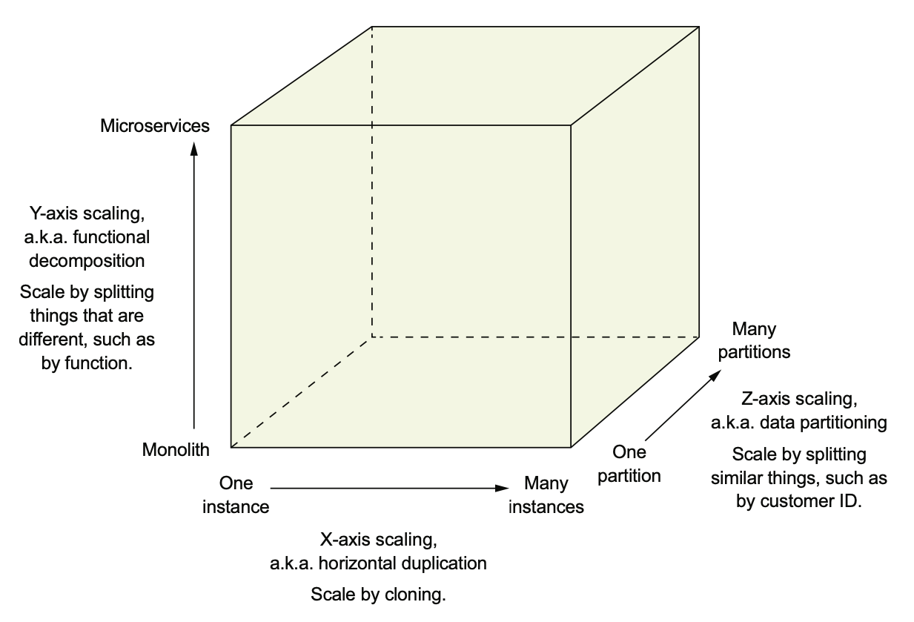
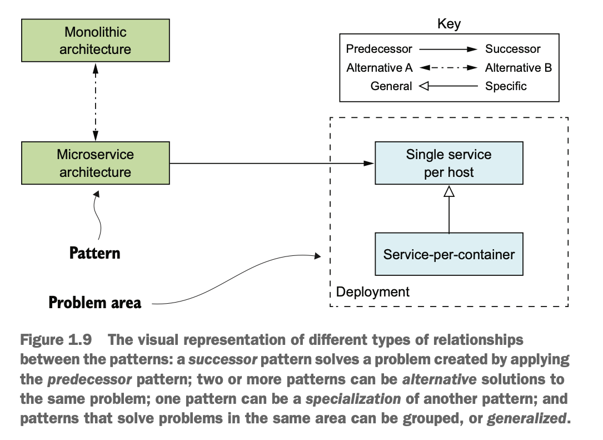
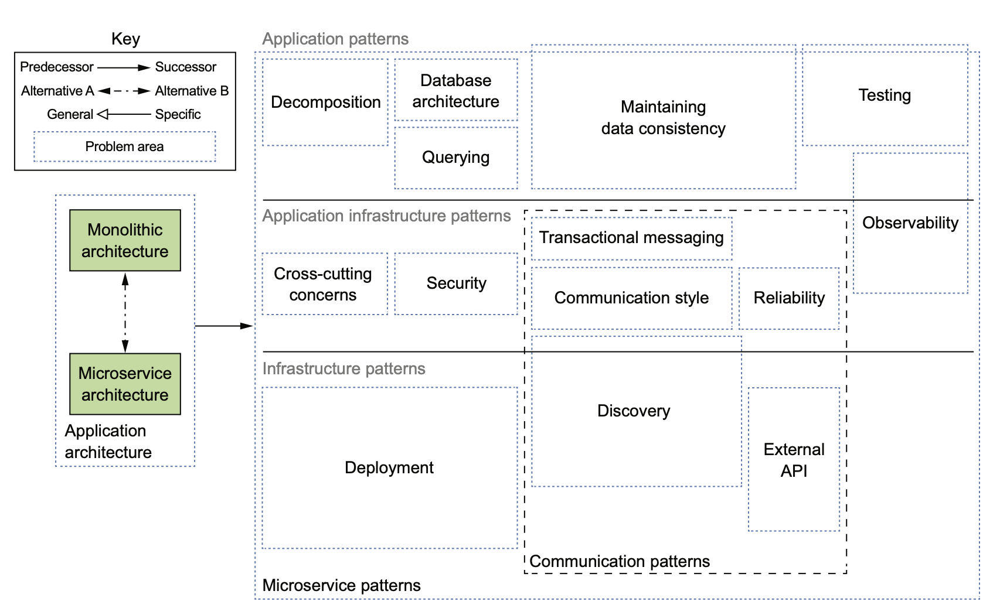

## Benefits of monolith

- `Simple to develop:` IDEs and other developer tools are focused on building a single application.
- `Easy to make radical changes to the application:` You can change the code and the database schema, build, and deploy.
- `Straightforward to test:` The developers wrote end-to-end tests that launched the application, invoked the REST API, and tested the UI with Selenium.
- `Straightforward to deploy:` All a developer had to do was copy the WAR file to a server that had Tomcat installed.
- `Easy to scale:` Can run multiple instances of the application behind a load balancer.

## Disadvantages of monolith

- `Complexity Intimidates Developers`
  - It's too large for any developer to fully understand the code.
  - Fixing bugs and implementing new features is difficult and time-consuming.
- `Development is slow`
  - Large application overloads and slowdown a developers IDE.
  - Application takes a lot of time to startup.
  - The edit-build-run-test loop takes a long time, which badly impacts productivity.
- `Path from commit to deployment is long and arduous`
  - Team deploys applications with longer release cycles typically on a monthly or quarterly basis.
  - Builds are frequently in an unreleasable state.
  - Merges from feature branches to main branch are lengthy and painful.
  - Because of the complexity, the impact of a change is not well understood
    - The CI process must run entire test suite.
    - Most of the releases may require manual testing.
- `Scaling is difficult`
  - Different application modules may have conflicting resource requirements.
    - For ex, some modules may require cpu scaling and some may require memory scaling.
  - The conflicting resource requirements let us compromise on the server configuration.
- `Delivering a reliable monolith is challenging`
  - Testing the application thoroughly is difficult, due to its large size.
  - This lack of testability means bugs make their way into production.
  - The application lacks fault isolation, because all modules are running within the same process.
  - A bug in one module, for example, a memory leak crashes all instances of the application, one by one.
- `Locked into increasingly obsolete technology stack`
  - The monolithic architecture makes it difficult to adopt new frameworks and languages.
  - Developers are stuck with the technology choices they made at the start of the project.
  - Developers must maintain an application written using an increasingly obsolete technology stack.
  - The development team has never found the time to upgrade those frameworks because major parts of the application are written using increasingly out-of-date frameworks.

## Microservices architecture

- Software architecture has very little to do with functional requirements.
- Architecture affects nonfunctional requirements or quality attributes.
- The most important quality attributes are maintainability, extensibility, and testability.

### Scale cube

- The below three-dimensional scale model defines the scale of an application.
  - X-AXIS SCALING LOAD BALANCES REQUESTS ACROSS MULTIPLE INSTANCES
    - Run n identical instances of an application behind a load balancer.
    - This is a great way of improving availability of an application.
  - Z-AXIS SCALING ROUTES REQUESTS BASED ON AN ATTRIBUTE OF THE REQUEST
    - This also runs n instances of an application, but each instance is responsible for only a subset of the data.
    - An application might use a route requests to an instance using a route key. For ex, userid.  
    - Z-axis scaling is a great way to scale an application to handle increasing transaction and data volumes.
  - Y-AXIS SCALING FUNCTIONALLY DECOMPOSES AN APPLICATION INTO SERVICES
    - X-axis and Z-axis does not solve the problem of increasing development and application complexity.
    - To solve application complexity we use Y-axis scaling, or functional decomposition.
  
  

### Microservices as a form of modularity

- Modularity is essential when developing large, complex applications.
- In a monolithic application, modules are defined using a combination of programming language constructs (such as Java packages) and build artifacts (such as Java JAR files).
- The microservice architecture uses services as the unit of modularity.
- Other than preserving the modularity there are other benefits like deploy and scale services independently.

### Each service has its own database

- Microservices are loosely coupled and communicate only via APIs.
- One way to achieve loose coupling is by each service having its own datastore.
  - for example, Order Service has a database that includes the ORDERS table, and Customer Service has its database, which includes the CUSTOMERS table.
- At runtime, one service will never be blocked because another service holds a database lock.

### Micro services vs SOA

- Inter-service communication
  - SOA
    - SOA applications typically use heavyweight technologies such as SOAP and other WS* standards.
    - They often use an ESB, a smart pipe that contains business and message-processing logic to integrate the services.
  - Micro services
    - microservice architecture tend to use lightweight, open source technologies.
    - The services communicate via dumb pipes, such as message brokers or lightweight protocols like REST or gRPC.

- Data
  - SOA applications typically have a global data model and share databases.
  - In the microservice architecture each service has its own database.

- Service
  - SOA
    - SOA is typically used to integrate large, complex, monolithic applications.
    - SOA application usually consists of a few large services
  - Microservices
    - Microservices are much smaller.
    - Microservices typically consists of dozens or hundreds of smaller services.

## Benefits of microservices

- The microservice architecture has the following benefits:
  - It enables the continuous delivery and deployment of large, complex applications.
    - It has the testability(automated) required by continuous delivery/deployment.
    - It has the deployability(independently) required by continuous delivery/deployment.
    - It enables development teams to be autonomous and loosely coupled
  - Services are small and easily maintained.
  - Services are independently deployable.
  - Services are independently scalable.
  - The microservice architecture enables teams to be autonomous.
  - It allows easy experimenting and adoption of new technologies.
  - It has better fault isolation. Memory leak in a service only affects that service.

## Drawbacks of the microservice architecture

- Finding the right set of services is challenging.
- Distributed systems are complex, which makes development, testing, and deployment difficult.
- Deploying features that span multiple services requires careful coordination.
- Deciding when to adopt the microservice architecture is difficult.
  
## Patterns

- A pattern is a reusable solution to a problem that occurs in a particular context.
- A pattern must describe the context within which it applies.
- A commonly used pattern structure includes three especially valuable sections:
  - Forces - THE ISSUES THAT YOU MUST ADDRESS WHEN SOLVING A PROBLEM
  - Resulting context - THE CONSEQUENCES OF APPLYING A PATTERN
    - Benefits—The benefits of the pattern, including the forces that have been resolved
    - Drawbacks—The drawbacks of the pattern, including the unresolved forces
    - Issues—The new problems that have been introduced by applying the pattern
  - Related patterns
    - `Predecessor:` A predecessor pattern is a pattern that motivates the need for this pattern.
    - `Successor:` A pattern that solves an issue that has been introduced by this pattern.
    - `Alternative:` A pattern that provides an alternative solution to this pattern.`
    - `Generalization:` A pattern that is a general solution to a problem.
    - `Specialization:` A specialized form of a particular pattern.

## Microservice patterns

- Architecture and design are all about making decisions.
- While making these decisions you have lots of trade-offs to consider.
- If you pick the microservice architecture, you’ll need to address lots of issues.

### Microservice architecture pattern language

- The pattern language consists of several groups of patterns.
- The application architecture pattern group consists of Monolithic architecture pattern and the Microservice architecture pattern.
- The patterns are also divided into three layers:
  - `Infrastructure patterns:` These solve problems that are mostly infrastructure issues outside of development.
  - `Application infrastructure:` These are for infrastructure issues that also impact development.
  - `Application patterns:` These solve problems faced by developers.

### PATTERNS FOR DECOMPOSING AN APPLICATION INTO SERVICES

- There are two decomposition patterns:
  - Decompose by business capability, which organizes services around business capabilities.
  - Decompose by subdomain, which organizes services around domain-driven design (DDD) subdomains.
### COMMUNICATION PATTERNS

- An application built using the microservice architecture is a distributed system.
- Interprocess communication (IPC) is an important part of the microservice architecture.
  - Communication style—What kind of IPC mechanism should you use?
  - Discovery—How does a client of a service determine the IP address of a service
    instance so that, for example, it makes an HTTP request?
  - Reliability—How can you ensure that communication between services is reli-
    able even though services can be unavailable?
  - Transactional messaging—How should you integrate the sending of messages and
    publishing of events with database transactions that update business data?
  - External API—How do clients of your application communicate with the services?

### DATA CONSISTENCY PATTERNS FOR IMPLEMENTING TRANSACTION MANAGEMENT

- Having a database per service introduces some significant issues.
- The traditional approach of using distributed transactions (2PC) isn’t a viable option for a modern application.
- An application needs to maintain data consistency by using the Saga pattern.

### PATTERNS FOR QUERYING DATA IN A MICROSERVICE ARCHITECTURE

- Issue with using a database per service is that some queries need to join data that’s owned by multiple services.
- Sometimes we can use the API composition pattern, which invokes the APIs of one or more services and aggregates results.
- Sometimes, we must use the Command query responsibility segregation (CQRS) pattern, which maintains one or more easily queried replicas of the data.

### SERVICE DEPLOYMENT PATTERNS

- Deploying a microservice is much more complex than a monolith.
- There may be tens or hundreds of services that are written in a variety of languages and frameworks.
- Ideally, we should use a deployment platform that provides the developer with a simple UI (command-line or GUI) for deploying and managing their services.
  - The deployment platform will typically be based on virtual machines (VMs), containers, or serverless technology.

### OBSERVABILITY PATTERNS PROVIDE INSIGHT INTO APPLICATION BEHAVIOR

- Understanding and diagnosing problems in a microservice architecture is complicated.
- A request can bounce around between multiple services before a response is finally returned to a client.
- Similarly, problems with latency are more difficult to diagnose because there are multiple suspects.
- We can use the following patterns to design observable services:
  - `Health check API:` Expose an endpoint that returns the health of the service.
  - `Log aggregation:` Log service activity and write logs into a centralized logging server, which provides searching and alerting.
  - `Distributed tracing:` Assign each external request a unique ID and trace requests as they flow between services.
  - `Exception tracking:` Report exceptions to an exception tracking service, which de-duplicates exceptions, alerts developers, and tracks the resolution of each exception.
  - `Application metrics:` Maintain metrics, such as counters and gauges, and expose them to a metrics server.
  - `Audit logging:` Log user actions.

### PATTERNS FOR THE AUTOMATED TESTING OF SERVICES

- The microservice architecture makes individual services easier to test because they’re much smaller than the monolithic application.
- Here are patterns for simplifying testing by testing services in isolation:
  - `Consumer-driven contract test:` Verify that a service meets the expectations of its clients.
  - `Consumer-side contract test:` Verify that the client of a service can communicate with the service.
  - `Service component test:` Test a service in isolation.

### PATTERNS FOR HANDLING CROSS-CUTTING CONCERNS

- In a microservice architecture, there are numerous concerns that every service must implement, including the observability patterns and discovery patterns.
- It must also implement the Externalized Configuration pattern, which supplies configuration parameters such as database credentials to a service at runtime.
- Apply the Microservice Chassis pattern and build services on top of a framework that handles these concerns instead of reimplementing these from scratch.

### SECURITY PATTERNS

- In a microservice architecture, users are typically authenticated by the API gateway.
- It must pass information about the user, such as identity and roles, to the services it invokes.
- A common solution is to apply the Access token pattern.
  - The API gateway passes an access token, such as JWT (JSON Web Token), to the services, which can validate the token and obtain information about the user.
  