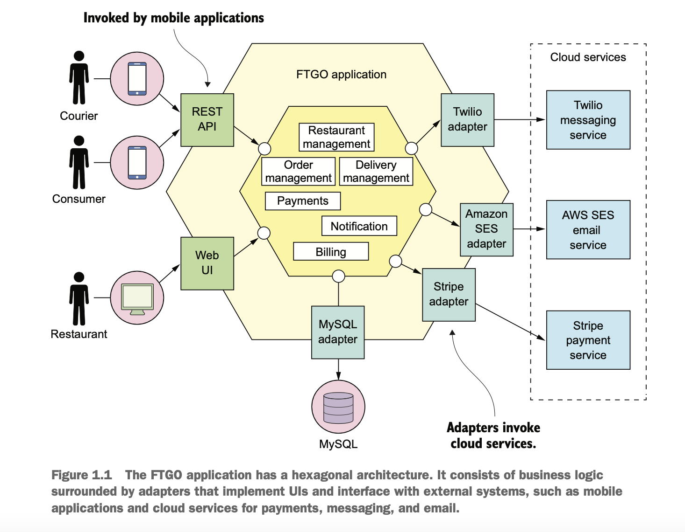

## Benefits of monolith

- Simple to develop—IDEs and other developer tools are focused on building a sin- gle application.
- Easy to make radical changes to the application—You can change the code and the database schema, build, and deploy.
- Straightforward to test—The developers wrote end-to-end tests that launched the application, invoked the REST API, and tested the UI with Selenium.
- Straightforward to deploy—All a developer had to do was copy the WAR file to a server that had Tomcat installed.
- Easy to scale — Can run multiple instances of the application behind a load balancer.

## Disadvantages of monolith

- `Complexity Intimidates Developers`
  - It's too large for any developer to fully understand the code.
  - Fixing bugs and implementing new features is difficult and time-consuming.
- `Development is slow`
  - Large application overloads and slowdown a developers IDE.
  - Application takes a lot of time to startup.
  - The edit-build-run-test loop takes a long time, which badly impacts productivity.
- `Path from commit to deployment is long and arduous`
  - Team deploys applications with longer release cycles typically on a monthly or quarterly basis.
  - Builds are frequently in an unreleasable state.
  - Merges from feature branches to main branch are lengthy and painful.
  - Because of the complexity, the impact of a change is not well understood
    - The CI process must run entire test suite.
    - Most of the releases may require manual testing.
- `Scaling is difficult`
  - Different application modules may have conflicting resource requirements.
    - For ex, some modules may require cpu scaling and some may require memory scaling.
  - The conflicting resource requirements let us compromise on the server configuration.
- `Delivering a reliable monolith is challenging`
  - Testing the application thoroughly is difficult, due to its large size.
  - This lack of testability means bugs make their way into production.
  - The application lacks fault isolation, because all modules are running within the same process.
  - A bug in one module, for example, a memory leak crashes all instances of the application, one by one.
- `Locked into increasingly obsolete technology stack`
  - The monolithic architecture makes it difficult to adopt new frameworks and languages.
  - Developers are stuck with the technology choices they made at the start of the project.
  - Developers must maintain an application written using an increasingly obsolete technology stack.
  - The development team has never found the time to upgrade those frameworks because major parts of the application are written using increasingly out-of-date frameworks.

## Benefits of microservices

- The microservice architecture has the following benefits:
  - It enables the continuous delivery and deployment of large, complex applications.
  - Services are small and easily maintained.
  - Services are independently deployable.
  - Services are independently scalable.
  - The microservice architecture enables teams to be autonomous.
  - It allows easy experimenting and adoption of new technologies.
  - It has better fault isolation.

## Drawbacks of the microservice architecture

- Finding the right set of services is challenging.
- Distributed systems are complex, which makes development, testing, and deployment difficult.
- Deploying features that span multiple services requires careful coordination.
- Deciding when to adopt the microservice architecture is difficult.

## Hexagonal architecture

- In a hexagonal architecture, the core of the application consists of the business logic. 
- The business logic is surrounded by are various adapters.
- The business logic consists of modules, each of which is a collection of domain objects.
  - Examples of modules are Order Management, Delivery Management, Billing, and Payments.
- The adapters implement UIs and integrate with external systems.
- There are several adapters that interface with the external systems. 
  - `Inbound adapters:` Handle requests by invoking the business logic, including the REST API and Web UI adapters. 
  - `Outbound adapters:` Enable the business logic to access the external services like MySQL database or cloud services such as Twilio and Stripe.  
  
    

