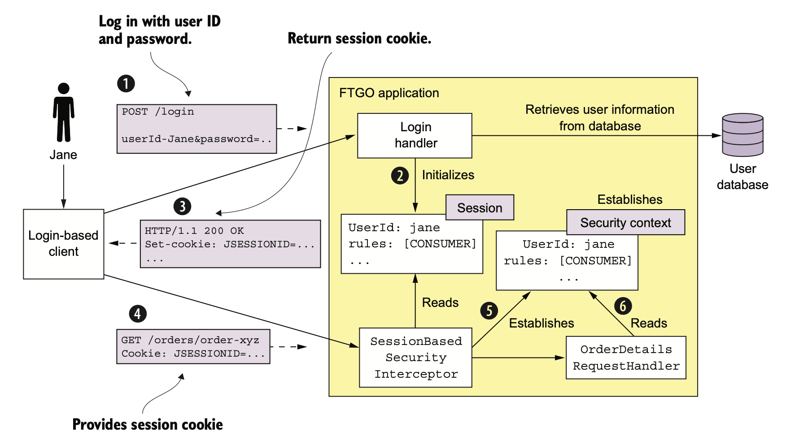
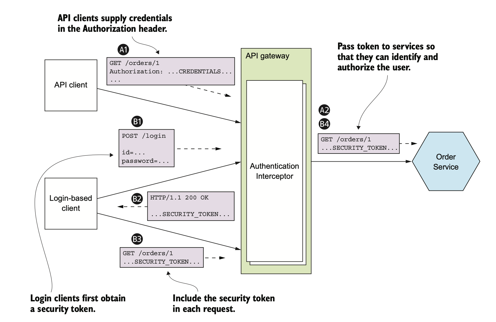
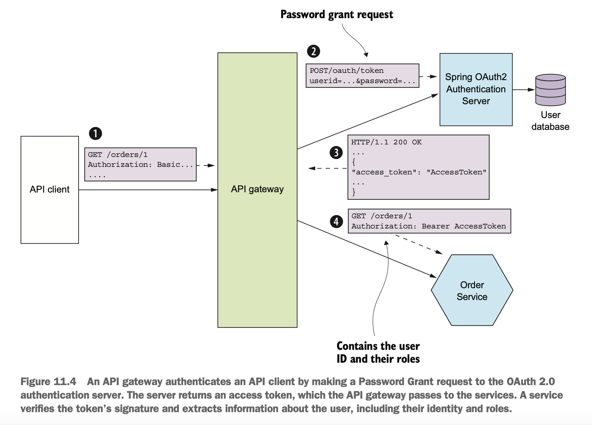
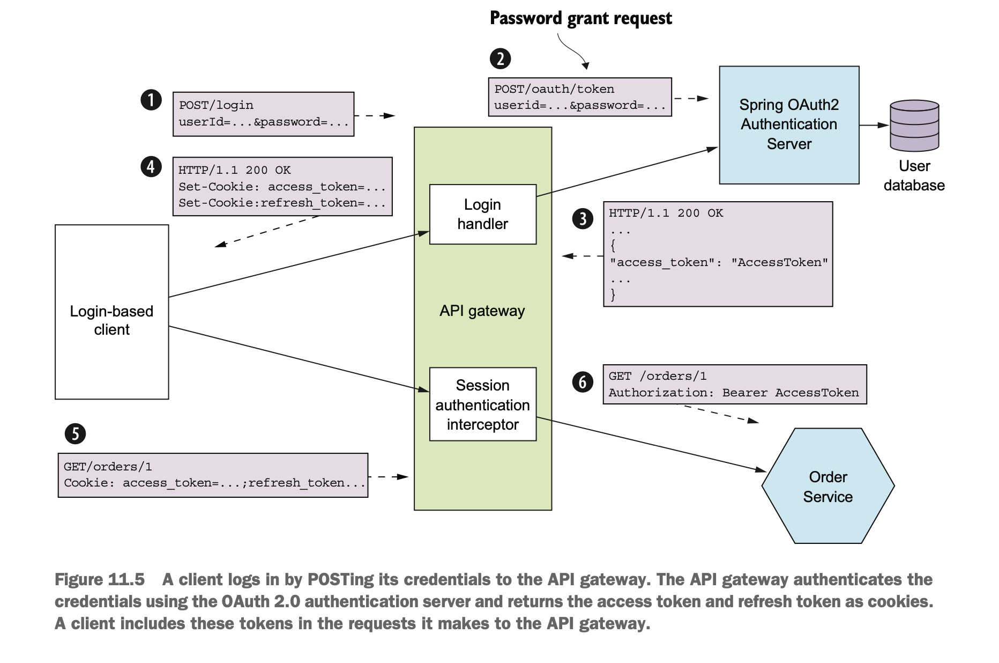

# Security

- An application developer is primarily responsible for implementing four different aspects of security:
  - `Authentication:` Verifies the identity of an application or human.
  - `Authorization:` Verifies that the principal is allowed to perform the requested operation on the specified data.
    - Applications often use a combination of role-based(RBAC) security and access control lists (ACLs).
      - `RBAC:` Assigns each user one or more roles that grant them permission to invoke particular operations.
      - `ACLS:` Grant users or roles permission to perform an operation on a particular business object, or aggregate.
        - For ex, OS file permissions like read, write and execute permissions.
  - `Auditing:` Tracking the operations that a principal performs in order to detect security issues, help customer 
    support, and enforce compliance.  
  - `Secure interprocess communication:` All communication in and out of services should be over TLS. Interservice 
    communication may even need to use authentication.

## Security in a monolithic application

- The following steps are involved in a typical monolithic application for authentication/authorization.
  - User logs in with their user ID and password.
  - The application verifies the credentials and returns a session(JSESSIONID) token to the client.
    - A session id is usually an opaque token such as a cryptographically strong random number.
    - A session id stores the principal’s ID and roles.
  - The following steps happen when user makes successive requests.
    - User sends session id as part of every request.
    - A filter/interceptor on the app server reads session id, verifies it and creates the security context.
    - The created security context is stored in a thread local variable such that it is available throughout the request
      life cycle.
      - For ex, In spring a request handler can call SecurityContextHolder.getContext().getAuthentication() to obtain 
        information about the current user, such as their identity and roles.
      - Similarly, Passport(nodejs) framework stores the security context as the user attribute of the request.

## Role based security

- The above example of FTGO application uses role based security of spring.
- It defined various roles like CONSUMER, RESTAURANT, COURIER and ADMIN etc.
- It uses Spring Security’s declarative security mechanism to restrict access to URLs and service methods to specific roles.
- Roles are also interwoven into the business logic.
  - For example, a consumer can only access their orders, whereas an administrator can access all orders.
- `Drawbacks`
  - Load balancing and operations become difficult
    - In memory sessions require all requests for a particular session to be routed to the same application instance.
  - To shut down an app instance requires some session draining mechanism that waits for all sessions to expire.

## Security in microservices

- In microservices architecture each external request is handled by the API gateway and at least one service.
- Each service must implement some aspects of security.
  - For ex, Order Service must only allow a consumer to see their orders, which requires a combination of authentication 
    and authorization.
- In microservices architecture we need to determine who is responsible for authenticating the user and who is responsible
  for authorization.
- Two aspects of the monolithic app security doesn't work in microservices.  
  - `In memory security context:` Services can’t share memory, so they can’t use an in-memory security context, such as 
    a thread-local, to pass around the user identity.
  - `Centralized session:` Multiple services could access a database-based session but it violates the principle of loose
    coupling.

## Handling authentication in the API Gateway

- Handling authentication at each service has two disadvantages.
  - Permits unauthenticated requests to enter the internal network.
    - Every development team correctly implementing security in all of their services.
  - Different clients authenticated in different ways.
    - Pure API clients supply credentials with each request, for ex using basic authentication.
    - Few clients might first log in and then supply a session token with each request.
- Handling authentication in the API Gateway eliminates all the disadvantages state above.
  - Api Gateway hides the complexity of authentication for various clients from the services.

### Authentication flow using API Gateway

- Authentication at API gateway happens differently for API clients and login-based clients.
- The sequence of events for API clients is as follows:
  - A client makes a request containing credentials.
  - The API gateway authenticates the credentials, creates a security token, and passes that to the service or services.
- The sequence of events for login-based clients is as follows:
  - A client makes a login request containing credentials.
  - The API gateway returns a security token.
  - The client includes the security token in requests that invoke operations.
  - The API gateway validates the security token and forwards it to the service or services.

 

## HANDLING AUTHORIZATION

- An application needs authorization to verify if the client is allowed to perform an action.
  - For ex, getOrderDetails() query can only be invoked by the CONSUMER who placed the Order and a customer service agent 
    who is helping the consumer.
- Authorization can be handled either at API Gateway or at each service.
- `Implementing authorization at API Gateway`
  - As with authentication, centralizing authorization within the API gateway reduces the risk of security vulnerabilities.
  - `Drawbacks`
    - API Gateway and services have to be updated in lock-step.
    - API gateway can typically only implement role-based access to URL paths.
- `Implementing authorization at service`
  - A service can implement role-based authorization for URLs and for service methods.
  - It can also implement ACLs to manage access to aggregates.

### USING JWTS TO PASS USER IDENTITY AND ROLES

- There are two types of tokens we can choose for an API Gateway to pass the token to services.
  - `opaque`
    - These are typical UUIDs.
    - `Drawbacks`
      - These reduce the performance and availability and increase latency because the recipient of the token must
        make an RPC call to a security service to validate the token and retrieve user information.
  - `transparent`
    - The most popular choice for these are JWTs.

### _JWT_

- JWT is a standard way to securely represent claims, such as user identity and roles, between two parties.
- A JWT has a payload, which is a JSON object that contains information about the user, such as their identity and roles,
  and other metadata, such as an expiration date.
- It’s signed with a secret(private key) that’s only known to the creator of the JWT, such as the API gateway.
  - The secret ensures that a malicious third party can’t forge or tamper with a JWT.
- A service will perform the request operation after verifying the JWT’s signature and expiration date.
- `Issue`
  - One issue with JWT is that because a token is self-contained, it’s irrevocable.
  - So, there’s no practical way to revoke an individual JWT that has fallen into the hands of a malicious third party.
  - The solution is to issue JWTs with short expiration times, because that limits what a malicious party could do.
  - To produce short-lived JWTs an application must continuously reissue JWTs to keep the session active.
  - This short-lived JWTs problem is solved by the security standard called OAUTH 2.0

## OAUTH 2.0

- The typical way of implementing security has the following steps.
  - Implement a User service that manages a user database containing user information like credentials and roles.
  - The api gateway calls User service to authenticate client request and obtain a JWT.
- This approach is very generic and it is not an efficient way of utilising the development team.
- `OAUTH 2.0`
  - We can use either off-the-shelf service or framework that implements a standard called OAuth 2.0.
  - OAuth 2.0 is an authorization protocol that was originally designed to enable a user of a public cloud service, 
    such as GitHub or Google, to grant a third-party application access to its information without revealing its password.
    - For ex, OAUTH 2.0 securely grant a third party cloud-based Continuous Integration (CI) service access to your 
      GitHub repository.

## Using OAUTH 2.0 to implement security in microservices

- Although the original focus of OAuth 2.0 was authorizing access to public cloud services, you can also use it for 
  authentication and authorization in your application.
- The key concepts in OAuth 2.0 are the following:
  - `Authorization Server:` Provides an API for authenticating users and obtaining an access token and a refresh token.
    - Spring OAuth is a great example of a framework for building an OAuth 2.0 authorization server.
  - `Access Token:` A token that grants access to a Resource Server. The format of token is implementation dependent.
    - Spring OAuth use JWTs.
  - `Refresh Token:` A long-lived yet revocable token that a Client uses to obtain a new AccessToken.
  - `Resource Server:` A service that uses an access token to authorize access.
    - In a microservice architecture, the services are resource servers.
  - `Client:` A client that wants to access a Resource Server.
    - In a microservice architecture, API Gateway is the OAuth 2.0 client.
- API Gateway authenticates both API clients and login clients.

### API Clients oauth flow

- The API gateway authenticate the API client by making a request to the OAuth 2.0 authorization server, which returns 
  an access token.
- The API gateway then makes one or more requests containing the access token to the services.
- The sequence of events shown in figure are as follows.
  - The client makes a request, supplying its credentials using basic authentication.
  - The API gateway makes an OAuth 2.0 Password Grant request to the OAuth 2.0 authentication server.
  - The authentication server validates the API client’s credentials and returns an access token and a refresh token.
  - The API gateway includes the access token in the requests it makes to the services.
  - A service validates the access token and uses it to authorize the request.

 

### Login client oauth flow

- An OAuth 2.0-based API gateway can authenticate session-oriented clients by using an OAuth 2.0 access token as a 
  session token.
- When the access token expires, it can obtain a new access token using the refresh token.  
- The sequence of events is as follows:
  - The login-based client POSTs its credentials to the API gateway.
  - The API gateway’s Login Handler makes an OAuth 2.0 Password Grant request to the OAuth 2.0 authentication server.  
  - The authentication server validates the client’s credentials and returns an access token and a refresh token.
  - The API gateway returns the access and refresh tokens to the client as cookies.
  - The client includes the access and refresh tokens in requests it makes to the API gateway.
  - The API gateway’s Session Authentication Interceptor validates the access token and includes it in requests it 
    makes to the services.  
    
 

- `Benefits`
  - Using an off-the-shelf OAuth 2.0 Authentication Server saves time instead of reinventing the wheel or risk 
    developing an insecure design.
    
