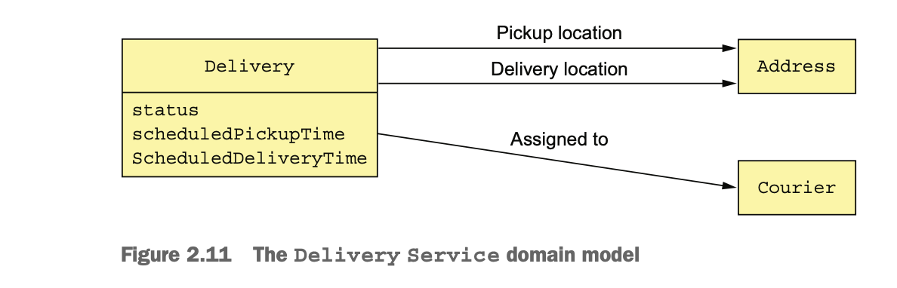

## Software architecture

### Decomposition

- An application’s architecture is its decomposition into parts (the elements) and the relationships (the relations) between those parts.
- Decomposition is important for a couple of reasons:
  - It enables multiple people (or multiple teams) with possibly specialized knowledge to work productively together on an application.
  - It defines how the software elements interact.

### THE 4+1 VIEW MODEL OF SOFTWARE ARCHITECTURE

- An application’s architecture can be viewed from multiple perspectives.
- The purpose of each view is as follows:
  - `Logical view:` The software elements that are created by developers.
  - `Implementation Vew:` The output of the build system
  - `Process view:` The components at runtime.
  - `Deployment:` How the processes are mapped to machines.
    
    
    

## Architectural styles

- An architectural style determines the vocabulary of components and connectors that can be used in instances of that style,
  together with a set of constraints on how they can be combined.
- An application typically uses a combination of architectural styles.

### THE LAYERED ARCHITECTURAL STYLE

- A layered architecture organizes software elements into layers.
- Each layer has a well-defined set of responsibilities.
- A layer can only depend on either the layer immediately below it (if strict layering) or any of the layers below it.
- The popular three-tier architecture is the layered architecture applied to the logical view.
  - Presentation layer—Contains code that implements the user interface or external APIs
  - Business logic layer—Contains the business logic
  - Persistence layer—Implements the logic of interacting with the database

### Drawbacks
- `Single presentation layer:` It doesn't represent the fact that an application is likely to be invoked by more than 
   just a single system.
- `Single persistence layer:` It doesn't represent the fact that an application is likely to interact with more than 
  just a single database. 
- `Defines the business logic layer as depending on the persistence layer:` In theory, this dependency prevents you 
  from testing the business logic without the database.

## THE HEXAGONAL ARCHITECTURE STYLE

- In a hexagonal architecture, the core of the application consists of the business logic.
- The business logic is surrounded by are various adapters.
- The business logic consists of modules, each of which is a collection of domain objects.
    - Examples of modules are Order Management, Delivery Management, Billing, and Payments.
- The adapters implement UIs and integrate with external systems.
- There are several adapters that interface with the external systems.
    - `Inbound adapters:` Handle requests by invoking the business logic, including the REST API and Web UI adapters.
    - `Outbound adapters:` Enable the business logic to access the external services like MySQL database or cloud services such as Twilio and Stripe.

      


## Defining an application’s microservice architecture

- Defining microservice architecture is a three-step process.
    - Defining system operations.
        - A system operation represents an external request.
        - It’s either a command, which updates data, or a query, which retrieves data.
        - The behavior of each command is defined in terms of an abstract domain model, which is also derived from the requirements.
    - Defining services.
        - This step is to determine the decomposition into services.
            - One strategy is to define services corresponding to business capabilities
            - Another strategy is to organize services around domain-driven design subdomains.
    - Defining service apis and collaborations.
        - Assign each system operation identified in the first step to a service.
            - A service might implement an operation entirely by itself.
            - It might need to collaborate with other services.


### Identifying system operations

- This is a two-step process.
    - The first step creates the high-level domain model consisting of the key classes that provide a vocabulary 
      with which to describe the system operations.
    - The second step identifies the system operations and describes each one’s behavior in terms of the domain model.
    - The domain model is derived primarily from the nouns of the user stories, and the sys- tem operations are 
      derived mostly from the verbs.

### Creating High level domain

- A domain model is created using standard techniques such as analyzing the nouns in the stories and scenarios and 
  talking to the domain experts.
- We can analyze the story and expand that into user scenarios.
- For ex, Place order story is divided into following user stories.

```
Given a consumer
  And a restaurant
  And a delivery address/time that can be served by that restaurant
  And an order total that meets the restaurant's order minimum
When the consumer places an order for the restaurant
Then consumer's credit card is authorized
  And an order is created in the PENDING_ACCEPTANCE state
  And the order is associated with the consumer
  And the order is associated with the restaurant
```
- The nouns in the above user scenario are Consumer, Order, Restaurant, and CreditCard.
  
- The Accept order story can be written like this.

```
Given an order that is in the PENDING_ACCEPTANCE state
  and a courier that is available to deliver the order
When a restaurant accepts an order with a promise to prepare by a particular
     time
Then the state of the order is changed to ACCEPTED
  And the order's promiseByTime is updated to the promised time
  And the courier is assigned to deliver the order
```
- This above scenario suggests the existence of Courier, Delivery, MenuItem and Address classes.


- The responsibilities of each class are as follows:
    - `Consumer:` A consumer who places orders.
    - `Order:` An order placed by a consumer. It describes the order and tracks its status.
    - `OrderLineItem:` A line item of an Order.
    - `DeliveryInfo:` The time and place to deliver an order.
    - `Restaurant:` A restaurant that prepares orders for delivery to consumers.
    - `MenuItem:` An item on the restaurant’s menu.
    - `Courier:` A courier who deliver orders to consumers. Tracks the availability of the courier and their current location.
    - `Address:` The address of a Consumer or a Restaurant.
    - `Location:` The latitude and longitude of a Courier.

### DEFINING SYSTEM OPERATIONS

- There are two types of system operations:
    - Commands—System operations that create, update, and delete data.
    - Queries—System operations that read (query) data.

#### Commands

- A good starting point to identifying system commands is by analyzing verbs in the user stories.

```
Actor         Story                     Command                       Description

Consumer      Create Order              createOrder()                 Creates an order
Restaurant    Accept Order              acceptOrder()                 Indicates that the restaurant has accepted the order and is committed to preparing it by the indicated time
Restaurant    Order Ready for pickup    noteOrderReadyForPickup()     Indicates that the order is ready for pickup.
Courier       Update Location           noteUpdatedLocation()         Updates the current location of the courier.
Courier       Delivery pickedup         noteDeliveryPickedUp()        Indicates that the courier has pickedup the order.
Courier       Delivery delivered        noteDeliveryDelivered()       Indicates that the courier has delivered the order.
```

- A command has a specification that defines its parameters, return value, and behavior in terms of the domain model classes.
- Here is the createOrder() system operation.

```
Operation               createOrder (consumer id, payment method, delivery address, delivery time, restaurant id, order line items)
Returns                 orderId, ...
Preconditions           The consumer exists and can place orders.
                        The line items correspond to the restaurant’s menu items.
                        The delivery address and time can be serviced by the restaurant.
Post-conditions         The consumer’s credit card was authorized for the order total.
                        An order was created in the PENDING_ACCEPTANCE state.
```

- The pre-conditions mirror the givens in the Place Order user scenario described earlier.
- The post-conditions mirror the `thens` from the scenario.
- When a system operation is invoked it will verify the preconditions and perform the actions required to make the post-conditions true.
- Here’s the specification of the acceptOrder() system operation:
```
Operation               acceptOrder(restaurantId, orderId, readyByTime)
Returns                 -
Preconditions           - The order.status is PENDING_ACCEPTANCE.
                        - A courier is available to deliver the order.
Post-conditions         - The order.status was changed to ACCEPTED.
                        - The order.readyByTime was changed to the readyByTime.
                        - The courier was assigned to deliver the order.
```

#### Queries

- Besides implementing commands, an application must also implement queries.
- The queries provide the UI with the information a user needs to make decisions.
- For example, the flow when a consumer places an order:
    - User enters delivery address and time.
    - System displays available restaurants.
    - User selects restaurant.
    - System displays menu.
    - User selects item and checks out.
    - System creates order.
- This user scenario suggests the following queries:
    - findAvailableRestaurants(deliveryAddress, deliveryTime)
        - It is probably the most architecturally significant.
        - It’s a complex query involving geosearch.
    - findRestaurantMenu(id)

## Define services by applying the Decompose by Business capabilities pattern

- A business capability is something that a business does in order to generate value.
- The set of capabilities for a given business depends on the kind of business.
    - For example, the capabilities of an insurance company typically include Underwriting, Claims management, 
      Billing, Compliance, and so on.
- Business capabilities of a business are generally stable, but the manner in which they are done have drastically changed.
  - For ex, depositing a check in bank is a business capabilities which used to be manual until recent times.
    Now, deposit check at atm, through online etc, have come.

#### Identifying Business capabilities

- An organization’s business capabilities are identified by analyzing the organization’s purpose, structure, and business processes.
- Each business capability can be treated as a service.
- Its specification consists of various components, including inputs, outputs, and service-level agreements.
- A business capability is often focused on a particular business object.
- The business capabilities for FTGO(Food On The Go) include the following:
  - `Supplier management`
    – `Courier management:` Managing courier information
    – `Restaurant information management:` Managing restaurant menus and other information, including location and open hours
  - `Consumer management:` Managing information about consumers
  - `Order taking and fulfillment`
    – `Order management:` Enabling consumers to create and manage orders
    – `Restaurant order management:` Managing the preparation of orders at a restaurant
    – `Logistics`
    – `Courier availability management:` Managing the real-time availability of couriers to delivery orders
    – `Delivery management:` Delivering orders to consumers
  - `Accounting`
    – `Consumer accounting:` Managing billing of consumers
    – `Restaurant accounting:` Managing payments to restaurants
    – `Courier accounting:` Managing payments to couriers
- Most top-level capabilities are decomposed into sub-capabilities.
  - For example, Order taking and fulfillment is decomposed into five sub-capabilities.

### Business capabilities to services

- The decision of which level of the capability hierarchy to map to which service is somewhat subjective.


- The services defined above may evolve overtime. For ex,
    - We may discover that a particular decomposition is inefficient due to excessive interprocess communication and 
      that you must combine services.
    - Alternatively, a service might grow in complexity to the point where it becomes worthwhile to split it into 
      multiple services.

## Defining services by applying the Decompose by sub-domain pattern

- It is an approach for building complex software applications that is centered on the development of an 
  object-oriented domain model.
- DDD is quite different from traditional approach to enterprise modelling.
- Enterprise Model
  - In this model, a single definition of each business entity, such as customer, order, and so on.
  - Different parts of an organization to agree on a single model is a tough task.
  - This model can be confusing because different parts of the organization might use either the 
    same term for different concepts.  
- DDD is the solution for the problems faced in enterprise model.    
- DDD has two concepts that are incredibly useful when applying the microservice architecture:
    - subdomains.
      - These subdomains are very similar to the business capabilities described earlier.
    - Bounded contexts.
      - DDD calls the scope of a domain model a bounded context.

### Bounded Context

- A bounded context includes the code artifacts that implement the model.
- Each bounded context is a service or possibly a set of services.
- The subdomain map to service, each with its own domain model as shown below.


## Decomposition guidelines

- We have seen at the main ways to define a microservice architecture.
- We can also use a couple of principles from object-oriented design when applying the microservice architecture pattern.

### SINGLE RESPONSIBILITY PRINCIPLE

- A class should have only one reason to change.
- If a class has multiple responsibilities that change independently, the class won’t be stable.
- We can apply SRP when defining a microservice architecture and create small, cohesive services that each have a 
  single responsibility.

### COMMON CLOSURE PRINCIPLE

- The classes in a package should be closed together against the same kinds of changes.
- If two classes change in lockstep because of the same underlying reason, then they belong in the same package    
- The goal is that when that business rule changes, developers only need to change code in a few packages (ideally only one).

### Obstacles to use decomposition

- `Network latency:` A particular decomposition may be impractical due to too many round trips.
- `Reduced availability:` Synchronous communication between services reduces availability.
- `Data consistency:` Maintaining data consistency across services is difficult to achieve.
  - The traditional solution is to use a two-phase, commit-based, distributed transaction management mechanism.
  - Traditional approach is not a good choice as many modern db systems don't support this.
  - Use Sagas. A saga is a sequence of local transactions that are coordinated using messaging.
- `Obtaining a consistent view of the data:`
  - In a microservice architecture, even though each service’s database is consistent, obtaining
    a globally consistent view of the data is difficult.
- `God classes:` 
  - God classes are classes that are used throughout an application.
  - A god class typically implements business logic for many aspects of the application.
  - Most applications have at least one of these classes, each representing a concept that’s central to the domain.
    - For ex, accounts in banking, orders in e-commerce, policies in insurance, and so on.  
  - Use concepts from domain-driven design to eliminate god classes.

### Solution to God classes

- Consider the Order class in the FTGO application.


- One solution is to package the order class into a library. But, this results in tight coupling.
- A better solution is to apply DDD and treat each service as a separate subdomain with its own domain model.
- This means that each of the services in the FTGO application that has anything to do with orders has its own 
  domain model with its version of the Order class.
- For ex, `Delivery service` has a view of an Order called `Delivery`. 
  - It has the Order fields `address`, `pickup time`, `delivery address`, and `delivery time`.
  - Also, it uses more relavant field names that start with delivery.
- Similarly `Kitchen Service` has a much simpler view of an order. It's version of an order is called `Ticket`.




## Defining Service Apis

- A service api operation could be
    - A system operation.
      - These are invoked by external clients and perhaps by other services.
    - A collaborating service.
        - A service publishes events primarily to enable it to collaborate with other services.
        - Events can be used to implement saga(Long lived transactions) or to update CQRS views.

### ASSIGNING SYSTEM OPERATIONS TO SERVICES

- Decide which service is the initial entry point for a request.
- Sometimes the mapping is less obvious. For ex:
    - The `noteUpdatedLocation()` operation, which updates the courier location.
        - Because it’s related to courier, this operation should be assigned to the Courier service.
        - On the other hand, it’s the Delivery Service that needs the courier location.
        - In this case, assigning an operation to a service that needs the information provided by the operation 
          is a better choice, hence defined in Delivery Service.
- Here is the assignment of system operations to services.

```
Consumer Service      createConsumer()
Order Service         createOrder()
Restaurant Service    findAvailableRestaurants()
Kitchen Service       acceptOrder()
                      noteOrderReadyForPickup()
Delivery Service      noteUpdatedLocation()
                      noteDeliveryPickedUp()
                      noteDeliveryDelivered()
```

### DETERMINING THE APIS REQUIRED TO SUPPORT COLLABORATION BETWEEN SERVICES

- Some system operations are handled entirely by a single service.
    - For ex, the Consumer Service handles the createConsumer() operation entirely by itself.
- But, many system operations span multiple services.
  - For example, in order to implement the createOrder() operation, the Order Service must invoke the following services in order to verify its preconditions and make the post-conditions become true:
    - `Consumer Service:` Verify that the consumer can place an order and obtain their payment information.
    - `Restaurant Service:` Validate the order line items, verify that the delivery address/time is within the restaurant’s service area, verify order minimum is met, and obtain prices for the order line items.
    - `Kitchen Service:` Create the Ticket.
    - `AccountingService:` Authorize the consumer’s credit card.


