## Communicating using the Asynchronous messaging pattern

### Overview of messaging

- A message consists of a header and a message body.
- Header
    - The header is a collection of name-value pairs, metadata that describes the data being sent.
    - The header can also contain messageId, generated by either the sender or messaging infrastructure.
    - The header can also contain an optional return address, which specifies the message channel that a reply should be written to.
- Body
    - The message body is the data being sent.
    - There are several types of messages.
        - `Document:` A generic message that contains only data.
        - `Command:` A message that specifies the operation to invoke and its parameters.
        - `Event:` A message indicating an event, which represents a state change of a domain object like Order, Customer etc.

### Overview of messaging channels

- Messages are exchanged over channels.
- There are two types of message channels.
    - `A point-to-point channel:` Delivers a message to exactly one of the consumers that is reading from the channel.
        - For ex, a `command message`.
    - `A publish-subscribe channel:` Delivers each message to all the attached consumers.
        - For ex, an `event message`.

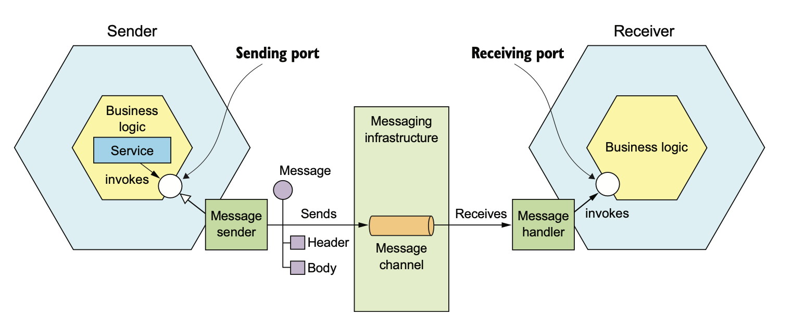

#### Asynchronous request/response

- Asynchronous messages are commonly used for one way notifications, where sender sends a message and receiver(s) consume.
- Asynchronous messages are also used for request/response style of communication.
    - The client sends a command message, which specifies the message identifier, operation to perform, and parameters.
    - The command message has a reply channel information in the header.
    - The server writes the reply message, which contains a correlation id that has the same value as message identifier to the reply channel.
    - The client uses the correlation id to match the reply message with the request.

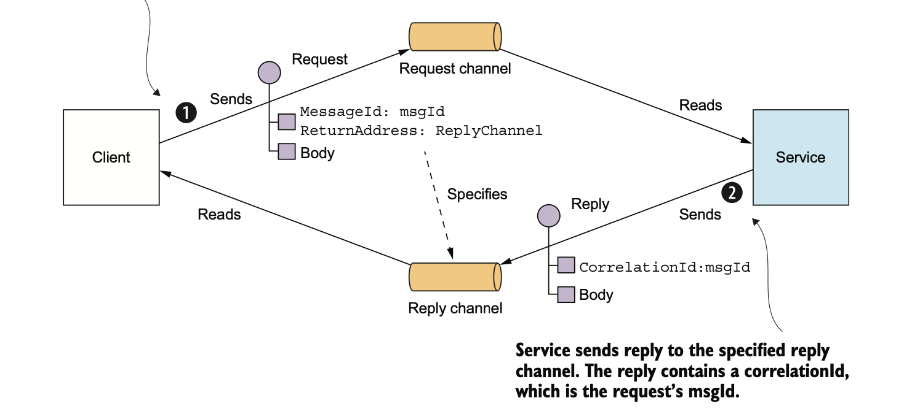

## API's specification for a messaging-based service API

- The specification for a service’s asynchronous API must specify
    - Names of the message channels
    - Message types(command, document or event)

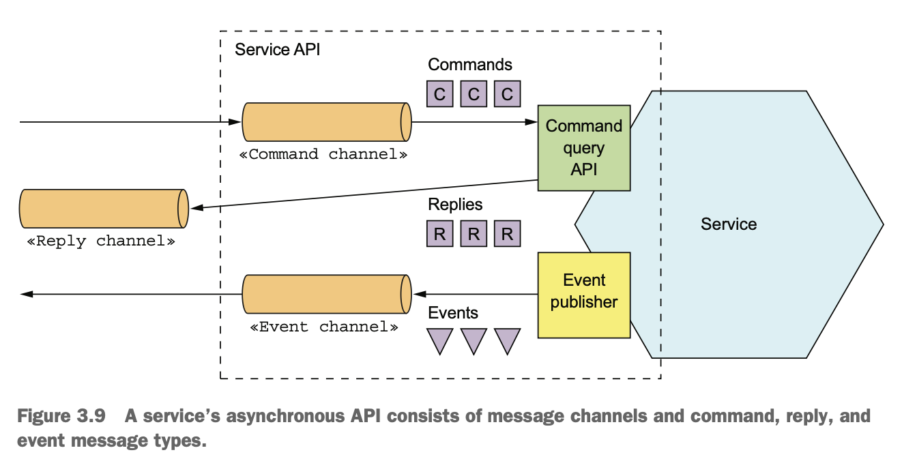

## Using a message broker

- A message broker is an intermediary through which all messages flow.
- Benefits
    - The sender doesn’t need to know the network location of the consumer.
    - A message broker buffers messages until the consumer is able to process them.
    - Flexible interaction styles
        - point-to-point
        - publish/subscribe

- Examples of popular open source message brokers:
    - ActiveMQ
    - RabbitMQ
    - Apache Kafka

### Selecting message broker

- The following factors need to be considered while selecting a message broker.
    - `Supported programming languages:` Does message broker supports a variety of programming languages?
    - `Supported messaging standards:`  Does broker follows standards such as AMQP and STOMP, or proprietary?.
    - `Message ordering:` Does message broker preservers order?.
    - `Delivery guarantees:` what delivery guarantees are provided?
    - `Persistence:` Does message broker persist data to disk and able to survive broker crashes?.
    - `Durability:` If a consumer reconnects to the message broker, does it receive the messages that were sent while disconnected.
    - `Scalability:` how scalable is the message broker?
    - `Latency:` what is the end-to-end latency?
    - `Competing consumers:` Does the message broker support competing consumers?

### Drawbacks

- `Potential performance bottleneck:` Fortunately, many modern message brokers are highly scalable.
- `Potential single point of failure:` It should be highly available, otherwise system reliability will be impacted.
- `Additional operational complexity:` It is another system that should be installed, configured and operated.

## Competing receivers and message ordering

- Preserving the order of messages is challenging when multiple instances of a same service compete.
    - `Problem`
        - For ex, there are three instances of a service reading from the same point-to-point channel.
        - A sender publishes Order Created, Order Updated, and Order Cancelled event messages sequentially.
        - The order of these events may go wrong due to network issues or due to any other reason.
    - `Solution`
        - A common solution is to use sharded channels(apache kafka).
        - A sharded channel consists of two or more shards, each of which behaves like a channel.
            - The sender specifies a shard key in the message’s header.
            - The message broker uses a shard key to assign the message to a particular shard/partition.
        - The messaging broker groups together multiple instances of a receiver(treats them as the same logical receiver).
            - For example, apache kafka uses the term consumer group.
            - The message broker assigns each shard to a single receiver.

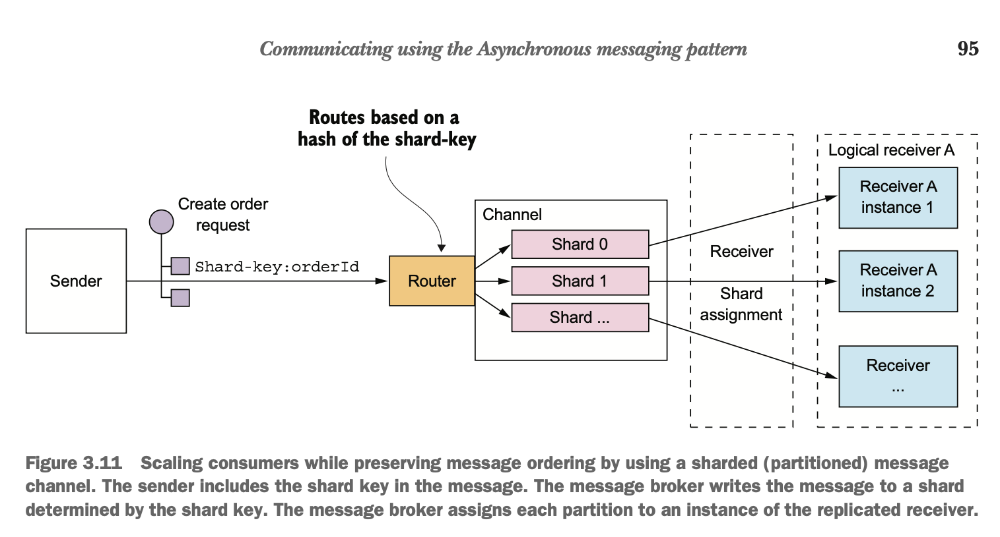

## Handling duplicate messages

- A failure of a client, network, or message broker can result in a message being delivered multiple times.
- Duplicate messages can be handled in the following ways
    - `Idempotent message handlers:`
        - Application logic has to be idempotent.
        - If message is received multiple times, it will have no effect.
        - It is not practically possible to write idempotent message handlers all times.
    - `Tracking messages`
        - Consumer should track messages that it has processed and discard any duplicates.
        - There are two ways to handle this.
            - Store the message id of each message that is consumed in a new database table.
            - To record message ids in an application table instead of a dedicated table.
                - This approach is particularly useful when using a NoSQL database that has a limited transaction model.

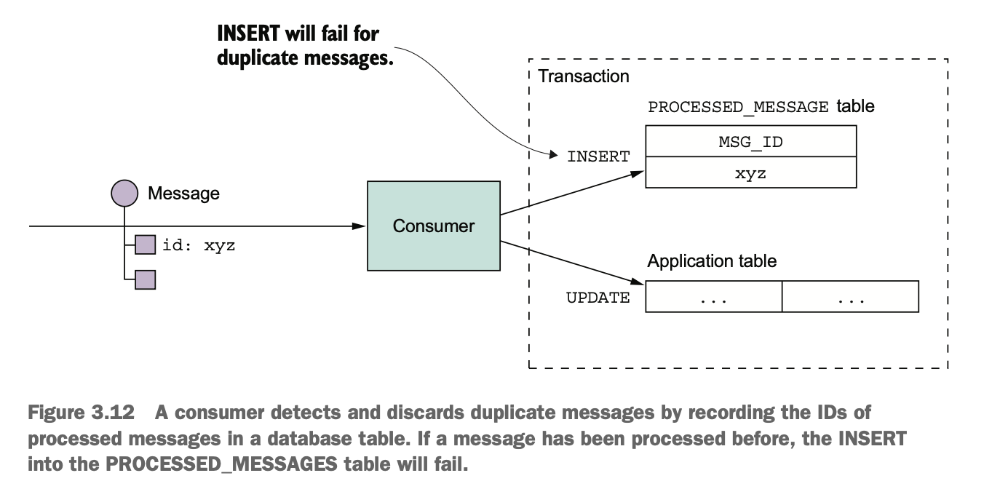

## _Transactional Messaging_

- A service often needs to publish messages as part of a transaction along with updating the database.
- A service might update the database and then crash without sending to the message broker.
- Distributed transaction that spans the database and the message broker are not supported by modern message brokers.

### _Using a database table as a message queue_

- One solution to the transaction messaging is Transactional outbox.
- This pattern uses a database table as a temporary message queue.
- As part of the db transaction that does CUD on business objects, the service inserts them into `OUTBOX` table.
- Atomicity is guaranteed because this is a local ACID transaction.
- The Outbox table acts as a temporary storage.
- The MessageRelay is a component(app) that reads messages from outbox table and publishes them to message broker.
- This approach works with NoSQL DBs also.

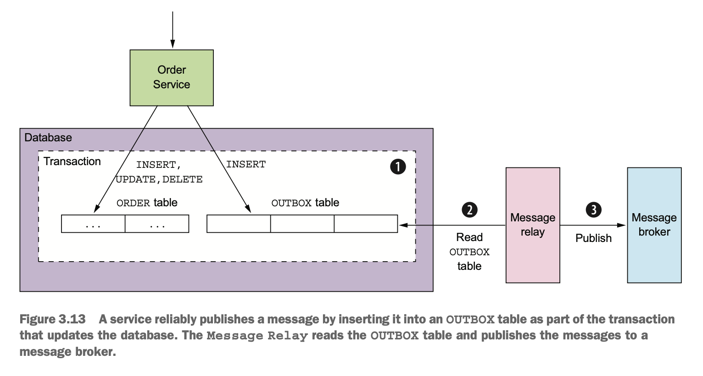

### _Publishing Events_

- There are two ways to publish events.

#### _Polling publisher pattern_

- MessageRelay component polls the OUTBOX table for unpublished messages.

```SELECT * FROM OUTBOX ORDERED BY ... ASC```

- MessageRelay publishes the messages to the message broker.
- MessageRelay deletes those messages from the OUTBOX table.

```
BEGIN
DELETE FROM OUTBOX WHERE ID in (....)
COMMIT
```
- Drawbacks
    - Frequently polling the database can be expensive.
    - All NoSQL databases may not support this.

#### _Transaction log tailing pattern_

- A sophisticated solution is for MessageRelay to tail the database transaction log (also called the commit log).
- Every committed update made is represented as an entry in the database’s transaction log.
- A transaction log miner can read the transaction log and publish each change as a message to the message broker.
    - The Transaction Log Miner reads the transaction log entries.
    - It converts each relevant log entry corresponding to an inserted message into a message.
    - It publishes that message to the message broker.
    - This works with both SQL and NOSQL.

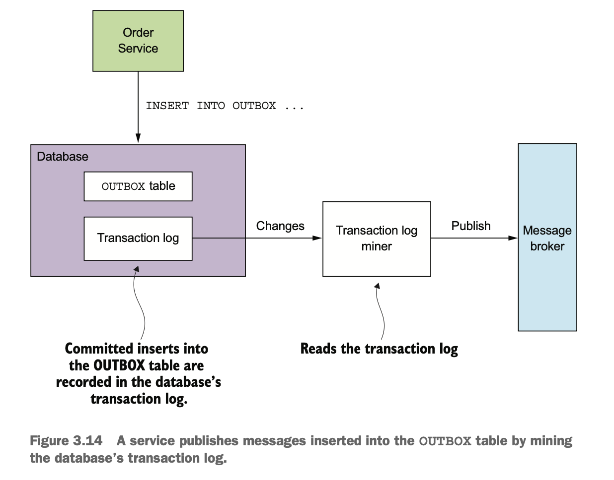

- Few examples of transaction log miners are
    - `Debezium (http://debezium.io):` - An open source project that publishes messages to apache kafka.
    - `LinkedIn Databus:` - An open source project that mines the Oracle transaction log and publishes the changes as events.
    - `DynamoDB streams:` - DynamoDB streams contain the time-ordered sequence of changes (creates, updates, and deletes)
      made to the items in a DynamoDB table in the last 24 hours.
    - `Eventuate Tram:` - An open source transaction messaging library that uses MySQL binlog protocol, Postgres WAL,
      or polling to read changes made to an OUTBOX table and publish them to Apache Kafka.

## Libraries and frameworks for messaging

- A message brokers client libraries are typically low level.
- It is better to use higher-level libraries like spring messaging(KakfaTemplate, JmsTemplate etc).
- These higher level libraries are simple to use for sending and receiving and follows declarative approach.
- Let's see all 3 types of messaging.

### Basic messaging

```
MessageProducer messageProducer = ...;
String channel = ...;
String payload = ...;
messageProducer.send(destination, MessageBuilder.withPayload(payload).build())

MessageConsumer messageConsumer;
messageConsumer.subscribe(subscriberId, Collections.singleton(destination),
     message -> { ... })
```

### Domain event publishing

```
## Producer
DomainEventPublisher domainEventPublisher;
String accountId = ...;
DomainEvent domainEvent = new AccountDebited(...);
domainEventPublisher.publish("Account", accountId, Collections.singletonList(
     domainEvent));

## Subscriber
DomainEventHandlers domainEventHandlers = DomainEventHandlersBuilder
            .forAggregateType("Order")
            .onEvent(AccountDebited.class, domainEvent -> { ... })
            .build();
new DomainEventDispatcher("eventDispatcherId",
            domainEventHandlers,
            messageConsumer);
```

### Command/Reply based messaging

```
CommandProducer commandProducer = ...;
Map<String, String> extraMessageHeaders = Collections.emptyMap();
String commandId = commandProducer.send("CustomerCommandChannel", 
                        new DoSomethingCommand(),
                        "ReplyToChannel",
                        extraMessageHeaders);


CommandHandlers commandHandlers = CommandHandlersBuilder
            .fromChannel(commandChannel)
            .onMessage(DoSomethingCommand.class, (command) -> { 
                ... ; 
                return withSuccess(); 
            })
            .build();
```

## Using asynchronous messaging to improve availability

- Consider the scenario shown below.
  - Client makes an HTTP POST /orders request to the Order Service.
  - Order Service retrieves consumer information by making an HTTP GET /consumers/id request to the Consumer Service.
  - Order Service retrieves restaurant information by making an HTTP GET /restaurant/id request to the Restaurant Service.  
  - Order service validates the request using the consumer and restaurant information.
  - Order service creates an Order.
  - Order service sends an HTTP response to the client.

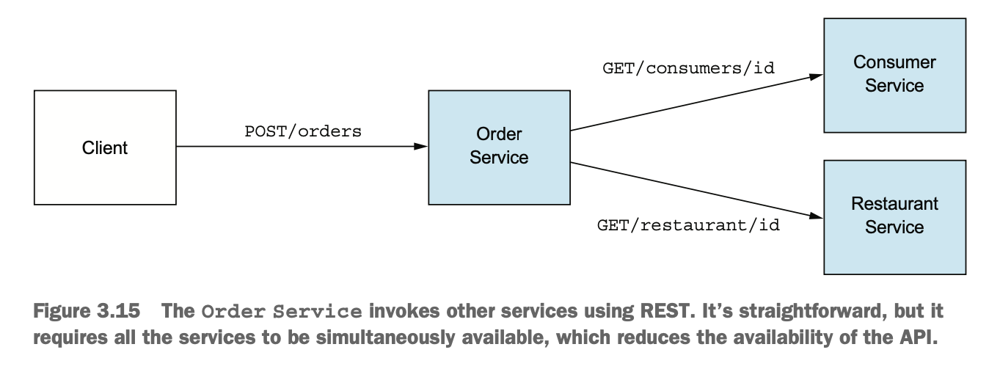

### Synchronous communication reduces availability.

- Assume the Order Service and the two services that it invokes are 99.5% available.
  - The overall availability is 99.5<sup>3</sup> = 98.5.
- Each additional service that participates in handling a request further reduces availability.

### Using asynchronous interaction styles

- There are two scenarios.
  - Clients support asynchronous request/response.
  - Client doesn't support asynchronous style.

### Clients support asynchronous request/response

- This architecture is extremely resilient, because message broker buffers messages until they are consumed.
- Here is the sample flow for order service.  
  - A client creates an `order` by sending a request message onto `Order request channel`. 
  - The order service receives message via `Order request channel`.
  - The order service creates `consumer request` and places onto `consumer request channel`.
  - The consumer service validates request and send response onto `Order Service reply channel`.
  - The order service consumes the message and creates `restaurant request`.
  - The order service sends the message onto `restaurant request channel`.
  - The restaurant service validates request and send response onto the same `Order Service reply channel`.
  - The order service consumes the message and creates `Order response`.
  - The order service sends the message onto `Client reply channel`.

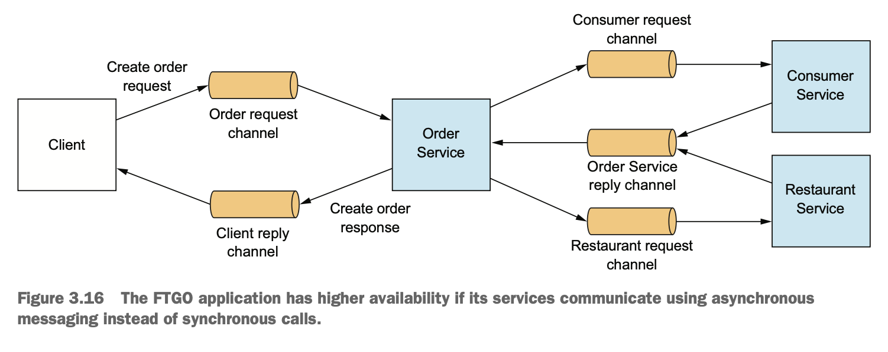    

### Client doesn't support asynchronous request/response

- Services often have an external API that uses a synchronous protocol such as REST.
- There are two ways to handle this.
  - Replicate Data.
  - Finish Processing after returning a response.

#### Replicate Data

- A service maintains a replica of the data that it needs when processing requests.
  - For ex, Order Service could maintain a replica of data owned by Consumer Service and Restaurant Service.
  - Consumer Service and Restaurant Service publish events whenever their data changes.
  - Order Service subscribes to those events and updates its replica.
- Benefits
  - This would enable a service to respond without interacting with dependent services.
    - For ex, Order Service replicates data from Restaurant Service so that it can validate and price menu items.
- Drawbacks
  - Replicating large amounts of data is inefficient.
    - For ex, Order Service to maintain a replica of the data owned by Consumer Service, due to the large number 
      of consumers is impractical.
  - Updating dependent services is not possible.
    - For ex, if Order service wants to update Restaurant/Consumer service, this approach won't work.

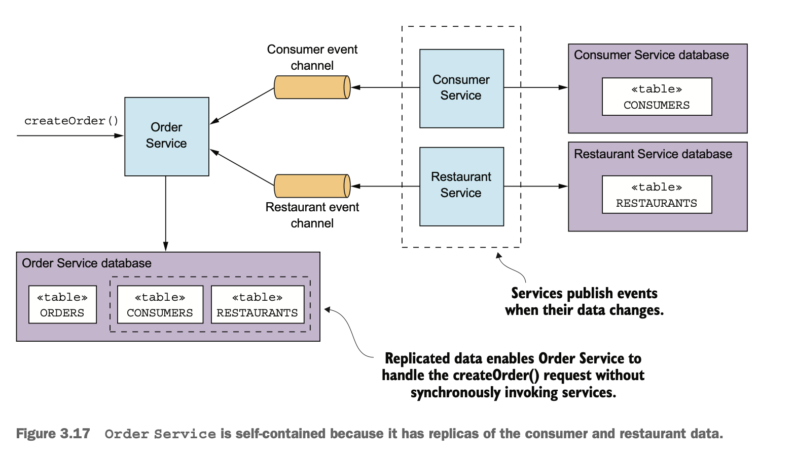 

#### Finish Processing after returning a response.

- A service to handle a request as follows:
  - Validate the request using only the data available locally.
  - Update its database, including inserting messages into the OUTBOX table.
  - Return a response to its client.
  - Asynchronously sends messages to other services.     
- This approach is often implemented in SAGA.
- For ex, if Order service uses this approach, the sequence of events are as follows.
  - Order Service creates an Order in a PENDING state.
  - Order Service returns a response to its client containing the order ID.
  - Order Service sends a ValidateConsumerInfo message to Consumer Service.
  - Order Service sends a ValidateOrderDetails message to Restaurant Service(concurrently with previous one).
  - Consumer Service receives a ValidateConsumerInfo message.
    - Consumer service verifies if consumer can place an order.
  - Consumer Service sends a ConsumerValidated message to Order Service.
  - Restaurant Service receives a ValidateOrderDetails message.
    - Restaurant Service verifies if menu items are valid.
  - Restaurant Service sends an OrderDetailsValidated message to Order Service.
  - Order Service receives ConsumerValidated and OrderDetailsValidated and changes the state of the order to VALIDATED.
- Order Service can receive the ConsumerValidated and OrderDetailsValidated messages in any order.
  - If Order service receives ConsumerValidated first, the state of the order is updated to CONSUMER_VALIDATED.
  - If Order service receives OrderDetailsValidated first, the state of the order is update to ORDER_DETAILS_VALIDATED.
- Order Service changes the state of the Order to VALIDATED only after receiving the other message.
- Drawbacks
  - The only drawback with this approach is that it makes client code(Order Service) complex.

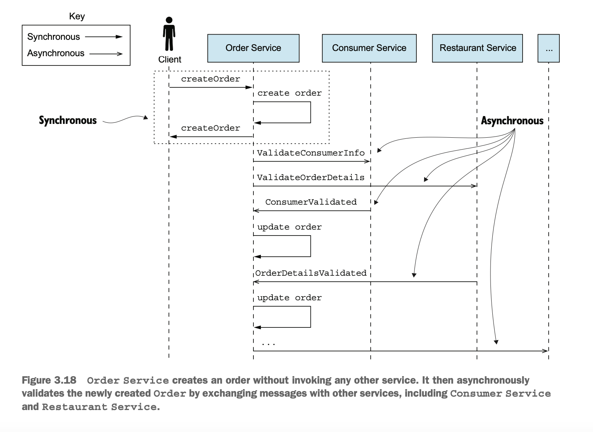
    
