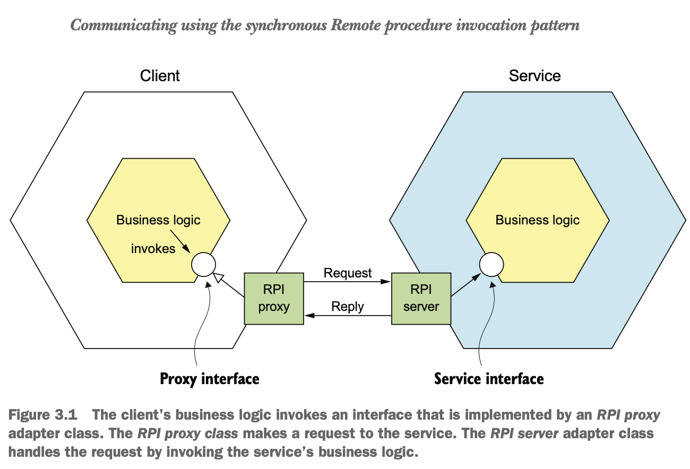
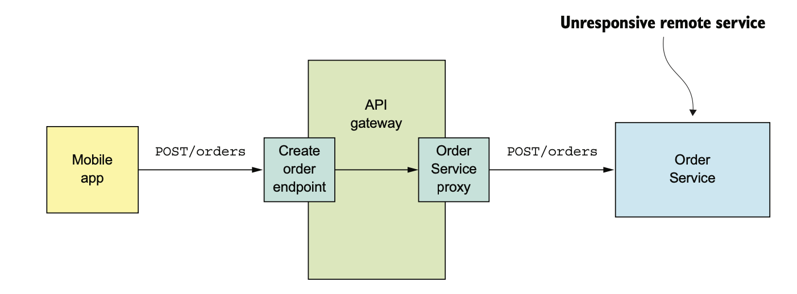

# Overview of IPC

- Service instances are typically processes running on multiple machines.
- They must interact using IPC(Inter process communication).
- The choice of IPC is an important architectural decision, because it impacts availability of the application.

## IPC technologies

- There are plenty of different IPC technologies.
  - Synchronous request/response based. Ex: REST, gRPC.
  - Asynchronous message-based communication mechanisms such as AMQP or STOMP.  
- Services can use human-readable, text-based formats such as JSON or XML.
- Alternatively, they could use a more efficient binary format such as Avro or Protocol Buffers.

### Interaction styles

- There are a variety of client-service interaction styles.
- The first dimension:
  - `One-to-one:` Each client request is processed by exactly one service.
  - `One-to-many:` Each request is processed by multiple services.
- The second dimension:
  - `Synchronous:` The client expects a timely response from the service and might even block while it waits.
  - `Asynchronous:` The client doesn't block, and the response, if any, isn’t necessarily sent immediately.

### One-to-One interaction styles

- `Request/response:`  A service client makes a request to a service and waits for a response. 
- `Asynchronous request/response:` A service client sends a request to a service, which replies asynchronously. 
- `One-way notifications:` A service client sends a request to a service, but no reply is expected or sent.

### One-to-Many interaction styles

- `Publish/subscribe:` A client publishes a notification message, which is consumed by zero or more interested services.
- `Publish/async responses:` A client publishes a request message and then waits for a certain amount of time for 
  responses from interested services.

## Defining Apis

- A service’s API is a contract between the service and its clients.
- If a new version of an api is released with an incompatible API, there will be runtime failures.
- It’s important to precisely define a service’s API using some kind of interface definition language(IDL).
- Up-front design increases the chances of building a service that meets the needs of its clients.

## Evolving Apis

- A service's clients are other services.
- These clients are often other app teams within the organization or may be external to the organization.
- As modern applications are never down for maintenance, we typically perform rolling updates.
- Rolling updates to a service run both old and new versions simultaneously.

### Semantic Versioning

- The Semantic Versioning specification (Semvers) requires a version number to consist of three parts: 
  - MAJOR.MINOR.PATCH.
    - `MAJOR:` Makes an incompatible change to the API.
    - `MINOR:` Makes backward-compatible enhancements to the API. 
    - `PATCH:` Makes a backward-compatible bug fix.

### Making minor, backward-compatible changes

- Ideally, one should strive to only make backward-compatible changes.
- Backward-compatible changes are additive changes to an API:
  - Adding optional attributes to request 
  - Adding attributes to a response
  - Adding new operations
- Use robustness principle while working with services.
- Robustness states `Be conservative in what you do, be liberal in what you accept from others`.
  - Services should provide default values for missing request attributes.
  - Similarly, clients should ignore any extra response attributes.

### Making major, breaking changes

- Because we can't force clients to upgrade immediately, a service must simultaneously support old and new versions 
  of an API for some period of time.
- To achieve this, we can use two approaches.
  - `Embed major version in URL`. 
    - For example, version 1 paths are prefixed with '/v1/orders', and version 2 paths with '/v2/orders'.
  - `Content Negotiation:` This includes version number in the MIME type.
    - For example, a client would request version 1.x of an Order using a request like this:

```
    GET /orders/xyz HTTP/1.1
    Accept: application/vnd.example.resource+json; version=1
```
- This request tells the Order Service that the client expects a version 1.x response.    

## Message Formats

- The choice of message format can impact the efficiency, usability and evolution of the API.
- Services may be written in different programming languages and may change to a different language over time.
- It’s essential to use a cross-language message format.
- There are two main categories of message formats: text and binary.

### Text

- The most common text-based formats are JSON and XML.
  - Advantages  
    - These are human-readable and self descriptive.
    - Changes to the message schema can easily be backward-compatible.
  - Disadvantages
    - Messages are verbose, especially XML.
      - Every message has the overhead of containing the names of attributes in addition to their values.
    - Overhead of parsing text when messages are large.

### Binary

- If efficiency and performance are important, consider using a binary format.
- Popular formats are Protocol Buffers and Avro.
- Both formats provide a typed IDL for defining the structure of your messages.
- A compiler generates the code that serializes and deserializes messages.
- This approach forces to take an API-first approach to service design.
- Protocol Buffers uses tagged fields, whereas an Avro consumer needs to know the schema in order to interpret messages.

## Communication Using Synchronous RPI(Remote procedure Invocation)

### RPI

- The business logic in the client invokes a proxy interface , implemented by an RPI proxy adapter class. 
- The RPI proxy makes a request to the service. 
- The request is handled by an RPI server adapter class, which invokes the service’s business logic via an interface. 
- The RPI server sends back a reply to the RPI proxy, which returns the result to the client’s business logic.

- `Note:` The proxy interface usually encapsulates the underlying communication protocol like REST, gRPC.



### REST

- A key concept in REST is a resource.
- A resource represents a single business object, such as a Customer or Product, or a collection of business objects.
- REST uses the HTTP verbs for manipulating resources.
- A GET request returns the representation of a resource.
- A POST request creates a new resource, and a PUT request updates a resource.
  - The Order Service has below endpoints. 
    - A POST /orders endpoint for creating an Order. 
    - A GET /orders/{orderId} endpoint for retrieving an Order.
- For design first approach of REST services The most popular IDL is Open API.  

### The REST maturity model

- Leonard Richardson defines a very useful maturity model for REST that consists of the following levels:
  - `Level 0:` 
    - Clients of a `level 0` service invoke the service by making `HTTP POST` requests to its sole URL endpoint. 
    - Each request specifies the action to perform, the target of the action, and any parameters.
  - `Level 1:`
    - A level 1 service supports the idea of resources. 
    - To perform an action on a resource, a client makes a POST request that specifies the action to perform and any parameters.
  - `Level 2:` 
    - A level 2 service uses HTTP verbs to perform actions: GET to retrieve, POST to create, and PUT to update. 
    - The request query parameters and body, if any, specify the actions' parameters. 
    - This enables services to use web infrastructure such as caching for GET requests.
  - `Level 3:`
    - The design of a level 3 service is based on HATEOAS (Hypertext As The Engine Of Application State) principle. 
    - The representation of a resource returned by a GET request contains links for performing actions on that resource. 
      - For example, a client can cancel an order using a link in the representation returned by the GET request that retrieved the order. 
    - The benefits of HATEOAS include no longer having to hard-wire URLs into client code.
- For more information on REST maturity model refer [REST maturity model](http://martinfowler.com/articles/richardsonMaturityModel.html)
- For information on advantages of HATEOS, refer [HATEOS](https://www.infoq.com/news/2009/04/hateoas-restful-api-advantages/)

### Fetching multiple resources in a single request

- A common problem when designing a REST API is how to enable the client to retrieve multiple related objects 
  in a single request.
- solution:
  - Design API to allow the client to retrieve related resources when it gets a resource.
  - For example, `GET /orders/order-id-1345?expand=consumer`.
- This approach won't work well for complex scenarios.
- Alternative technology to achieve this is GraphQL. GraphQL has efficient data fetching technology.

### Mapping operations to HTTP verbs

- Mapping the operations on a business resources to a http verb is not always straight forward.
- For ex, a REST api should use PUT operation for updating an order. 
  - There are other ways to update it using cancel, revise etc.
- One solution for this is to use a sub-resource.
  - Examples: `POST /orders/ {orderId}/cancel`, `POST /orders/{orderId}/ revise`.
- Another solution is to use URL parameters.
- `Note:` Both the above solutions are not restful.

### Benefits and Drawbacks of REST

#### Benefits

- It’s simple and familiar.
- You can test an HTTP API from within a browser(postman plugin), or with curl.
- It directly supports request/response style communication.
- HTTP is firewall friendly.
- It doesn’t require an intermediate broker, which simplifies the system’s architecture.

### Drawbacks

- It only supports the request/response style of communication.
- Reduced availability. Both client and server must be available.
- Clients must know the locations (URLs) of the service instances.
- Fetching multiple resources in a single request is challenging.
- It is difficult to map multiple update operations to HTTP verbs.

## gRPC

- The gRPC is a framework for writing cross-language clients and servers.
- The gRPC provides way to map multiple update operations to HTTP verbs.
- It is required to follow design first approach.  
- The Protocol Buffer compiler can generate code for a variety of languages, including Java, C#, NodeJS, and GoLang.
- The gRPC also supports streaming RPC. A client or a server can send stream of messages.

### gRPC API

- A gRPC API consists of one or more services and request/response message definitions.
- A service definition is analogous to a Java interface and is a collection of strongly typed methods.

#### Protocol Buffer

- It is an efficient, compact, binary format.
- It uses a tagged format.
- Each field of a Protocol Buffers message is numbered and has a type code.
- A message recipient can extract the fields that it needs and skip over the fields that it doesn’t recognize.
- As a result, gRPC enables APIs to evolve while remaining backward-compatible.

```
        service OrderService{
          rpc createOrder(CreateOrderRequest)returns(CreateOrderReply){}
          rpc cancelOrder(CancelOrderRequest) returns (CancelOrderReply) {}
          rpc reviseOrder(ReviseOrderRequest) returns (ReviseOrderReply) {} 
        }

        message CreateOrderRequest {
          int64 restaurantId = 1;
          int64 consumerId = 2;
          repeated LineItem lineItems = 3;
        ...
        }
        
        message LineItem {
          string menuItemId = 1;
          int32 quantity = 2;
        }
        
        message CreateOrderReply {
          int64 orderId = 1;
        }        
        
```

- CreateOrderRequest and CreateOrderReply are typed messages. 
  - For example, CreateOrderRequest message has a restaurantId field of type int64. The field’s tag value is 1.
  
#### Advantages

- It’s straightforward to design an API that has a rich set of update operations.
- It has an efficient, compact IPC mechanism, especially when exchanging large messages.
- Bidirectional streaming enables both RPI and messaging styles of communication.
- It enables interoperability between clients and services written in a wide range of languages.

### Drawbacks

- It takes more work for JavaScript clients to consume gRPC-based API than REST/JSON-based APIs.
- Older firewalls might not support HTTP/2.

## Handling Partial failures

- Services may not respond to client's request due to failure, maintenance activities or very slow due to extreme load.
- The client is blocked waiting for a response
- If there is a failure, that could cascade to the client’s clients and so on and cause an outage.
- Consider the below example. 
  - The Order Service proxy would block indefinitely.
  - It causes increased load on the API Gateway by consuming important resources like threads.




- We must design Robust RPI proxies, such as OrderServiceProxy, to handle unresponsive remote services.
- Also, we must decide how to recover from a failed remote service.

### Design Robust Proxies

- `Network timeouts:` 
  - Never block indefinitely and always use timeouts when waiting for a response.
- `Limiting the number of requests:`
  - Impose an upper bound on the number of outstanding requests that a client can make to a particular service.
  - If the limit is reached, further attempts should fail immediately.
- `Circuit breaker pattern:`
  - Track the number of successful and failed requests.
  - If the error rate exceeds some threshold, trip the circuit breaker so that further attempts fail immediately.
  - After a timeout period, the client should try again, and, if successful, close the circuit breaker.
  
### Recovering from failure

- This decides how services should recover from unresponsive remote service.
- These decisions vary based on the below scenarios.  
  - `Return an error to the client`
    - For ex, if Order creation service fails, it should return error to mobile client.
  - `Fallback`
    - Fallback means return either default or cached response.
    - For ex, the endpoint `findOrder(GET /order/{orderId})` requires APIGateway to compose responses from Order Service, Kitchen Service, Delivery Service.
    - The client can display useful information if Delivery service is unavailable as this is not so important.
    - In this scenario, API Gateway(or other composed service) can return either cached data or omit the response from this service.

## Service Discovery

- Service instances have dynamically allocated Ipaddresses.
- The set of service instances change dynamically due to failures, scaling and upgrades etc.
- The key component of Service Discovery is service registry.
- This is a database of the network locations of an application’s service instances.

### Overview of Application level service discovery

- The application level service discovery is a combination of two patterns.
  - `Self Registration`
    - A service instance invokes the service registry’s registration API to register its network location.
    - It may also supply a health check URL.
    - The service registry invokes health check URL periodically to verify that the service instance is healthy.
    - A service registry may require a service instance to periodically invoke a “heartbeat” API in order to prevent its registration from expiring.
  - `Client-side discovery`
    - A service client queries the service registry to obtain a list of the service’s instances.
    - A client might cache the service instances to improve performance.
    - The service client uses a load-balancing algorithm, such as a round-robin or random, to select a service instance.
- The popular application level service discovery is Eureka for java/spring apps.
- Benefits  
  - Application level service discovery works with services are deployed on multiple deployment platforms.
- Drawbacks
  - It works with only one language/framework. For ex, Eureka works with java apps.

### Overview of platform provided service discovery

- The deployment platform includes a service registry that tracks the IP addresses of the deployed services.
- The deployment platform automatically load balances requests across the three instances of the Order Service.
- Service discovery flow
  - The deployment platform gives each service a DNS name and a virtual IP (VIP) address.
  - The DNS name resolves to the VIP address.
  - A service client makes a request to the DNS name/VIP.
  - The deployment platform automatically routes the request to one of the available service instances.

## Communicating using the Asynchronous messaging pattern

### Overview of messaging

- A message consists of a header and a message body.
- Header
  - The header is a collection of name-value pairs, metadata that describes the data being sent.
  - The header can also contain messageId, generated by either the sender or messaging infrastructure.
  - The header can also contain an optional return address, which specifies the message channel that a reply should be written to.
- Body
  - The message body is the data being sent.
  - There are several types of messages.
    - `Document:` A generic message that contains only data.
    - `Command:` A message that specifies the operation to invoke and its parameters.
    - `Event:` A message indicating an event, which represents a state change of a domain object like Order, Customer etc.

### Overview of messaging channels

- Messages are exchanged over channels.
- There are two types of message channels.
  - `A point-to-point channel:` Delivers a message to exactly one of the consumers that is reading from the channel. 
    - For ex, a `command message`.
  - `A publish-subscribe channel:` Delivers each message to all the attached consumers.
    - For ex, an `event message`.


#### Asynchronous request/response

- Asynchronous messages are commonly used for one way notifications, where sender sends a message and receiver(s) consume.
- Asynchronous messages are also used for request/response style of communication.
  - The client sends a command message, which specifies the message identifier, operation to perform, and parameters.
  - The command message has a reply channel information in the header.
  - The server writes the reply message, which contains a correlation id that has the same value as message identifier to the reply channel.
  - The client uses the correlation id to match the reply message with the request.


## API's specification for a messaging-based service API

- The specification for a service’s asynchronous API must specify
  - Names of the message channels
  - Message types(command, document or event)


## Using a message broker

- A message broker is an intermediary through which all messages flow.
- Benefits
  - The sender doesn’t need to know the network location of the consumer.
  - A message broker buffers messages until the consumer is able to process them.
  - Flexible interaction styles
    - point-to-point
    - publish/subscribe
  
- Examples of popular open source message brokers:
  - ActiveMQ
  - RabbitMQ
  - Apache Kafka
  
### Selecting message broker

- The following factors need to be considered while selecting a message broker.
  - `Supported programming languages:` Does message broker supports a variety of programming languages?
  - `Supported messaging standards:`  Does broker follows standards such as AMQP and STOMP, or proprietary?.
  - `Messaging ordering:` Does message broker which preservers order?.
  - `Delivery guarantees:` what delivery guarantees are provided?
  - `Persistence:` Does message broker persist data to disk and able to survive broker crashes?.
  - `Durability:` If a consumer reconnects to the message broker, does it receive the messages that were sent while disconnected.
  - `Scalability:` how scalable is the message broker?
  - `Latency:` what is the end-to-end latency?
  - `Competing consumers:` Does the message broker support competing consumers?
  
### Drawbacks

- `Potential performance bottleneck:` Fortunately, many modern message brokers are highly scalable.
- `Potential single point of failure:` It should be highly available, otherwise system reliability will be impacted.
- `Additional operational complexity:` It is another system that should be installed, configured and operated.

## Competing receivers and message ordering

- Preserving the order of messages is challenging when multiple instances of a same service compete.
  - `Problem`
    - For ex, there are three instances of a service reading from the same point-to-point channel.
    - A sender publishes Order Created, Order Updated, and Order Cancelled event messages sequentially.
    - The order of these events may go wrong due to network issues or due to any other reason.
  - `Solution`
    - A common solution is to use sharded channels(apache kafka).
    - A sharded channel consists of two or more shards, each of which behaves like a channel.
      - The sender specifies a shard key in the message’s header.
      - The message broker uses a shard key to assign the message to a particular shard/partition.
    - The messaging broker groups together multiple instances of a receiver(treats them as the same logical receiver).
      - For example, apache kafka uses the term consumer group.
      - The message broker assigns each shard to a single receiver.


## Handling duplicate messages

- A failure of a client, network, or message broker can result in a message being delivered multiple times.
- Duplicate messages can be handled in the following ways
  - `Idempotent message handlers:`
    - Application logic has to be idempotent.
    - If message is received multiple times, it will have no effect.
    - It is not practically possible to write idempotent message handlers all times.
  - `Tracking messages`
    - Consumer should track messages that it has processed and discard any duplicates.
    - There are two ways to handle this.
      - Store the message id of each message that is consumed in a new database table.
      - To record message ids in an application table instead of a dedicated table.
        - This approach is particularly useful when using a NoSQL database that has a limited transaction model.


## _Transactional Messaging_

- A service often needs to publish messages as part of a transaction along with updating the database.
- A service might update the database and then crash without sending to the message broker.  
- Distributed transaction that spans the database and the message broker are not supported by modern message brokers.

### _Using a database table as a message queue_

- One solution to the transaction messaging is Transactional outbox.
- This pattern uses a database table as a temporary message queue.
- As part of the db transaction that does CUD on business objects, the service inserts them into `OUTBOX` table.
- Atomicity is guaranteed because this is a local ACID transaction.
- The Outbox table acts as a temporary storage.
- The MessageRelay is a component(app) that reads messages from outbox table and publishes them to message broker.
- This approach works with NoSQL DBs also.


### _Publishing Events_

- There are two ways to publish events.

#### _Polling publisher pattern_

- MessageRelay component polls the OUTBOX table for unpublished messages.

```SELECT * FROM OUTBOX ORDERED BY ... ASC```

- MessageRelay publishes the messages to the message broker.
- MessageRelay deletes those messages from the OUTBOX table.

```
BEGIN
DELETE FROM OUTBOX WHERE ID in (....)
COMMIT
```
- Drawbacks
  - Frequently polling the database can be expensive.
  - All NoSQL databases may not support this.
  
#### _Transaction log tailing pattern_

- A sophisticated solution is for MessageRelay to tail the database transaction log (also called the commit log).
- Every committed update made is represented as an entry in the database’s transaction log.
- A transaction log miner can read the transaction log and publish each change as a message to the message broker.
  - The Transaction Log Miner reads the transaction log entries.
  - It converts each relevant log entry corresponding to an inserted message into a message.
  - It publishes that message to the message broker.
  - This works with both SQL and NOSQL.
    


- Few examples of transaction log miners are
  - `Debezium (http://debezium.io):` - An open source project that publishes messages to apache kafka.
  - `LinkedIn Databus:` - An open source project that mines the Oracle transaction log and publishes the changes as events.
  - `DynamoDB streams:` - DynamoDB streams contain the time-ordered sequence of changes (creates, updates, and deletes) 
    made to the items in a DynamoDB table in the last 24 hours.
  - `Eventuate Tram:` - An open source transaction messaging library that uses MySQL binlog protocol, Postgres WAL, 
    or polling to read changes made to an OUTBOX table and publish them to Apache Kafka.

    