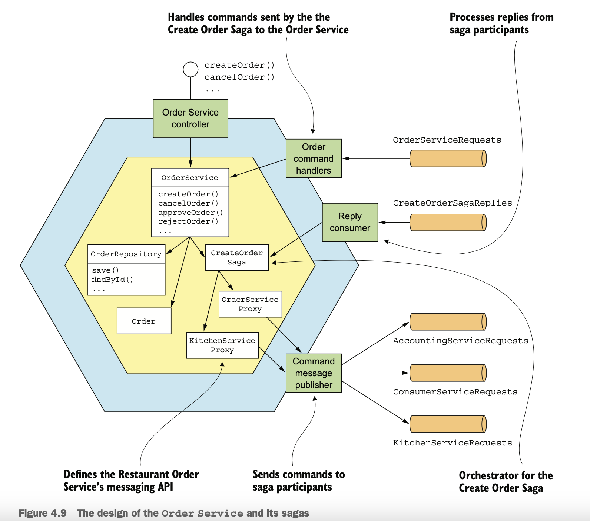
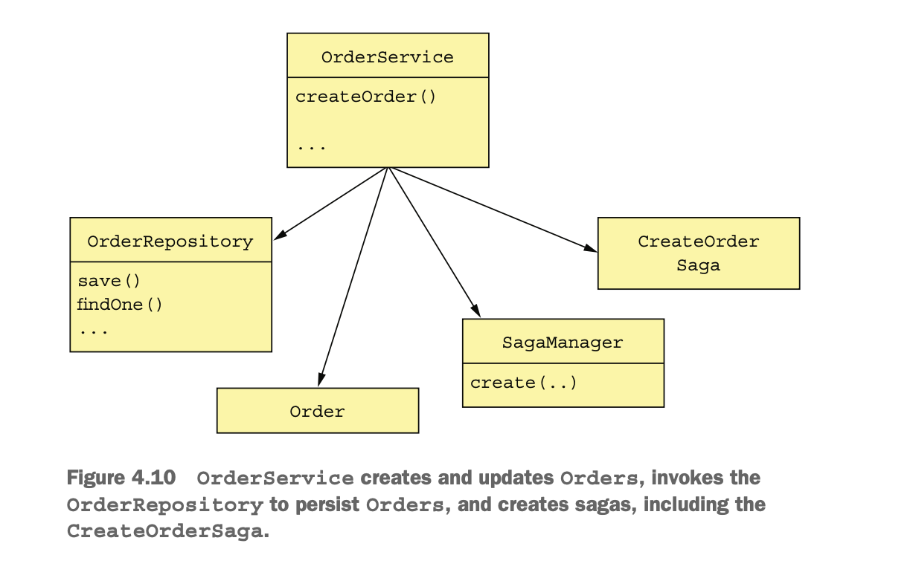
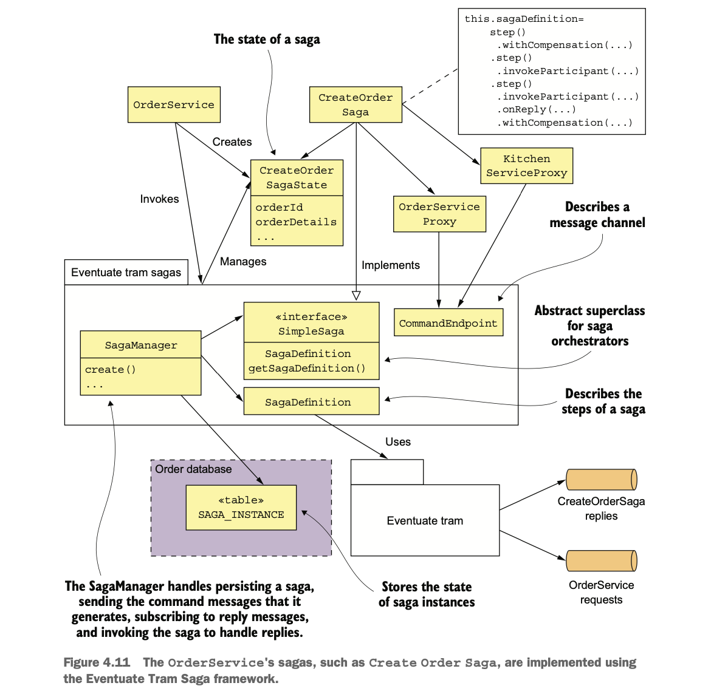
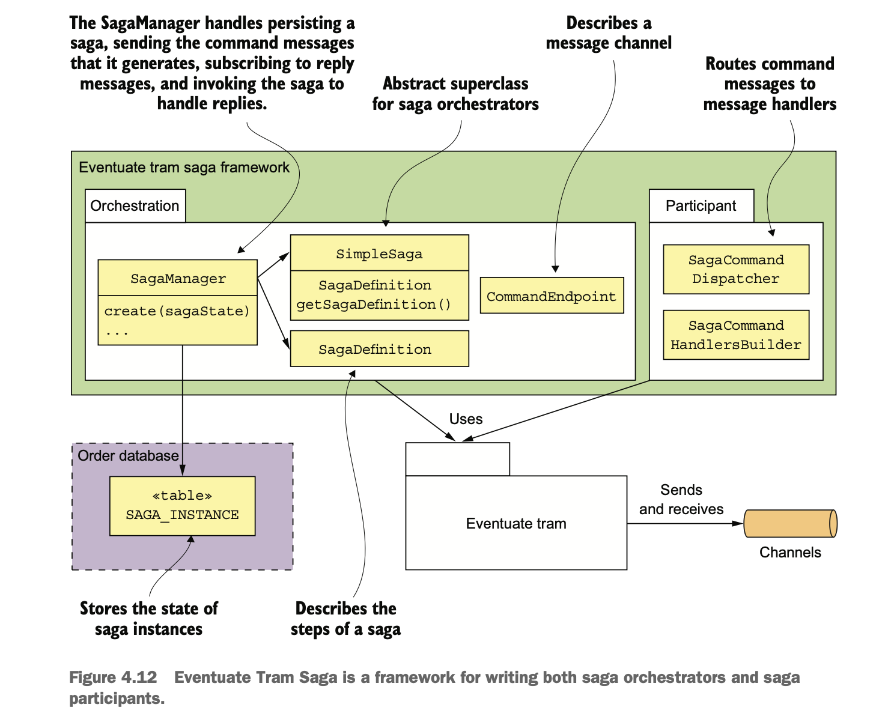
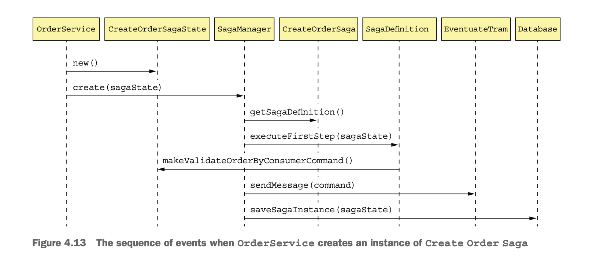
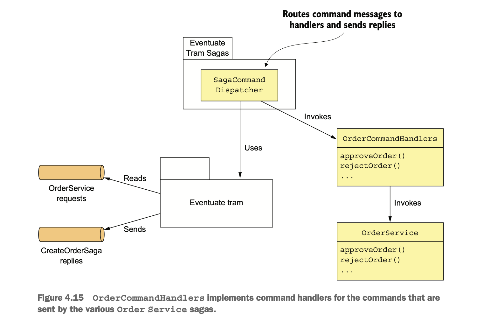

## The design of the Order Service and the Create Order Saga

- The order services business logic contains traditional business classes, such as OrderService, OrderEntity etc.
- Order Service
    - OrderService has methods which are invoked by system commands from OrderController.
    - Order Service also participates in its own sagas, it has an OrderCommandHandlers adapter class that handles command
      messages by invoking OrderService.
- Saga Orchestrator      
  - There are also saga orchestrator classes such as CreateOrderSaga, CreateOrderSagaState.
- Service proxies
  - The saga orchestrators send command messages to a saga participant using a saga participant proxy class.
    - KitchenServiceProxy
    - OrderServiceProxy


      
### OrderService class

- OrderService creates and udpates orders.
- OrderService invokes OrderRepository to persist orders.
- OrderService creates saga, such as CreateOrderSaga using the SagaManager.
  - The SagaManager class is one of the classes provided by the Eventuate Tram Saga framework.
    


- OrderService create() method is inovked by OrderController.
- The create() method does the following.
  - Persists the Order using the OrderRepository.
  - Creates the CreateOrderSaga by calling SagaManager.create(), passing a CreateOrderSagaState containing the ID of 
    the newly saved Order and the OrderDetails.
    - The SagaManager(framework class)
      - Instantiates the saga orchestrator.
      - Sends a command message to the first saga participant.
      - Persists the saga orchestra- tor in the database.
- Let's see OrderService create method code.

```java
public class OrderService {

    private Logger logger = LoggerFactory.getLogger(getClass());

    private SagaInstanceFactory sagaInstanceFactory;

    private OrderRepository orderRepository;

    private RestaurantRepository restaurantRepository;

    private CreateOrderSaga createOrderSaga;

    private CancelOrderSaga cancelOrderSaga;

    private ReviseOrderSaga reviseOrderSaga;

    private OrderDomainEventPublisher orderAggregateEventPublisher;

    private Optional<MeterRegistry> meterRegistry;

    public OrderService(SagaInstanceFactory sagaInstanceFactory,
                        OrderRepository orderRepository,
                        DomainEventPublisher eventPublisher,
                        RestaurantRepository restaurantRepository,
                        CreateOrderSaga createOrderSaga,
                        CancelOrderSaga cancelOrderSaga,
                        ReviseOrderSaga reviseOrderSaga,
                        OrderDomainEventPublisher orderAggregateEventPublisher,
                        Optional<MeterRegistry> meterRegistry) {

        this.sagaInstanceFactory = sagaInstanceFactory;
        this.orderRepository = orderRepository;
        this.restaurantRepository = restaurantRepository;
        this.createOrderSaga = createOrderSaga;
        this.cancelOrderSaga = cancelOrderSaga;
        this.reviseOrderSaga = reviseOrderSaga;
        this.orderAggregateEventPublisher = orderAggregateEventPublisher;
        this.meterRegistry = meterRegistry;
    }

    @Transactional
    public Order createOrder(long consumerId, long restaurantId, DeliveryInformation deliveryInformation,
                             List<MenuItemIdAndQuantity> lineItems) {
        Restaurant restaurant = restaurantRepository.findById(restaurantId)
                .orElseThrow(() -> new RestaurantNotFoundException(restaurantId));

        List<OrderLineItem> orderLineItems = makeOrderLineItems(lineItems, restaurant);

        ResultWithDomainEvents<Order, OrderDomainEvent> orderAndEvents =
                Order.createOrder(consumerId, restaurant, deliveryInformation, orderLineItems);

        Order order = orderAndEvents.result;
        orderRepository.save(order);

        orderAggregateEventPublisher.publish(order, orderAndEvents.events);

        OrderDetails orderDetails = new OrderDetails(consumerId, restaurantId, orderLineItems, order.getOrderTotal());

        CreateOrderSagaState data = new CreateOrderSagaState(order.getId(), orderDetails);
        sagaInstanceFactory.create(createOrderSaga, data);

        meterRegistry.ifPresent(mr -> mr.counter("placed_orders").increment());

        return order;
    }
}
```



### The implementation of the Create Order Saga

- The Create Order Saga involves the following participants.
  - `CreateOrderSaga:`
    - A singleton class that defines the saga’s state machine.
    - It invokes the CreateOrderSagaState to create command messages.
    - Sends command messages to participants using message channels specified by the proxy classes.  
  - `CreateOrderSagaState`
    - It defines sagas persistent state.
    - It creates command messages.
  - `Saga participant proxy classes`
    - Each proxy class defines a saga participant’s messaging API.
      - It consists of CommandChannel, command message type and reply channel.

### Eventuate Tram saga framework

- The Eventuate Tram Saga framework provides a domain-specific language (DSL) for defining a saga’s state machine. 
- It executes the saga’s state machine and exchanges messages with saga participants using the Eventuate Tram framework.
- The framework persists the saga’s state in the database.

#### _THE CREATEORDERSAGA ORCHESTRATOR_

- The CreateOrderSaga implements SimpleSaga(framework), a base interface for sagas.
- The CreateOrderSaga’s constructor creates the saga definition and stores it in the sagaDefinition field.

```java
public class CreateOrderSaga implements SimpleSaga<CreateOrderSagaState> {


    private Logger logger = LoggerFactory.getLogger(getClass());

    private SagaDefinition<CreateOrderSagaState> sagaDefinition;

    public CreateOrderSaga(OrderServiceProxy orderService, ConsumerServiceProxy consumerService, KitchenServiceProxy kitchenService,
                           AccountingServiceProxy accountingService) {
        this.sagaDefinition =
                step()
                        .withCompensation(orderService.reject, CreateOrderSagaState::makeRejectOrderCommand)
                        .step()
                        .invokeParticipant(consumerService.validateOrder, CreateOrderSagaState::makeValidateOrderByConsumerCommand)
                        .step()
                        .invokeParticipant(kitchenService.create, CreateOrderSagaState::makeCreateTicketCommand)
                        .onReply(CreateTicketReply.class, CreateOrderSagaState::handleCreateTicketReply)
                        .withCompensation(kitchenService.cancel, CreateOrderSagaState::makeCancelCreateTicketCommand)
                        .step()
                        .invokeParticipant(accountingService.authorize, CreateOrderSagaState::makeAuthorizeCommand)
                        .step()
                        .invokeParticipant(kitchenService.confirmCreate, CreateOrderSagaState::makeConfirmCreateTicketCommand)
                        .step()
                        .invokeParticipant(orderService.approve, CreateOrderSagaState::makeApproveOrderCommand)
                        .build();

    }

    @Override
    public SagaDefinition<CreateOrderSagaState> getSagaDefinition() {
        return sagaDefinition;
    }
}
```

- The step(), invokeParticipant(), onReply(), and withCompensation() methods are part of the DSL provided by 
  Eventuate Tram Saga.
- `invokeParticipant`  
  - The call to invokeParticipant() defines the forward transaction. For ex,
    - It creates the CreateTicket command message by calling CreateOrderSagaState.makeCreateTicketCommand() and 
      sends it to the channel specified by kitchenService.create.
- `onReply`
  - The call to onReply() specifies that CreateOrderSagaState.handleCreateTicketReply() should be called when a 
    successful reply is received from Kitchen Service.
    - This method stores the returned ticketId in the CreateOrderSagaState.
- `withCompensation`
  - The call to withCompensation() defines the compensating transaction.
    - It creates a RejectTicketCommand message by calling CreateOrderSagaState.makeCancelCreateTicket() and sends
      it to the channel specified by kitchenService.create.

#### _THE CREATEORDERSAGASTATE CLASS_

- The CreateOrderSagaState class represents the state of a saga instance.
- An instance of this class is created by OrderService and is persisted in the database by the framework.
- Its primary responsibility is to create the messages that are sent to saga participants.

```java
public class CreateOrderSagaState {

    private Logger logger = LoggerFactory.getLogger(getClass());

    private Long orderId;

    private OrderDetails orderDetails;
    private long ticketId;

    public Long getOrderId() {
        return orderId;
    }

    private CreateOrderSagaState() {
    }

    public CreateOrderSagaState(Long orderId, OrderDetails orderDetails) {
        this.orderId = orderId;
        this.orderDetails = orderDetails;
    }

    public OrderDetails getOrderDetails() {
        return orderDetails;
    }

    public void setOrderId(Long orderId) {
        this.orderId = orderId;
    }

    public void setTicketId(long ticketId) {
        this.ticketId = ticketId;
    }

    public long getTicketId() {
        return ticketId;
    }

    CreateTicket makeCreateTicketCommand() {
        return new CreateTicket(getOrderDetails().getRestaurantId(), getOrderId(), makeTicketDetails(getOrderDetails()));
    }
    
    void handleCreateTicketReply(CreateTicketReply reply) {
        logger.debug("getTicketId {}", reply.getTicketId());
        setTicketId(reply.getTicketId());
    }

    private CancelCreateTicket makeCancelCreateTicketCommand() {
        return new CancelCreateTicket(getOrderId());
    }
}
```

#### _THE PROXY CLASSES_

- Let's see The KitchenServiceProxy class.
- It defines the command message endpoints for Kitchen Service.
- There are three endpoints:
  - `create:` Creates a Ticket
  - `confirmCreate:` Confirms the creation 
  - `cancel:` Cancels a Ticket

```java
public class KitchenServiceProxy {

  public final CommandEndpoint<CreateTicket> create = CommandEndpointBuilder
          .forCommand(CreateTicket.class)
          .withChannel(KitchenServiceChannels.COMMAND_CHANNEL)
          .withReply(CreateTicketReply.class)
          .build();

  public final CommandEndpoint<ConfirmCreateTicket> confirmCreate = CommandEndpointBuilder
          .forCommand(ConfirmCreateTicket.class)
          .withChannel(KitchenServiceChannels.COMMAND_CHANNEL)
          .withReply(Success.class)
          .build();
  public final CommandEndpoint<CancelCreateTicket> cancel = CommandEndpointBuilder
          .forCommand(CancelCreateTicket.class)
          .withChannel(KitchenServiceChannels.COMMAND_CHANNEL)
          .withReply(Success.class)
          .build();

}
```

- Proxy classes have two important benefits.
  - A proxy class defines static typed endpoints, which reduces the chance of a saga sending the wrong message to a service.
  - A proxy class is a well-defined API for invoking a service that makes the code easier to understand and test.

#### _THE EVENTUATE TRAM SAGA FRAMEWORK_

- The framework provides SimpleSaga(a base interface for sagas), and a SagaManager class.
- It creates and manages saga instances.
- The SagaManager does the following.
  - Sends the command messages.
  - Subscribes to reply messages.
  - Invokes the saga to handle replies.



- The sequence of events when OrderService creates a saga are as follows:
  - OrderService creates the CreateOrderSagaState.
  - It creates an instance of a saga by invoking the SagaManager.
  - The SagaManager executes the first step of the saga definition.
  - The CreateOrderSagaState is invoked to generate a command message.
  - The SagaManager sends the command message to the saga participant (the Consumer Service).
  - The SagaManager saves the saga instance in the database.


    
- The sequence of events when OrderService receives a reply are as follows:
  - Eventuate Tram invokes SagaManager with the reply from Consumer Service.
  - SagaManager retrieves the saga instance from the database.
  - SagaManager executes the next step of the saga definition.
  - CreateOrderSagaState is invoked to generate a command message.
  - SagaManager sends the command message to the specified saga participant(Kitchen Service).
  - SagaManager saves the update saga instance in the database.

- If a saga participant fails, SagaManager executes the compensating transactions in reverse order.

#### _The OrderCommandHandlers class_

- Order Service participates in its own sagas, especially for approving or rejecting an order.
- The OrderCommandHandlers class defines the handler methods for the command messages sent by these sagas.
- Each handler method invokes OrderService to update an Order and makes a reply message.
- The SagaCommandDispatcher class routes the command messages to the appropriate handler method and sends the reply.



```java
public class OrderCommandHandlers {

    @Autowired
    private OrderService orderService;

    public CommandHandlers commandHandlers() {
        return SagaCommandHandlersBuilder
                .fromChannel("orderService")
                .onMessage(ApproveOrderCommand.class, this::approveOrder)
                .onMessage(RejectOrderCommand.class, this::rejectOrder)

                .onMessage(BeginCancelCommand.class, this::beginCancel)
                .onMessage(UndoBeginCancelCommand.class, this::undoCancel)
                .onMessage(ConfirmCancelOrderCommand.class, this::confirmCancel)

                .onMessage(BeginReviseOrderCommand.class, this::beginReviseOrder)
                .onMessage(UndoBeginReviseOrderCommand.class, this::undoPendingRevision)
                .onMessage(ConfirmReviseOrderCommand.class, this::confirmRevision)
                .build();

    }

    public Message approveOrder(CommandMessage<ApproveOrderCommand> cm) {
        long orderId = cm.getCommand().getOrderId();
        orderService.approveOrder(orderId);
        return withSuccess();
    }


    public Message rejectOrder(CommandMessage<RejectOrderCommand> cm) {
        long orderId = cm.getCommand().getOrderId();
        orderService.rejectOrder(orderId);
        return withSuccess();
    }
}
```

#### _The OrderServiceConfiguration class_

- The Order Service defines several spring beans such as orderService, createOrderSagaManager, createOrderSaga, 
  orderCommandHandlers, orderCommandHandlersDispatcher, kitchenServiceProxy and orderServiceProxy etc.

```java
@Configuration
@Import({TramEventsPublisherConfiguration.class, SagaOrchestratorConfiguration.class, CommonConfiguration.class})
public class OrderServiceConfiguration {

  @Bean
  public OrderService orderService(SagaInstanceFactory sagaInstanceFactory,
                                   RestaurantRepository restaurantRepository,
                                   OrderRepository orderRepository,
                                   DomainEventPublisher eventPublisher,
                                   CreateOrderSaga createOrderSaga,
                                   CancelOrderSaga cancelOrderSaga,
                                   ReviseOrderSaga reviseOrderSaga,
                                   OrderDomainEventPublisher orderAggregateEventPublisher,
                                   Optional<MeterRegistry> meterRegistry) {

    return new OrderService(sagaInstanceFactory, orderRepository, eventPublisher, restaurantRepository,
            createOrderSaga, cancelOrderSaga, reviseOrderSaga, orderAggregateEventPublisher, meterRegistry);
  }

  @Bean
  public SagaManager<CreateOrderSagaState> createOrderSagaManager(CreateOrderSaga saga) {
      return new SagaManagerImpl<>(saga);
  }

  @Bean
  public CreateOrderSaga createOrderSaga(OrderServiceProxy orderService, ConsumerServiceProxy consumerService, KitchenServiceProxy kitchenServiceProxy, AccountingServiceProxy accountingService) {
    return new CreateOrderSaga(orderService, consumerService, kitchenServiceProxy, accountingService);
  }

  @Bean
  public SagaCommandDispatcher orderCommandHandlersDispatcher(OrderCommandHandlers orderCommandHandlers, SagaCommandDispatcherFactory sagaCommandDispatcherFactory) {
      return sagaCommandDispatcherFactory.make("orderService", orderCommandHandlers.commandHandlers());
  }

  @Bean
  public DomainEventDispatcher domainEventDispatcher(OrderEventConsumer orderEventConsumer, DomainEventDispatcherFactory domainEventDispatcherFactory) {
      return domainEventDispatcherFactory.make("orderServiceEvents", orderEventConsumer.domainEventHandlers());
  }
  
  @Bean
  public CancelOrderSaga cancelOrderSaga() {
    return new CancelOrderSaga();
  }

  @Bean
  public ReviseOrderSaga reviseOrderSaga() {
    return new ReviseOrderSaga();
  }


  @Bean
  public KitchenServiceProxy kitchenServiceProxy() {
    return new KitchenServiceProxy();
  }

  @Bean
  public OrderServiceProxy orderServiceProxy() {
    return new OrderServiceProxy();
  }

  @Bean
  public ConsumerServiceProxy consumerServiceProxy() {
    return new ConsumerServiceProxy();
  }

  @Bean
  public AccountingServiceProxy accountingServiceProxy() {
    return new AccountingServiceProxy();
  }

  @Bean
  public OrderDomainEventPublisher orderAggregateEventPublisher(DomainEventPublisher eventPublisher) {
    return new OrderDomainEventPublisher(eventPublisher);
  }

  @Bean
  public MeterRegistryCustomizer meterRegistryCustomizer(@Value("${spring.application.name}") String serviceName) {
    return registry -> registry.config().commonTags("service", serviceName);
  }
}
```  
  
