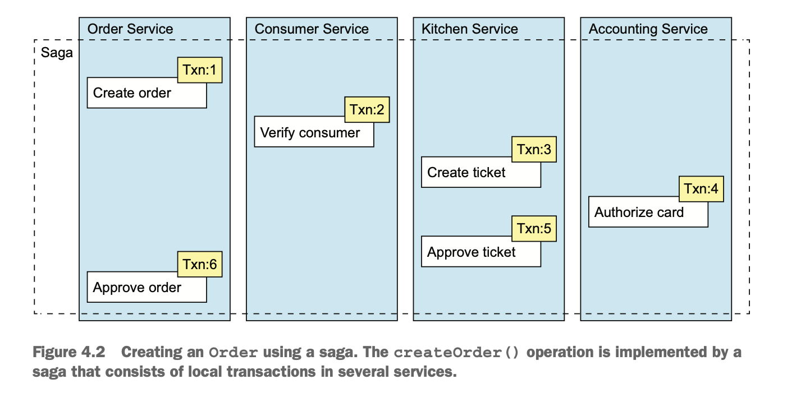
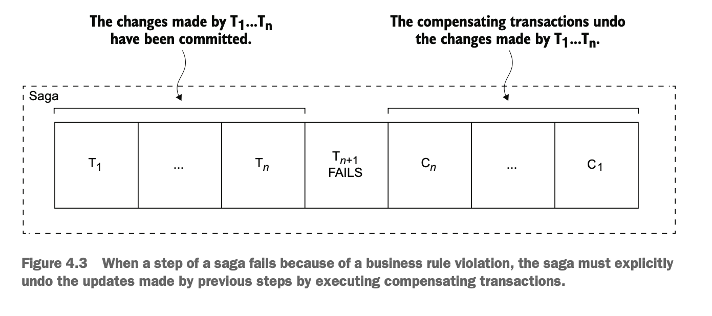
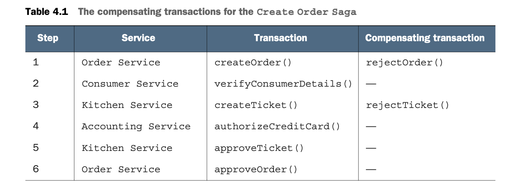
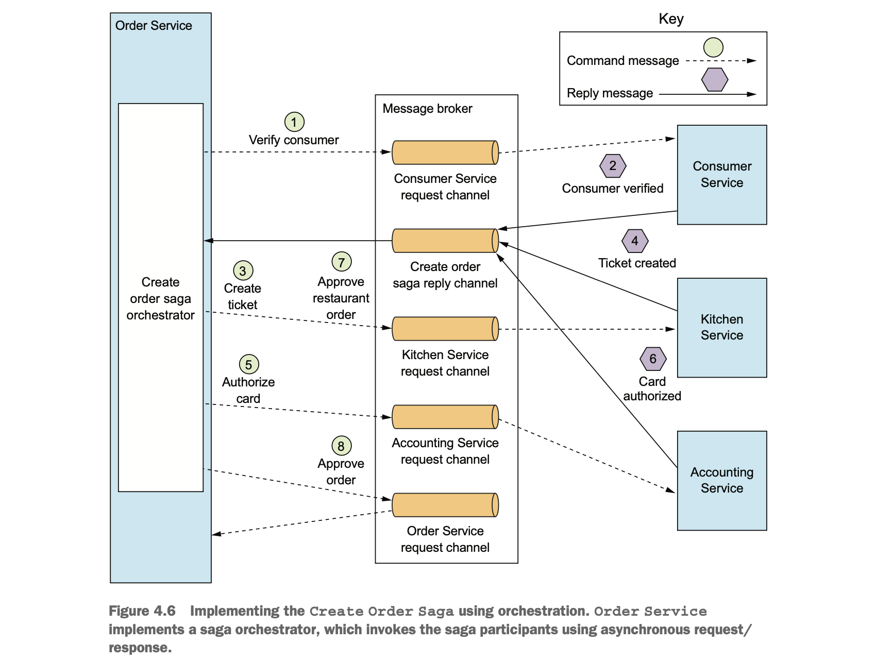
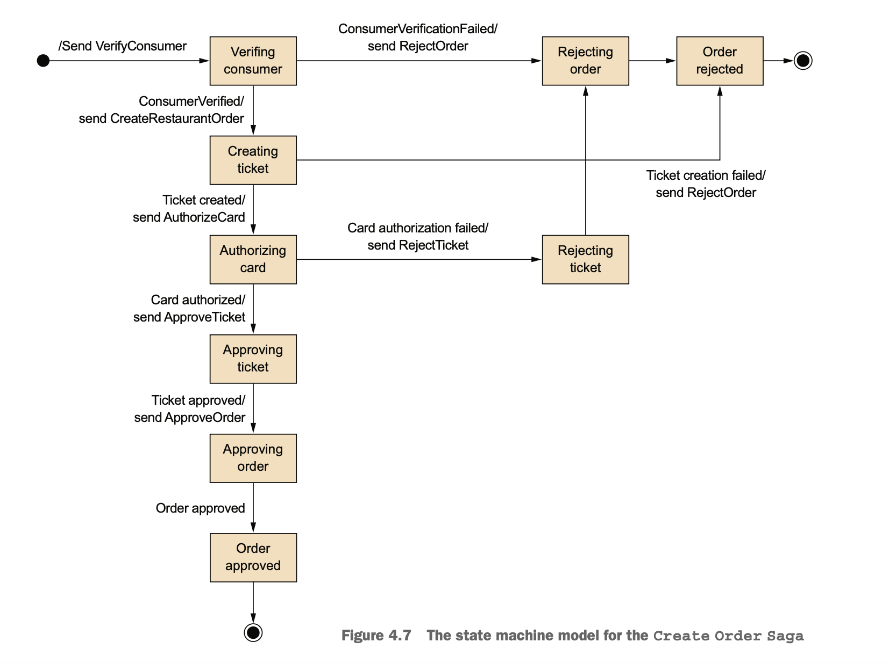
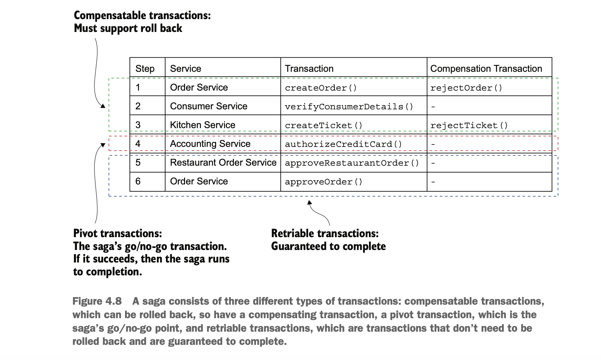

## Transaction management in a microservice architecture

- Enterprise applications use frameworks and libraries that simplify transaction management.
- These frameworks provide both programmatic and declarative approach.
- It is straight forward to use them.
- Transaction management in microservices is challenging, because data is scattered around multiple services.
- For ex, createOrder() operation accesses data in numerous services such as `Consumer Service` and updates data in
  `Order Service`, `Kitchen Service`, and `Accounting Service`.

## Distributed transactions

- The standard for distributed transaction management is the X/Open Distributed Transaction Processing (DTP) 
  Model (X/Open XA). 
- XA uses two-phase commit (2PC) to ensure that all participants in a transaction either commit or rollback.
- An XA-compliant technology stack consists of the following.
  - XA-compliant databases.
  - XA-compliant message brokers.
  - XA-compliant database drivers.
  - XA-compliant messaging APIs.
  - An IPC mechanism that propagates the XA global transaction ID.
- Most SQL DB technologies support XA.

### Trouble with Distributed transactions 
 
- Modern technologies like MongoDB, Cassandra, RabbitMQ, Apache Kafka don't support XA.
- XAs are a form of synchronous IPC, which reduces the availability.

## Using Sagas to maintain data consistency

- Sagas are mechanisms to maintain data consistency in microservices architecture without using XA.
- Define a saga for each system command that needs to update data in multiple services.
- A saga is a sequence of local transactions.
- Each local transaction updates data within a single service using ACID properties.
- The co-ordination of the steps are implemented using asynchronous messaging.
- The benefit of using sagas is that all steps are executed even if some services are temporarily unavailable.

### How it works

- Sagas differ from ACID transactions.
- Sagas lack the isolation property of ACID transactions because each local transaction commits its changes.
- In case of a failure a saga must be rolled back using compensating transactions.

#### Example SAGA

- Let's take `Create Order Saga` which is initiated by `createOrder` operation.
- This saga consists of the following local transactions:
  - `Order Service:` Create an Order in an APPROVAL_PENDING state.
  - `Consumer Service:` Verify that the consumer can place an order.
  - `Kitchen Service:` Validate order details and create a Ticket in the CREATE_PENDING.
  - `Accounting Service:` Authorize consumer’s credit card.
  - `Kitchen Service:` Change the state of the Ticket to AWAITING_ACCEPTANCE.
  - `Order Service:` Change the state of the Order to APPROVED.

#### Rollback

- Sagas use compensating transactions to rollback changes.
- Each transaction(Ti) in a saga has a compensating transaction(Ci).
- To undo the effects of those first n steps, the saga must execute each Ci in reverse order.  
- For example, if the authorization of the credit card fails in the fourth step of the Create Order Saga,
  the application must explicitly undo the changes made by the first three steps.

- Each step in a saga need compensating transaction, except for
  - Read-only steps(verifyConsumerDetails())
  - Steps that are followed by other steps which always succeed(For ex approveTicket() and approveOrder()).

    
- Consider the below scenarios where authorization of credit card fails.
  - `Order Service:` Create an Order in an APPROVAL_PENDING state.
  - `Consumer Service:` Verify that the consumer can place an order.
  - `Kitchen Service:` Validate order details and create a Ticket in the CREATE_PENDING state.
  - `Accounting Service:` Authorize consumer’s credit card, which fails.
  - `Kitchen Service:` Change the state of the Ticket to CREATE_REJECTED.
  - `Order Service:` Change the state of the Order to REJECTED.
- The last two steps are compensating transactions that undo the updates made by Kitchen Service and Order Service.

## Coordinating Sagas

- Sagas are initiated by system command.
- The coordination logic starts with the first saga participant.
- The first participant executes local transaction and invokes the next saga participant.
- This process continues until all saga participants have executed all steps.
- If any transaction fails, the saga must execute compensating transactions in reverse order.
- There are two ways to structure a saga's coordination logic.
  - Choreography
  - Orchestration

### Choreography based sagas

- Distribute the decision-making and sequencing among the saga participants.
- They primarily communicate by exchanging events.
- It's essential for each service to write to DB and publishing event to happen atomically.
- Each saga participant must publish events based on a correlationId.

- `Let's see the happy path for create order saga`
  - Order Service creates an Order in the APPROVAL_PENDING state and publishes an OrderCreated event.
  - Consumer Service consumes the OrderCreated event, verifies that the consumer can place the order, and 
    publishes a ConsumerVerified event.
  - Kitchen Service consumes the OrderCreated event, validates the Order, creates a Ticket in a CREATE_PENDING state, 
    and publishes the TicketCreated event.
  - Accounting Service consumes the OrderCreated event and creates a CreditCardAuthorization in a PENDING state.
  - Accounting Service consumes the TicketCreated and ConsumerVerified events, charges the consumer’s credit card, 
    and publishes the CreditCardAuthorized event.
  - Kitchen Service consumes the CreditCardAuthorized event and changes the state of the Ticket to AWAITING_ACCEPTANCE.
  - Order Service receives the CreditCardAuthorized events, changes the state of the Order to APPROVED, and 
    publishes an OrderApproved event.
    
- `Let's see the failure scenario for Credit card authorization failure`
  - Order Service creates an Order in the APPROVAL_PENDING state and publishes an OrderCreated event.
  - Consumer Service consumes the OrderCreated event, verifies that the consumer can place the order, 
    and publishes a ConsumerVerified event.
  - Kitchen Service consumes the OrderCreated event, validates the Order, creates a Ticket in a CREATE_PENDING state, 
    and publishes the TicketCreated event.
  - Accounting Service consumes the OrderCreated event and creates a CreditCardAuthorization in a PENDING state.
  - Accounting Service consumes the TicketCreated and ConsumerVerified events, charges the consumer’s credit card, 
    and publishes a Credit Card Authorization Failed event.
  - Kitchen Service consumes the Credit Card Authorization Failed event and changes the state of the Ticket to REJECTED.
  - Order Service consumes the Credit Card Authorization Failed event and changes the state of the Order to REJECTED.
- `Benefits`
  - `Simplicity:` Services publish events when they create, update, or delete business objects.
  - `Loose coupling:` The participants subscribe to events and don’t have direct knowledge of each other.
- `Drawbacks`
  - `Difficult to understand:` Choreography based sagas are difficult to understand by developers as there is no single place to understand logic.
  - `Cyclic dependencies between the services:` The saga participants subscribe to each other’s events, which often creates cyclic dependencies.
  - `Risk of tight coupling:` Each saga participant needs to subscribe to all events that affect them.
  
### Orchestration-based sagas

- Centralize a saga’s coordination logic in a saga orchestrator class.
- A saga orchestrator sends command messages to saga participants.
- `Let's see the happy path for create order saga`
  - The saga orchestrator sends a `Verify Consumer command` to Consumer Service.
  - Consumer Service replies with a Consumer Verified message.
  - The saga orchestrator sends a `Create Ticket command` to Kitchen Service.
  - Kitchen Service replies with a Ticket Created message.
  - The saga orchestrator sends an `Authorize Card message` to Accounting Service.
  - Accounting Service replies with a Card Authorized message.
  - The saga orchestrator sends an `Approve Ticket command` to Kitchen Service.
  - The saga orchestrator sends an `Approve Order command` to Order Service.
  

### Modeling Saga orchestrators as state machines

- Model saga orchestrator as a state machine.
- A state machine consists of a set of states and a set of transitions between states that are triggered by events.
- Each transition can have an action, which is an invocation of saga participant.
- The transitions between states are triggered by the completion of a local transaction performed by a saga participant.
- The state machine model for the Create Order Saga consists of numerous states as follows.
  - `Verifying Consumer:` The initial state. The saga is waiting for the Consumer Service for verification.
  - `Creating Ticket:` The saga is waiting for a reply to the Create Ticket command.
  - `Authorizing Card:` Waiting for Accounting Service to authorize the consumer’s credit card.
  - `Order Approved:` A final state indicating that the saga completed successfully.
  - `Order Rejected:` A final state indicating that the Order was rejected by one of the participants.

- `Benefits`
  - `Simpler dependencies:` No cyclic dependencies.
  - `Less coupling:` Each service doesn't need to know about the events published by saga participants.
  - `Improves separation of concerns and simplifies the business logic:`
    - The saga coordination logic is localized in the saga orchestrator.
    - The domain objects are simpler and have no knowledge of the sagas that they participate in.
      - For ex, the Order class has no knowledge of the sagas and has simpler state machine model.
      - During execution, it transitions directly from the APPROVAL_PENDING state to the APPROVED state.
- `Drawback`
  - The risk of centralizing too much business logic in the orchestrator.
- Design orchestrators only for sequencing and don’t write any other business logic.

## Handling lack of isolation

- The database property isolation ensures that each transaction has exclusive access to data.
- Updates made by saga's local transactions are easily visible to other sagas once the transaction commits.
  - This behavior causes two problems.
    - Other sagas can change the data accessed by the saga while it’s executing.
    - other sagas can read its data before the saga has completed its updates, consequently exposing inconsistent data.
- A saga guarantees ACD of a database ACID.
  - `Atomicity:` Ensures all transactions are executed or all changes are undone.
  - `Consistency:` Referential integrity within a service is handled by local databases and across services is handled
    by each service.
  - `Durability:` Handled by local databases.
- The lack of isolation causes anomalies.
  - Anomaly causes the outcome of executing sagas concurrently is different from if they were executed serially.

### _Overview of anomalies_

- The lack of isolation can cause the following three anomalies:
  - `Lost updates:` One saga overwrites without reading changes made by another saga.
  - `Dirty reads:` A saga reads the updates made by another saga that has not yet completed those updates.
  - `uzzy/nonrepeatable reads:` Two different steps of a saga read the same data and get different results because 
    another saga has made updates.

#### _Lost updates example_

- Consider the below scenario
  - One saga during its first step, creates an order with `Create Order Saga`.
  - During execution, another saga step from `Cancel Order Saga` cancels the Order.
  - The final step of the `Create Order Saga` approves the Order.
- `Create Order Saga` ignores the update made by the `Cancel Order Saga` and overwrites it.  
- As a result, the FTGO application will ship an order that the customer had cancelled.

#### _DIRTY READS example_

- A saga that cancels an order consists of the following transactions:
  - `Consumer Service:` Increase the available credit.
  - `Order Service:` Change the state of the Order to CANCELLED. 
  - `Delivery Service:` Cancel the delivery.
- Let's see an example of Cancel Order saga and Create Order Sagas, and the Cancel Order Saga is rolled back because 
  it’s too late to cancel the delivery.
  - `Cancel Order Saga:` Increase the available credit
  - `Create Order Saga:` Reduce the available credit.
  - `CancelOrderSaga:` A compensating transaction that reduces the available credit.
- `Note:` The `Create Order Saga` does a dirty read of the available credit that enables the consumer to place an order
  that exceeds their credit limit.

### Countermeasures for handling the lack of isolation

- Countermeasures are applied for handling anomalies caused by lack of isolation.
- There are various counter measures to deal with lack of isolation.
  - `Semantic lock:` An application-level lock.
  - `Commutative updates:` Design update operations to be executable in any order.
  - `Pessimistic view:` Reorder the steps of a saga to minimize business risk.
  - `Reread value:` Prevent dirty writes by rereading data to verify that it’s unchanged before overwriting it.
  - `Version file:` Record the updates to a record so that they can be reordered.
  - `By value:` Use each request’s business risk to dynamically select the concurrency mechanism.

#### THE STRUCTURE OF A SAGA

- A saga consists of three types of transactions:
  - `Compensatable transactions:` Transactions that can potentially be rolled back using a compensating transaction.
  - `Pivot transaction:` The go/no-go point in a saga.
    - If the pivot transaction commits, the saga will run until completion.
    - A pivot transaction can be a transaction that’s neither compensatable nor retriable.
  - `Retriable transactions:` Transactions that follow the pivot transaction and are guaranteed to succeed.

- The createOrder() and createTicket() transactions have compensating transactions that undo their updates.
- The verifyConsumerDetails() transaction is read-only, so doesn't need a compensating transaction.
- The authorizeCreditCard() transaction is this saga’s pivot transaction.
- The approveTicket() and approveOrder() steps are retriable transactions that follow the pivot transaction.

#### _COUNTERMEASURE: SEMANTIC LOCK_

- A saga’s compensatable transaction sets a flag(lock) in any record that it creates or updates.
- The flag indicates that the record isn’t committed and could potentially change.
- The Order.state field is a great example of a semantic lock.
  - The *_PENDING states, such as APPROVAL_PENDING and REVISION_PENDING, implement a semantic lock.
  - For ex, the first step of `Create Order Saga` creates an Order in an APPROVAL_PENDING state and the final step 
    changes the field to APPROVED.
- A saga should deal carefully when record that has been locked.
  - For ex, a client might invoke cancelOrder() operation to cancel an Order that’s in the APPROVAL_PENDING state.
  - There are different ways to deal with this.
    - `cancelOrder()` system command to fail and tell the client to try again later.
      - `Drawback`
        - The client code becomes complex because it has to implement retry logic.
    - `cancelOrder()` call blocks until the lock is released.
- `Benefits of semantic lock`
  - Sagas that update the same record are serialized, which significantly reduces the programming effort.
  - Sagas remove the burden of retries from the client.
- `Drawbacks of semantic locks`
  - The application must manage locks.
  - The application must implement a deadlock detection algorithm that performs a rollback of a saga to break a deadlock
    and re-execute it.

#### _COUNTERMEASURE: COMMUTATIVE UPDATES_

- Operations are commutative if they can be executed in any order.
- Design the update operations to be commutative.
- An Account’s debit() and credit() operations are commutative.
  - For ex, when a saga needs to be rolled back after a compensatable transaction has debited (or credited) an account.
  - The compensating transaction can simply credit (or debit) the account to undo the update.
  - There’s no possibility of overwriting updates made by other sagas.

#### _COUNTERMEASURE: PESSIMISTIC VIEW_

- `PESSIMISTIC VIEW` reorders the steps of a saga to minimize business risk due to a dirty read.
- For ex, consider the dirty read of the available credit scenario of `Create Order Saga`.
- Using this counter measure, the `Cancel Order Saga` can be re-ordered as below.
  - `Order Service:` Change the state of the Order to cancelled.
  - `Delivery Service:` Cancel the delivery.
  - `Customer Service:` Increase the available credit.

#### _COUNTERMEASURE: REREAD VALUE_

- The `reread value` countermeasure prevents lost updates.
- This countermeasure is a form of the Optimistic Offline Lock pattern.
- The `Create Order Saga` could use this countermeasure to handle the scenario where the Order is cancelled while it’s 
  in the process of being approved. 
  - The transaction that approves the Order verifies that the Order is unchanged since it was created.
    - If it’s unchanged, the transaction approves the Order.
    - If the Order has been cancelled, the transaction aborts the saga, which causes its compensating transactions to 
      be executed.
      
#### _COUNTERMEASURE: VERSION FILE_

- It’s a way to turn non-commutative operations into commutative operations.
- Consider a scenario where the Create Order Saga executes concurrently with a Cancel Order Saga.
  - It’s possible that the `Cancel Order Saga` cancels the authorization of the consumer’s credit card before the 
    `Create Order Saga` authorizes the card.
- One way to handle these out of order requests is to record the operations as they arrive and then execute them in 
  correct order.
  
#### _COUNTERMEASURE: BY VALUE_

- It’s a strategy for selecting concurrency mechanisms based on business risk.
- It uses the properties of each request to decide between using sagas and distributed transactions.
  - It executes low-risk requests using sagas, perhaps using above counter measures.
  - It executes high-risk requests involving, for example, large amounts of money, using distributed transactions.
  