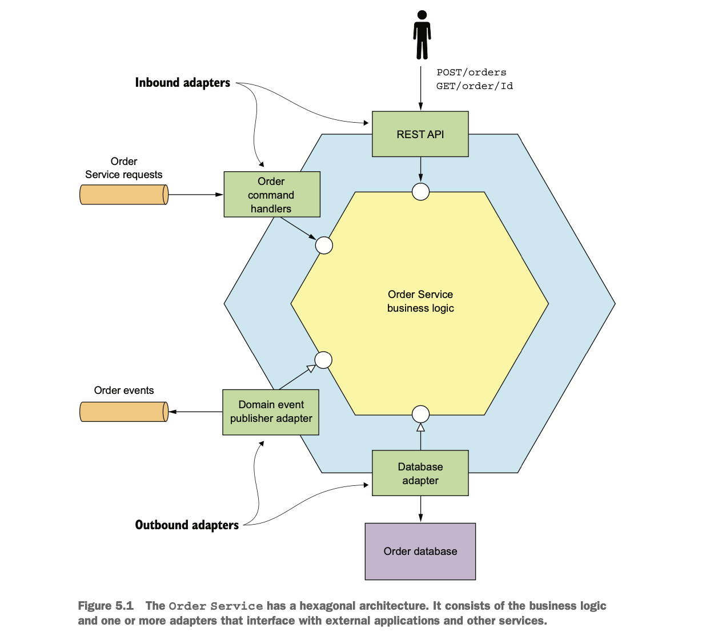
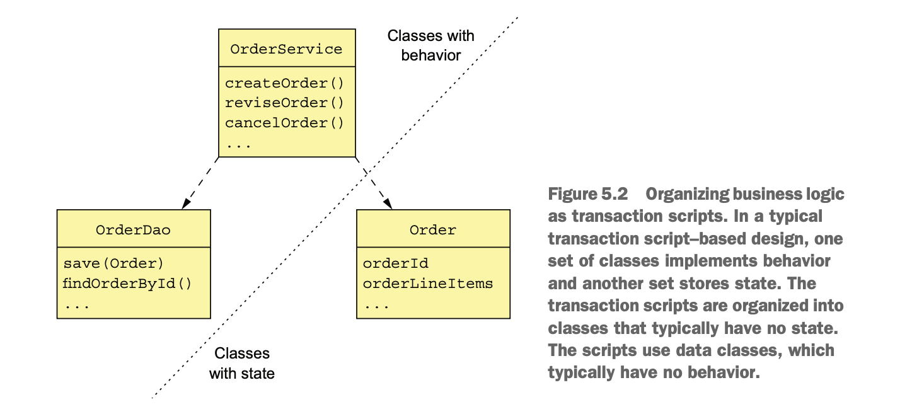
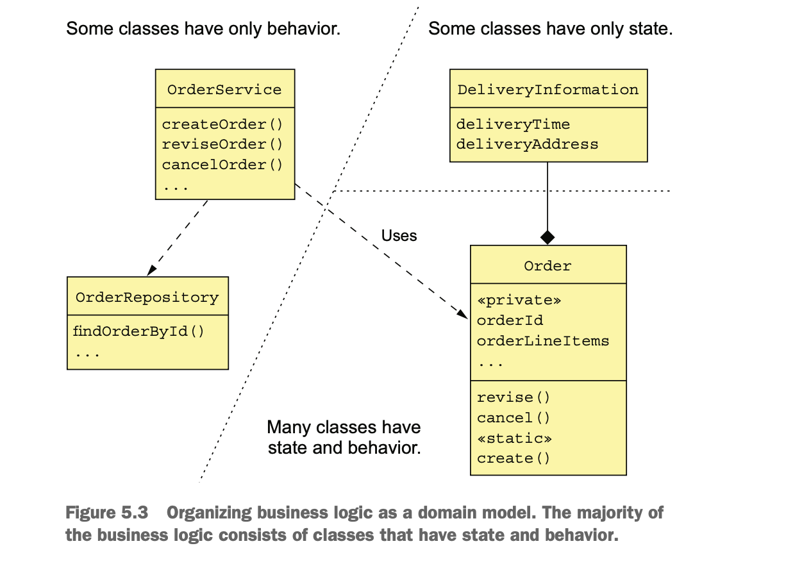
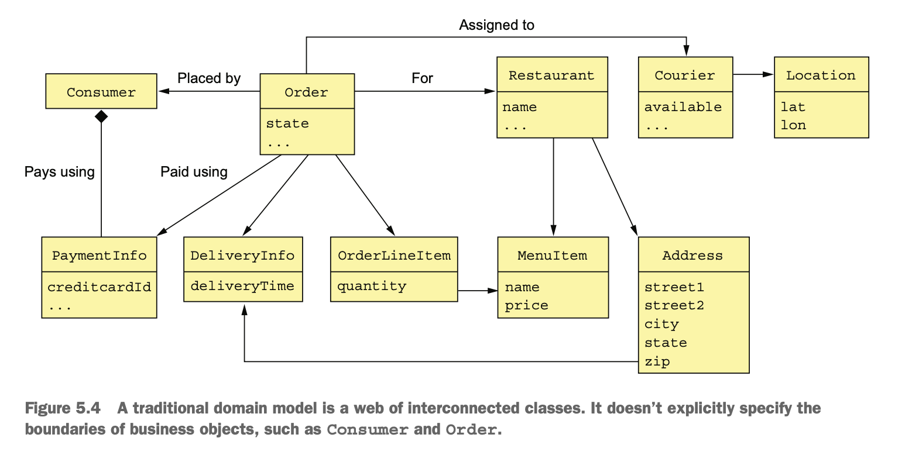
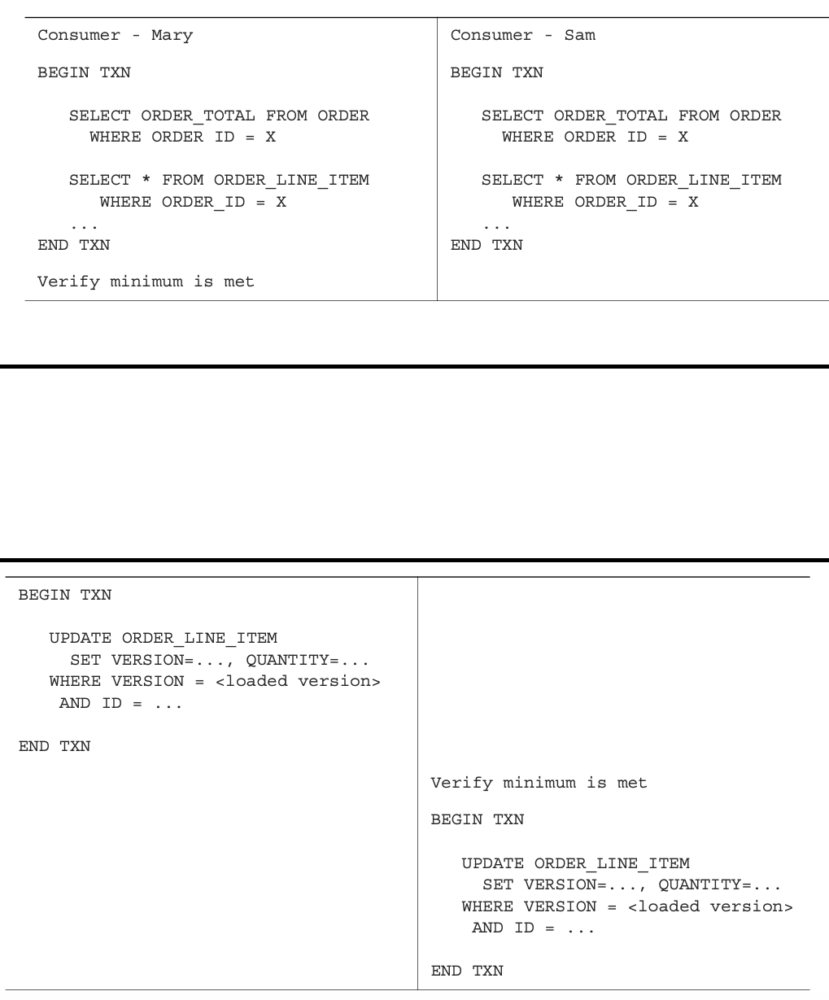
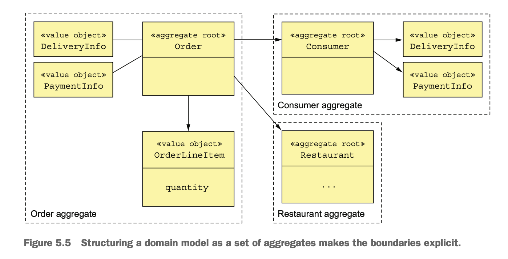
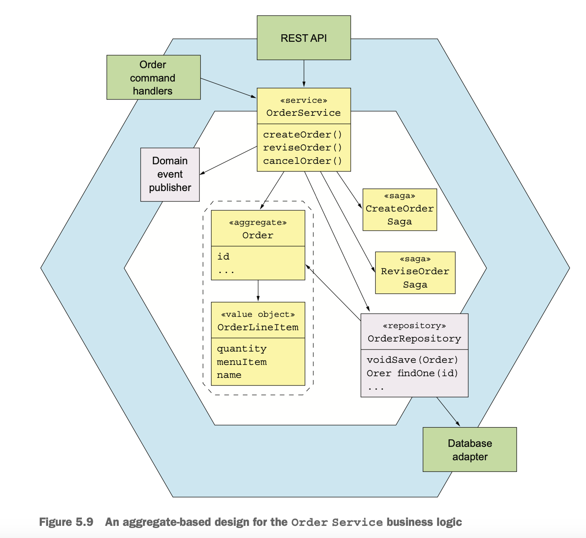
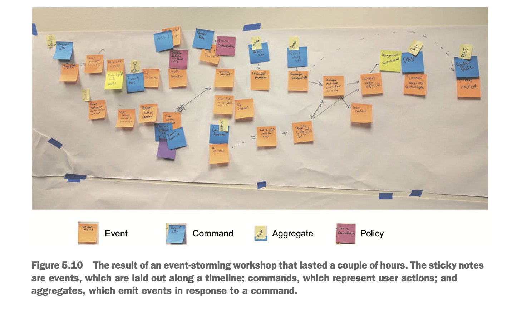

## Designing business logic in microservices

- Developing complex business logic is challenging in a microservice architecture because the business logic is spread over 
  multiple services.
- There are two challenges that needs addressing.
  - Designing domain model that span multiple services because a typical domain model consists of interconnected classes 
    using object references.
  - Designing business logic that works within the transaction management constraints of a microservice architecture.
- The above two issues can be addressed using aggregate pattern from DDD.

### Aggregate pattern

- The Aggregate pattern structures a service’s business logic as a collection of aggregates.
- An aggregate is a cluster of objects that can be treated as a unit.
- Aggregates are useful when developing logic in microservices for the following reasons.
  - Aggregates avoid any possibility of object references spanning service boundaries.
    - `An inter-aggregate reference is a primary key value rather than an object reference.`
  - A transaction can only create or update a single aggregate, aggregates fit the constraints of the microservices 
    transaction model.

###  Business logic organization patterns

- Business logic is the core of a hexagonal architecture.
- Surrounding the business logic are the inbound and outbound adapters.
- This service consists of the business logic and the following adapters:
  - `REST API adapter:` An inbound adapter that implements a REST API which invokes the business logic.
  - `OrderCommandHandlers:` An inbound adapter that consumes command mes- sages from a message channel and invokes the 
    business logic.
  - `Database Adapter:` An outbound adapter that’s invoked by the business logic to access the database.
  - `Domain Event Publishing Adapter:` An outbound adapter that publishes events to a message broker.



- There are two main patterns for organizing business logic:
  - The procedural Transaction script pattern.
  - The object-oriented Domain model pattern.

#### _Designing business logic using the Transaction script pattern_

- A transaction script to handle each request from the presentation tier.
- The classes that implement behavior are separate from those that store state.
- The scripts are usually located in service classes, like OrderService.
  - A service class has one method for each request/system operation.
  - The method implements the business logic for that request.
  - It accesses the database using DAOs, such as the OrderDao.
- This pattern is used when writing the application in C or another non-OOP language.
- This approach works well for simple business logic.



#### _Designing business logic using the Domain model pattern_

- In an object-oriented design, the business logic consists of an object model, a network of relatively small classes.
- These classes typically correspond directly to concepts from the problem domain.
- In this design some classes have only either state or behavior, but many contain both.



- In Domain model pattern, the service methods are usually simple.
- A service method almost always delegates to persistent domain objects.
  - A service method loads a domain object from the database and invoke one of its methods.
- The domain objects contain the bulk of the business logic.
  - For ex, the Order class has both state and behavior.
- `Benefits`
  - The design is easy to understand and maintain.
    - It consists of smaller classes each having fewer responsibilites.
  - `Easier to test`
    - Each class can and should be tested independently.
  - `Easier to extend`
    - It can use well-known design patterns, such as the Strategy pattern and the Template method pattern, that define 
      ways of extending a component without modifying the code.
- To work with microservices, we need to use a refinement of OOD known as DDD.
  
## Domain Driven Design

- In DDD, each service has its own domain model.
- It avoids the problem of a single application-wide domain model.
- Subdomains and the associated concept of Bounded Context are two of the strategic DDD patterns.
- DDD has the following building blocks.
  - `Entity:` An object which represents persistent identity.
    - Two entities whose attributes have the same values could still be different objects.
  - `Value object:` An object that represents a collection of values.
    - Two value objects whose attributes have the same values can be used interchangeably. For ex, Money class.
  - `Factory:` An object or method that implements object creation logic that is complex to done by the constructor.
    - A factory might be implemented as a static method of a class.
    - It can hide the concrete classes that are instantiated.
  - `Repository:` An object that encapsulates the mechanism for accessing the database.
  - `Service:` An object that implements business logic.

### Designing a domain model using the DDD aggregate pattern

- In traditional object-oriented design, a domain model is a collection of classes and relationships between classes.
- For ex, FTGO has Consumer, Order, Restaurant, and Courier.
- The explicit boundaries of each business object are not well-defined.
  - For ex, it doesn't define which classes are part of Order business object.
  


#### _The problem with fuzzy boundaries_

- Performing an operation on a business object doesn't define the scope properly.
  - For ex, load operation on Order should retrieve OrderLineItems, PaymentInfo etc.
- Business rules(or invariants) cannot be enforced.
  - For ex, an Order has a minimum order amount. Updating an order should not violate this invariant.

- Consider the below example.
  - Two user Mary and Sam are updating the same order on UI.
  - Sam reduces the quantity of samosa, and Mary reduces the quantity of naans.
  - Both consumers retrieve the order and its line items, UI verifies the minimum order criteria and then updates 
    line items to reduce the cost of the order.
  - From each consumer's perspective order minimum is preserved.
- The UI verifies the order minimum is satisfied before executing the second transaction.
- The second transaction uses an optimistic offline locking check verifies that the orderline is not changed.
- Because Sam and Mary are updating different line items, the transactions for both of them are going to succeed and 
  result in an invalid Order getting saved into DB.
- So, directly updating part of a business object can result in the violation of the business rules.



#### _Aggregates have explicit boundaries_

- An aggregate is a cluster of domain objects within a boundary that can be treated as a unit.
- An aggregate consists of a root entity and possibly one or more other entities and value objects.
- Aggregates are created from the nouns in the requirements such as Order, Customer, Restaurant etc.



- An aggregate defines the scope of operations such as load, update, and delete.
- An operation acts on an entire aggregate rather than parts of it.
  - This enforces invariants, there by avoiding any consistency issues caused by fuzzy boundaries mentioned above.
- An aggregate is often loaded in its entirety from the database.
  - This avoids any complications of lazy loading.
- Concurrency is handled by locking the aggregate root using a version number or db-level lock.
  - A client must invoke a method on the root of the Order aggregate to update orderline items, which enforces invariants.
- IDENTIFYING AGGREGATES IS KEY.
  - A key part of designing a domain model is identifying aggregates, their boundaries, and their roots.
  
#### _Aggregate Rules_

- DDD requires aggregates to obey a set of rules.
- These rules ensure that an aggregate is a self-contained unit that can enforce its invariants.
  - `REFERENCE ONLY THE AGGREGATE ROOT`
    - A client can only update an aggregate by invoking a method on the aggregate root.
      - For ex, a service uses a repository to load an aggregate from the database.
      - It updates an aggregate by invoking a method on the aggregate root.
  - `INTER-AGGREGATE REFERENCES MUST USE PRIMARY KEYS`
    - Aggregates reference each other by identity(primary key) instead of references.
      - For ex, an Order references its Consumer using a consumerId. 
      - similarly Order references a Restaurant using restaurantId.
    - `Benefits`
      - Aggregates are loosely coupled.
      - Boundaries are well-defined and prevents accidental updating a different aggregate.
      - Simplifies persistence, because aggregate is the unit of storage.
      - Eliminates the need of transparent lazy loading.
  - `ONE TRANSACTION CREATES OR UPDATES ONE AGGREGATE`
    - A transaction can only create or update a single aggregate.
      - This constraint also matches the limited transaction model of most NoSQL databases.
    - This rules makes it complicated to implement operations that needs to update multiple aggregates.
      - Sagas are designed to solve this problem.

### Aggregate granularity

- A key decision when designing a domain model is to decide on the size of the aggregate.
- If aggregates are small, the no of concurrent requests that can be handled by the application increases.
- If aggregates are large, the scope of a transaction on a large aggregate update is atomic.
  - For ex, If Consumer and Order are part of a single aggregate, an application can atomically update a consumer and
    its orders.
  - `Drawbacks`
    - Transactions that update different orders for the same customer would be serialized.
    - This is an obstacle to decomposition.
      - For ex, The business logic for Orders and Consumers must be collocated in the same service.
- Because of the above issues with larger aggregates, it is advisable to make aggregates as fine-grained as possible.

### Designing business logic with aggregates

- The bulk of the business logic consists of aggregates.
- The rest of the business logic resides in the domain services and the sagas.
  - The sagas orchestrate sequences of local transactions in order to enforce data consistency.
  - The services are the entry points into the business logic and are invoked by inbound adapters.
    - A service uses a repository to retrieve aggregates from the database or save aggregates to the database.
    - Each repository is implemented by an outbound adapter that accesses the database.



## Publishing domain events

- In the context of DDD, a domain event is something that has happened to an aggregate.
  - For ex, state-changing events include Order Created, Order Cancelled, Order Shipped.

### Reasons for publishing change events

- Maintaining data consistency across services using choreography-based sagas.
- Notifying a service that maintains a replica that the source data has changed(CQRS).
- Notifying a different application via a registered webhook or via a message broker in order to trigger the next step
  in a business process.
- Sending notifications such as text messages or emails to users informing them that their order has shipped.
- Monitoring domain events to verify that the application is behaving correctly.
- Analyzing events to model user behavior.

### Domain Event

- A domain event is a class has properties that meaningfully convey the event.
- Each property is either a primitive value or a value object.
- A domain event typically also has metadata, such as the event ID, and a timestamp.
- It might also have the identity of the user who made the change, because that’s useful for auditing.
- The metadata can be part of the event object, perhaps defined in a superclass.
- Alternatively, the event metadata can be in an envelope object that wraps the event object.
- The OrderCreated event is an example of a domain event.
- It doesn’t have any fields, because the Order’s ID is part of the event envelope.

```java
interface DomainEvent {}

interface OrderDomainEvent extends DomainEvent {}

class OrderCreatedEvent implements OrderDomainEvent {}


class DomainEventEnvelope<T extends DomainEvent> {
  private String aggregateType;
  private Object aggregateId;
  private T event;
}
```
- The DomainEvent interface(framework) is a marker interface that identifies a class as a domain event.
- OrderDomainEvent is a marker interface for events, such as OrderCreated, which are published by Order aggregate.
- The DomainEventEnvelope(framework) is a class that contains event metadata and the event object.

### Event enrichment

- An event consumer may need the order details when processing an OrderCreated event.
- There are two options for this.
  - Retrieve that information from the OrderService.
    - `Drawbacks`
      - Event consumer querying the service for the aggregate requires the overhead of a service request.
  - Event enrichment
    - Events contain the information that consumers need.
    - It simplifies event consumers because they don't need to request that data from the service.
    - For ex, an event consumer, such as the Order History Service no longer needs to fetch that data when processing 
      an OrderCreated event.
    - `Drawback`
      - An event class potentially needs to change whenever the requirements of its consumers change. 
     
```java
class OrderCreatedEvent implements OrderDomainEvent {
  private OrderDetails orderDetails;
  private Address deliveryAddress;
  private String restaurantName;

  private OrderCreatedEvent() {
  }

  public OrderCreatedEvent(OrderDetails orderDetails, Address deliveryAddress, String restaurantName) {

    this.orderDetails = orderDetails;
    this.deliveryAddress = deliveryAddress;
    this.restaurantName = restaurantName;
  }

}

public class Order {

  public static ResultWithDomainEvents<Order, OrderDomainEvent> createOrder(long consumerId, 
                                                                            Restaurant restaurant, 
                                                                            DeliveryInformation deliveryInformation, 
                                                                            List<OrderLineItem> orderLineItems) {
    Order order = new Order(consumerId, restaurant.getId(), deliveryInformation, orderLineItems);
    List<OrderDomainEvent> events = singletonList(new OrderCreatedEvent(
            new OrderDetails(consumerId, restaurant.getId(), orderLineItems,
                    order.getOrderTotal()),
            deliveryInformation.getDeliveryAddress(),
            restaurant.getName()));
    return new ResultWithDomainEvents<>(order, events);
  }
}

public class OrderService {

  private OrderDomainEventPublisher orderAggregateEventPublisher;
  
  @Transactional
  public Order createOrder(long consumerId, long restaurantId, DeliveryInformation deliveryInformation,
                           List<MenuItemIdAndQuantity> lineItems) {
    Restaurant restaurant = restaurantRepository.findById(restaurantId)
            .orElseThrow(() -> new RestaurantNotFoundException(restaurantId));

    List<OrderLineItem> orderLineItems = makeOrderLineItems(lineItems, restaurant);

    ResultWithDomainEvents<Order, OrderDomainEvent> orderAndEvents =
            Order.createOrder(consumerId, restaurant, deliveryInformation, orderLineItems);

    Order order = orderAndEvents.result;
    orderRepository.save(order);

    orderAggregateEventPublisher.publish(order, orderAndEvents.events);

    OrderDetails orderDetails = new OrderDetails(consumerId, restaurantId, orderLineItems, order.getOrderTotal());

    CreateOrderSagaState data = new CreateOrderSagaState(order.getId(), orderDetails);
    sagaInstanceFactory.create(createOrderSaga, data);

    meterRegistry.ifPresent(mr -> mr.counter("placed_orders").increment());

    return order;
  }
}

public class OrderDomainEventPublisher extends AbstractAggregateDomainEventPublisher<Order, OrderDomainEvent> {


  public OrderDomainEventPublisher(DomainEventPublisher eventPublisher) {
    super(eventPublisher, Order.class, Order::getId);
  }

}
```

### Identifying domain events

- The most popular approach to identify domain events is to use event storming.
- Event storming is an event-centric workshop format for understanding a complex domain.
  - This results in a domain model that consists of aggregates and events.
- Event storming consist of three main steps:
  - `Brainstorm events`
    - Domain experts need to brainstorm the domain events. Represented by orange sticky notes.
  - `dentify event triggers`
    - Ask Domain experts to identify the trigger of each event.
      - User actions(blue sticky notes)
      - External system(purple)
      - Another domain event
      - Passing of time.
  - `dentify aggregates`
    - Ask the domain experts to identify the aggregate that consumes command and emits event.
    - Represented by yellow stickers.

  

### Generating and publishing domain events

- An aggregate knows when its state changes and hence what event to publish.
- Aggregates cannot publish messages because they cannot use dependency injection.
- Services retrieve events from aggregate and publish messages using messaging API.
- An aggregate method return events back to the service.

```java
public class Ticket {
   public List<DomainEvent> accept(ZonedDateTime readyBy) {
      this.acceptTime = ZonedDateTime.now();
      this.readyBy = readyBy;
      return singletonList(new TicketAcceptedEvent(readyBy));
    }
}

public class KitchenService {
  @Autowired
  private TicketRepository ticketRepository;
  @Autowired
  private DomainEventPublisher domainEventPublisher;

  public void accept(long ticketId, ZonedDateTime readyBy) {
    Ticket ticket =
            ticketRepository.findById(ticketId)
                    .orElseThrow(() ->
                            new TicketNotFoundException(ticketId));
    List<DomainEvent> events = ticket.accept(readyBy);
    domainEventPublisher.publish(Ticket.class, orderId, events);
  }
}
```

- The accept() method of the KitchenService class first invokes the TicketRepository to load the Ticket from the database.
- KitchenService then publishes events returned by Ticket by calling DomainEventPublisher.publish()

#### Reliably PUBLISH DOMAIN EVENTS 

- The Eventuate tram framework uses transactional outbox pattern to reliably publish events.
  - After the transaction commits, the events that were inserted into the OUTBOX table and then published to the
    message broker.
- The Tram framework provides a DomainEventPublisher interface as shown below.

```java
public interface DomainEventPublisher {
 void publish(String aggregateType, Object aggregateId, List<DomainEvent> domainEvents);
```

- A service could call the DomainEventPublisher publisher directly.
  - `Drawback`
    - Cannot ensure to publish valid events.
- A better option for services is to use a sub-class of DomainEventPublisher to publish type-safe events.
  - It’s a generic class that has two type parameters. 
    - A, the aggregate type, 
    - E, the marker interface type for the domain events.
- The `publish` method retrieves the aggregate’s ID from the aggregate with a supplier function.

```java
public abstract class AbstractAggregateDomainEventPublisher<A, E extends DomainEvent> {
  private Function<A, Object> idSupplier;
  private DomainEventPublisher eventPublisher;
  private Class<A> aggregateType;
  
  protected AbstractAggregateDomainEventPublisher(
     DomainEventPublisher eventPublisher,
     Class<A> aggregateType,
     Function<A, Object> idSupplier) {
    this.eventPublisher = eventPublisher;
    this.aggregateType = aggregateType;
    this.idSupplier = idSupplier;
  }
  
  public void publish(A aggregate, List<E> events) {
    eventPublisher.publish(aggregateType, idSupplier.apply(aggregate),
            (List<DomainEvent>) events);
  }
}

public class TicketDomainEventPublisher extends
        AbstractAggregateDomainEventPublisher<Ticket, TicketDomainEvent> {
  public TicketDomainEventPublisher(DomainEventPublisher eventPublisher) {
    super(eventPublisher, Ticket.class, Ticket::getId);
  }
}
```

### Consuming domain events

- It is convenient to use a higher level API from framework to consume events.
- A DomainEventDispatcher dispatches domain events to the appropriate handle method.
- For ex, KitchenServiceEventConsumer subscribes to events published by Restaurant Service whenever a restaurant’s menu
  is updated.
- The reviseMenu() method handles RestaurantMenuRevised events by invoking service method.

```java
public class KitchenServiceEventConsumer {
  @Autowired
  private RestaurantService restaurantService;

  public DomainEventHandlers domainEventHandlers() {
    return DomainEventHandlersBuilder
            .forAggregateType("net.chrisrichardson.ftgo.restaurantservice.Restaurant")
            .onEvent(RestaurantMenuRevised.class, this::reviseMenu)
            .build();
  }

  public void reviseMenu(DomainEventEnvelope<RestaurantMenuRevised> de) {
    long id = Long.parseLong(de.getAggregateId());
    RestaurantMenu revisedMenu = de.getEvent().getRevisedMenu();
    restaurantService.reviseMenu(id, revisedMenu);
  }
}
```
