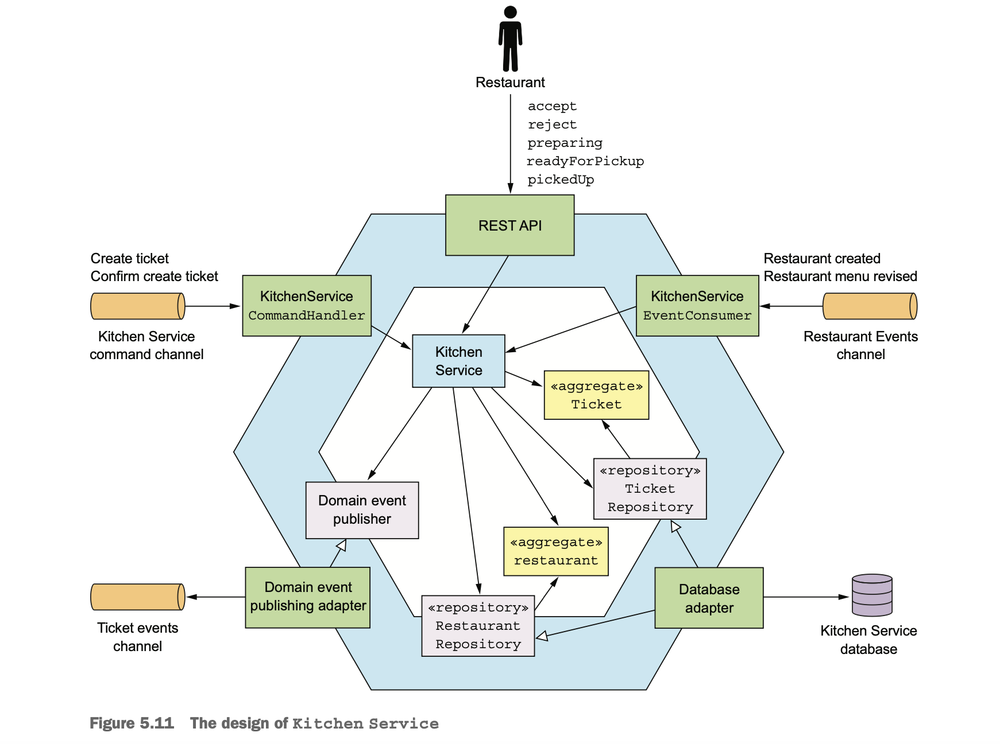

## Kitchen Service business logic

- The main aggregates in this service are the Restaurant and Ticket.
- Restaurant aggregate knows the restaurant’s menu and opening hours and can validate orders.
- A Ticket represents an order that a restaurant must prepare for pickup by a courier.
- The other important classes are KitchenService, TicketRepository, and RestaurantRepository.

### KitchenService

- It defines methods for creating and updating the Restaurant and Ticket aggregates.
- It uses methods from repositories to persist the aggregates.
- The KitchenService has three inbound adapters and two outbound adapters.
  - `Inbound adapters`
    - `REST API:` Invoked by the user interface used by workers at the restaurant to update tickets.
    - `KitchenServiceCommandHandler:` Invoked by sagas to create and update tickets.
    - `KitchenServiceEventConsumer:` Subscribes to events published by Restaurant Service to create and update Restaurants.
  - `Outbound adapters`
    - `DB adapter:` Invokes methods on the TicketRepository and the RestaurantRepository interfaces.
    - `DomainEventPublishingAdapter` Invokes methods on the interface to publish Ticket domain events.

  

### The Ticket aggregate

- Ticket is one of the aggregates of Kitchen Service.
- In the concept of BoundedContext, this aggregate represents the restaurant kitchen’s view of an order.
- It doesn’t contain information about the consumer, the delivery information, or payment details.
- KitchenService doesn’t generate a unique ID for this aggregate, it uses the ID supplied by OrderService.
- This references restaurant by restaurantId(primary key).

```java
@Entity(table="tickets")
public class Ticket {
    @Id
    private Long id;
    private TicketState state;
    private Long restaurantId;
    @ElementCollection
    @CollectionTable(name = "ticket_line_items")
    private List<TicketLineItem> lineItems;
    private ZonedDateTime readyBy;
    private ZonedDateTime acceptTime;
    private ZonedDateTime preparingTime;
    private ZonedDateTime pickedUpTime;
    private ZonedDateTime readyForPickupTime;
}
```
- The Ticket class has fields that track the history of the order, like acceptTime, preparingTime, and pickupTime.

#### _BEHAVIOR OF THE TICKET AGGREGATE_

- The Ticket aggregate defines several methods.
  - These are invoked when the restaurant create/updates the state of the order:
    - `create()` Invoked by saga to create a ticket.
    - `accept()` The restaurant has accepted the order.
    - `preparing()` The restaurant has started preparing the order(Can't cancelled now).
      - It changes the state of the order to PREPARING, records the time, and publishes an event.
    - `readyForPickup()` The order can now be picked up.
    - `cancel()` Invoked by saga to cancel the order(ticket).
      - It is called when a user attempts to cancel an order.

```java
public class Ticket {
    public static ResultWithAggregateEvents<Ticket, TicketDomainEvent> create(Long id, TicketDetails details) {
        return new ResultWithAggregateEvents<>(new Ticket(id, details), new TicketCreatedEvent(id, details));
    }

    public List<TicketPreparationStartedEvent> preparing() {
        switch (state) {
            case ACCEPTED:
                this.state = TicketState.PREPARING;
                this.preparingTime = ZonedDateTime.now();
                return singletonList(new TicketPreparationStartedEvent());
            default:
                throw new UnsupportedStateTransitionException(state);
        }
    }

    public List<TicketDomainEvent> cancel() {
        switch (state) {
            case CREATED:
            case ACCEPTED:
                this.state = TicketState.CANCELLED;
                return singletonList(new TicketCancelled());
            case READY_FOR_PICKUP:
                throw new TicketCannotBeCancelledException();
            default:
                throw new UnsupportedStateTransitionException(state);
        }
    }
}
```

#### _THE KITCHENSERVICE DOMAIN SERVICE_

- KitchenService is invoked by the service’s inbound adapters.
- It defines methods like accept(), reject(), cancel() etc.
- Each method loads the specifies aggregate, calls the corresponding method on the aggregate root, and publishes any 
  domain events.
- Here is an example of accept().  

```java
public class KitchenService {
    @Autowired
    private TicketRepository ticketRepository;
    @Autowired
    private TicketDomainEventPublisher domainEventPublisher;
    public void accept(long ticketId, ZonedDateTime readyBy) {
        Ticket ticket =
                ticketRepository.findById(ticketId)
                        .orElseThrow(() ->
                                new TicketNotFoundException(ticketId));
        List<TicketDomainEvent> events = ticket.accept(readyBy);
        domainEventPublisher.publish(ticket, events);
    }
}
```
- The accept() method is invoked when the restaurant accepts a new order.
  - It has two parameters:
    - `orderId:` ID of the order to accept
    - `readyBy:` Estimated time when the order will be ready for pickup

#### _THE KITCHENSERVICECOMMANDHANDLER CLASS_

- It is an adapter for handling command messages sent by the sagas implemented by Order Service.
- This class defines a handler method for each command.
  - It invokes KitchenService to create or update a Ticket and reply with a success or failure.
    
```java
public class KitchenServiceCommandHandler {
    @Autowired
    private KitchenService kitchenService;

    public CommandHandlers commandHandlers() {
        return CommandHandlersBuilder
                .fromChannel("orderService")
                .onMessage(CreateTicket.class, this::createTicket)
                .onMessage(ConfirmCreateTicket.class, this::confirmCreateTicket)
                .onMessage(CancelCreateTicket.class,
                        this::cancelCreateTicket)
                .build();
    }
    
    private Message createTicket(CommandMessage<CreateTicket> cm) {
        CreateTicket command = cm.getCommand();
        long restaurantId = command.getRestaurantId();
        Long ticketId = command.getOrderId();
        TicketDetails ticketDetails = command.getTicketDetails();
        try {
            Ticket ticket = kitchenService.createTicket(restaurantId, ticketId, ticketDetails);
            CreateTicketReply reply = new CreateTicketReply(ticket.getId());
            return withSuccess(reply);
        } catch (RestaurantDetailsVerificationException e) {
            return withFailure();
        } 
    }
}
```