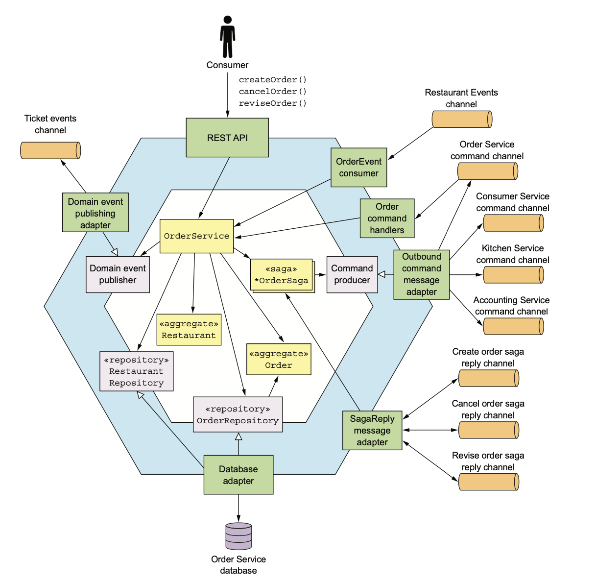
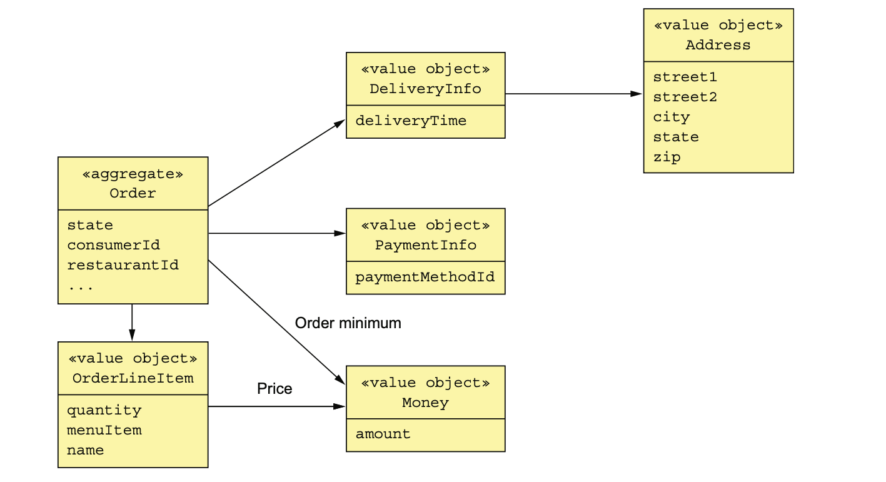
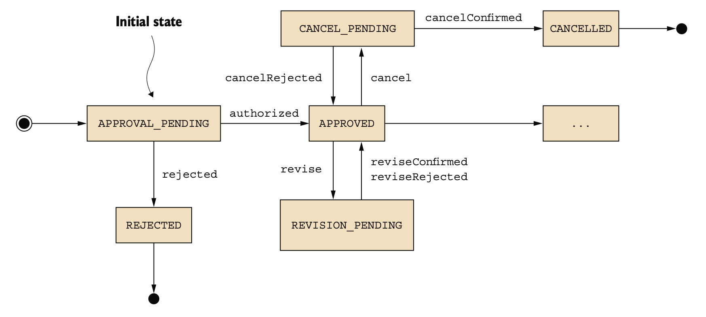

## Order Service business logic

- Order Service provides an API for creating, updating, and canceling orders.
- It is primarily invoked by consumer.
- The Order aggregate is the central aggregate of Order Service.
- The Restaurant is a partial replica of data owned by Restaurant Service.
  - It enables OrderService to validate and price an Order’s line items.
- The business logic consists of OrderService, OrderRepository, RestaurantRepository, and 
  various sagas such as the CreateOrderSaga.
- OrderService has several inbound and outbound adapters.
  - `Inbound adapters`
    - `REST API:` It is invoked by the UI used by consumers to create/update orders.
    - `OrderEventConsumer:` Subscribes to events published by Restaurant Service to create/update its replica of Restaurants.
    - `OrderCommandHandlers:` Invoked by sagas to update orders.
    - `SagaReplyAdapter:` Subscribes to the saga reply channels and invokes the sagas.
  - `Outbound adapters`
    - `DB adapter:` Invokes OrderRepository to persist order aggregate.
    - `DomainEventPublishingAdapter:` Publishes order domain events.
    - `OutboundCommandMessageAdapter:` CommandPublisher to send command messages to saga participants.



### The Order Aggregate

- The Order aggregate represents an order placed by a consumer.

### _THE STRUCTURE OF THE ORDER AGGREGATE_

- The Order class is the root of the Order aggregate. 
- The Order aggregate consists of value objects such as OrderLineItem, DeliveryInfo, and PaymentInfo.



- The Order class has a collection of OrderLineItems.
- It references Consumer and Restaurant by primary key.

```java
@Entity
@Table(name="orders")
@Access(AccessType.FIELD)
public class Order {
  @Id
  @GeneratedValue
  private Long id;
  @Version
  private Long version;
  private OrderState state;
  private Long consumerId;
  private Long restaurantId;
  @Embedded
  private OrderLineItems orderLineItems;
  @Embedded
  private DeliveryInformation deliveryInformation;
  @Embedded
  private PaymentInformation paymentInformation;
  @Embedded
  private Money orderMinimum;
}
```
- The id is the primary key.
- The version field is used for optimistic locking.
- The DeliveryInformation and PaymentInformation fields are mapped using the @Embedded 
  annotation and are stored as columns of the ORDERS table.
- The orderLineItems field is an embedded object that contains the order line items.

#### _THE ORDER AGGREGATE STATE MACHINE_````

- OrderService creates or updates an order.
- OrderService or the first step of saga invokes Order method.
  - Order method verifies the operation and changes the Order to a pending state(semantic lock). 
  - Once saga invokes all participants, OrderService updates the Order depending on the outcome.
  - For ex, `Create Order Saga` invokes Consumer Service, Accounting Service, and Kitchen Service.
  - OrderService first creates an Order in an APPROVAL_PENDING, later changes its state to 
    either APPROVED or REJECTED.



- Similarly, revise() and cancel() operations first change the Order to a PENDING state and change
  the status based on the outcome of saga.
  - For ex, cancel() operation changes status to CANCEL_PENDING initially.
    - If the operation is successful, change the Order to CANCELLED.
    - If the operation fails, revert the status to APPROVED.

#### _THE ORDER AGGREGATE’S METHODS_

- Let's see the createOrder() method.

```java
public class Order {
  public static ResultWithDomainEvents<Order, OrderDomainEvent> createOrder(long consumerId, 
                                                                            Restaurant restaurant, 
                                                                            List<OrderLineItem> orderLineItems) {
    Order order = new Order(consumerId, restaurant.getId(), orderLineItems);
    List<OrderDomainEvent> events = singletonList(new OrderCreatedEvent(
            new OrderDetails(consumerId, restaurant.getId(), orderLineItems,
                    order.getOrderTotal()),
            restaurant.getName()));
    return new ResultWithDomainEvents<>(order, events);
  }

  public Order(OrderDetails orderDetails) {
    this.orderLineItems = new OrderLineItems(orderDetails.getLineItems());
    this.orderMinimum = orderDetails.getOrderMinimum();
    this.state = APPROVAL_PENDING;
  } 

  public List<DomainEvent> noteApproved() {
    switch (state) {
      case APPROVAL_PENDING:
        this.state = APPROVED;
        return singletonList(new OrderAuthorized());
      default:
        throw new UnsupportedStateTransitionException(state);
    }
  }

  public List<DomainEvent> noteRejected() {
    switch (state) {
      case APPROVAL_PENDING:
        this.state = REJECTED;
        return singletonList(new OrderRejected());
      default:
        throw new UnsupportedStateTransitionException(state);
    }
  }
}
```

- The createOrder() method creates an Order and publishes an OrderCreatedEvent.
- The OrderCreatedEvent is enriched with the details of the Order, including the line items, 
  the total amount, the restaurant ID, and the restaurant name.
- Order History Service(CQRS) uses Order events, including OrderCreatedEvent, to maintain an easily 
  queried replica of Orders.
- The initial state of the Order is APPROVAL_PENDING. 
- When the CreateOrderSaga completes, it will invoke either noteApproved() or noteRejected().
- In addition to createOrder(), the Order class defines several update methods such as revise().

```java
class Order {
  public List<OrderDomainEvent> revise(OrderRevision orderRevision) {
    switch (state) {
      case APPROVED:
        LineItemQuantityChange change =
                orderLineItems.lineItemQuantityChange(orderRevision);
        if (change.newOrderTotal.isGreaterThanOrEqual(orderMinimum)) {
          throw new OrderMinimumNotMetException();
        }
        this.state = REVISION_PENDING;
        return singletonList(new OrderRevisionProposed(orderRevision,
                change.currentOrderTotal, change.newOrderTotal));
      default:
        throw new UnsupportedStateTransitionException(state);
    }
  }

  public List<OrderDomainEvent> confirmRevision(OrderRevision orderRevision) {
    switch (state) {
      case REVISION_PENDING:
        LineItemQuantityChange licd =
                orderLineItems.lineItemQuantityChange(orderRevision);
        orderRevision
                .getDeliveryInformation()
                .ifPresent(newDi -> this.deliveryInformation = newDi);
        if (!orderRevision.getRevisedLineItemQuantities().isEmpty()) {
          orderLineItems.updateLineItems(orderRevision);
        }
        this.state = APPROVED;
        return singletonList(new OrderRevised(orderRevision,
                licd.currentOrderTotal, licd.newOrderTotal));
      default:
        throw new UnsupportedStateTransitionException(state);
    }
  }
}
```

### The OrderService class

- The OrderService is the main entry point into the business logic and is invoked by various 
  inbound adapters, such as the REST API.
- Most of its methods create a saga to orchestrate the creation and updating of Order aggregates.
  - `createOrder`
    - The createOrder() method first creates and persists an Order aggregate. 
    - It then publishes the domain events emitted by the aggregate. 
    - It creates a CreateOrderSaga. 
  - `reviseOrder`
    - The reviseOrder() retrieves the Order and then creates a ReviseOrderSaga.

```java
@Transactional
public class OrderService {
  @Autowired
  private OrderRepository orderRepository;
  @Autowired
  private SagaManager<CreateOrderSagaState, CreateOrderSagaState> createOrderSagaManager;
  @Autowired
  private SagaManager<ReviseOrderSagaState, ReviseOrderSagaData> reviseOrderSagaManagement;
  @Autowired
  private OrderDomainEventPublisher orderAggregateEventPublisher;

  public Order createOrder(OrderDetails orderDetails) {
    Restaurant restaurant = restaurantRepository.findById(restaurantId)
            .orElseThrow(() -> new RestaurantNotFoundException(restaurantId));
    List<OrderLineItem> orderLineItems = makeOrderLineItems(lineItems, restaurant);
    ResultWithDomainEvents<Order, OrderDomainEvent> orderAndEvents = Order.createOrder(consumerId, restaurant, orderLineItems);
    Order order = orderAndEvents.result;
    orderRepository.save(order);
    orderAggregateEventPublisher.publish(order, orderAndEvents.events);
    OrderDetails orderDetails = new OrderDetails(consumerId, restaurantId, orderLineItems, order.getOrderTotal());
    CreateOrderSagaState data = new CreateOrderSagaState(order.getId(), orderDetails);
    createOrderSagaManager.create(data, Order.class, order.getId());
    return order;
  }

    public Order reviseOrder(long orderId, OrderRevision orderRevision){
      Order order = orderRepository.findById(orderId)
                                    .orElseThrow(() -> new OrderNotFoundException(orderId));
      ReviseOrderSagaData sagaData = new ReviseOrderSagaData(order.getConsumerId(), orderId, null, orderRevision);
      reviseOrderSagaManager.create(sagaData);
      return order;
    }
  }
```  