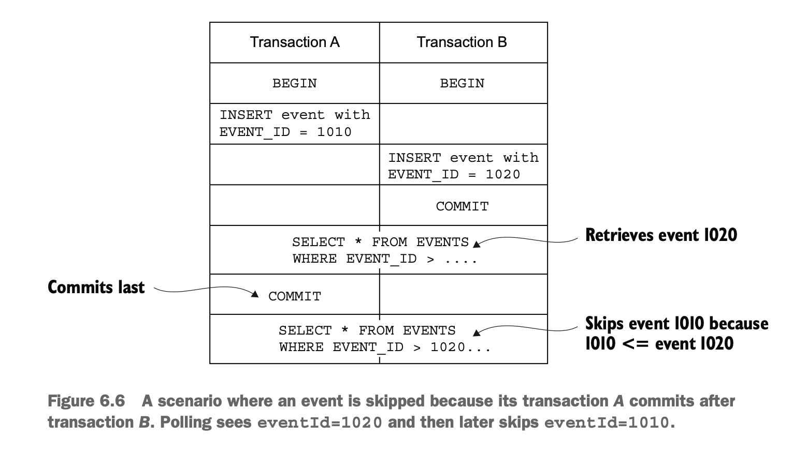

## Developing business logic with event sourcing

- Developing business logic using DDD aggregates publishes events when aggregate state changes.
- The event publishing logic is added as an extra feature.
- The business logic continues to work even when the developer forgets to publish an event.
- An alternative to this is event sourcing.

### Event sourcing
- Event sourcing, an event-centric way of writing business logic and persisting domain objects. 
- It persists an aggregate as a sequence of events.
- Each event represents a state change of the aggregate.
- An application recreates the current state of an aggregate by replaying the events.  
  - `Benefits`
    - Preserves the history of aggregates, which is valuable for auditing and regulatory purposes.
    - Reliably publishes domain events, which is useful in microservices.
  - `Drawbacks`
    - It involves a learning curve, because it is a different way to write business logic.
    - Querying event store is difficult, which requires CQRS pattern.

### The trouble with traditional persistence

- The traditional approach to persistence maps classes to database tables.
- It might do that using an ORM framework such as JPA or a lower-level framework such as MyBATIS.
- This approach has several drawbacks and limitations:
  - `Object-Relational impedance mismatch`
    - The data representation and management between object and relational world are incomptible.
    - For ex, object inheritance, polymorphism, composition relations won't work well with relational world joins.
    - Similarly, data integrity in oops world is managed through code, whereas in db primary keys, foreign keys.
  - `LACK OF AGGREGATE HISTORY`
    - Once an aggregate has been updated, its previous state is lost.
    - If an application must preserve the history of an aggregate, new mechanism needs to be implemented.
  - `IMPLEMENTING AUDIT LOGGING IS TEDIOUS AND ERROR PRONE`
    - Some applications require auditing for security or regulatory purposes.
    - For some applications, history of user actions is an important feature.   
      - For example, issue trackers and task-management applications such as Asana and JIRA display the history of 
        changes to task and issues.
  - `EVENT PUBLISHING IS BOLTED ON TO THE BUSINESS LOGIC`
    - Traditional persistence usually doesn’t support publishing domain events.
    - Some ORM frameworks, such as Hibernate, can invoke application-provided callbacks when data objects change.
    - But there’s no support for automatically publishing messages as part of the transaction that updates the data.
    - Due to these, developers must write event generation logic in addition to the business logic.

### Overview of event sourcing

- An aggregate’s business logic is structured around the requirement to produce and consume these events.

#### _EVENT SOURCING PERSISTS AGGREGATES USING EVENTS_

- Event sourcing persists each aggregate as a sequence of events in the database, known as an event store.
- For ex, rather than store each Order as a row in an ORDER table, event sourcing persists each Order aggregate 
  as one or more rows in db, known as event store(or EVENTS table). 
- Each row is a domain event, such as Order Created, Order Approved, Order Shipped etc.
- An aggregate’s business logic is structured around the requirement to produce and consume these events.
- For ex, event sourcing persists each Order aggregate as one or more rows in an EVENTS table.
  - It doesn't store each order in orders table.


- An application creates/updates aggregates, events are emitted.
  - These events are inserted into EVENTS table.
- Loading an aggregate consists of the following steps.
  - Load the events for the aggregate.
  - Create an aggregate instance by using its default constructor.
  - Iterate through the events, calling apply().
```
Class aggregateClass = ...;
Aggregate aggregate = aggregateClass.newInstance();
for (Event event : events) {
  aggregate = aggregate.applyEvent(event);
}
```
- These steps are similar to how an ORM framework loads a JPA entity.
  - An ORM framework loads an object by executing one or more SELECT statements.
  - Creates an object using reflection.
  - Populate values using reflection(or using setters).

#### _EVENTS REPRESENT STATE CHANGES_

- Events can either contain minimal data, such as just the aggregate ID or contain data that is useful for consumer.
  - For ex, an OrderCreated event may only contain the orderId or complete Order(including orderLineItems, 
    paymentInfo, deliveryInfo) so that consumers don't need to fetch data from OrderService.
- `Events aren’t optional when using event sourcing.`
- Every state change of an aggregate, including its creation, is represented by a domain event.
  - For example, an Order aggregate must emit an OrderCreated event when it’s created.
  - Similarly, Order*(Revised, Cancelled etc) event whenever it is updated.
- `This is a Stringent requirement unlike DDD where aggregate only emitted events that were of interest to consumers`.
- An event must contain the data that the aggregate needs to perform the state transition.
  - An aggregate state change might be as simple as updating Order.state or adding or removing objects, such as 
    revising an Order’s line items.

#### _AGGREGATE METHODS ARE ALL ABOUT EVENTS_

- The business logic(OrderService) handles a request to update an aggregate by calling a method on the aggregate root.
  - Aggregate method validates arguments and updates one or more fields on the aggregate.
- In event-sourcing, an aggregate method generates a sequence of events that represent the state changes.
  - These events are persisted in the database.
- Event sourcing refactors a command method into two or more methods.
  - The first method takes a command object parameter(request).
    - It determines what state changes need to be performed.
    - It validates its arguments and throws exception if command cannot be performed.
    - It returns a list of events.
  - The other methods each take a particular event type and update the aggregate.
    - These methods can't fail, because an event represents a state change.
- The Eventuate Client framework, an event-sourcing framework names these methods process and apply.


- An aggregate is created using the following steps:
  - Instantiate aggregate root using its default constructor.
  - Invoke process() to generate the new events.
  - Update the aggregate by iterating through the new events, calling its apply().
  - Save the new events in the event store.
- An aggregate is updated using the following steps:
  - Load aggregate’s events from the event store.
  - Instantiate the aggregate root using its default constructor.
  - Iterate through the loaded events, calling apply() on the aggregate root.
  - Invoke its process() method to generate new events.
  - Update the aggregate by iterating through the new events, calling apply().
  - Save the new events in the event store.

#### _EVENT SOURCING-BASED ORDER AGGREGATE_

- The fields of the Order aggregate are similar to JPA entity, but aggregateId is not stored in the aggregate.
- It is part of the entity_id in EVENTS table.
- Each command method has been replaced by a process() method and one or more apply() methods.

```java
public class Order {
  private OrderState state;
  private Long consumerId;
  private Long restaurantId;
  private OrderLineItems orderLineItems;
  private DeliveryInformation deliveryInformation;
  private PaymentInformation paymentInformation;
  private Money orderMinimum;

  public Order() {
  }

  public List<Event> process(CreateOrderCommand command) {
    // validate command here
    return events(new OrderCreatedEvent(command.getOrderDetails()));
  }

  public void apply(OrderCreatedEvent event) {
    OrderDetails orderDetails = event.getOrderDetails();
    this.orderLineItems = new OrderLineItems(orderDetails.getLineItems());
    this.orderMinimum = orderDetails.getOrderMinimum();
    this.state = APPROVAL_PENDING;
  }

  public List<Event> process(ReviseOrder command) {
    OrderRevision orderRevision = command.getOrderRevision();
    switch (state) {
      case APPROVED:
        LineItemQuantityChange change = orderLineItems.lineItemQuantityChange(orderRevision);
        if (change.newOrderTotal.isGreaterThanOrEqual(orderMinimum)) {
          throw new OrderMinimumNotMetException();
        }
        return singletonList(new OrderRevisionProposed(orderRevision, 
                change.currentOrderTotal, change.newOrderTotal));
      default:
        throw new UnsupportedStateTransitionException(state);
    } 
  }

  public void apply(OrderRevisionProposed event) {
    this.state = REVISION_PENDING;
  }

  public List<Event> process(ConfirmReviseOrder command) {
    OrderRevision orderRevision = command.getOrderRevision();
    switch (state) {
      case REVISION_PENDING:
        LineItemQuantityChange licd =
                orderLineItems.lineItemQuantityChange(orderRevision);
        return singletonList(new OrderRevised(orderRevision,
                licd.currentOrderTotal, licd.newOrderTotal));
      default:
        throw new UnsupportedStateTransitionException(state);
    } 
  }

  public void apply(OrderRevised event) {
    OrderRevision orderRevision = event.getOrderRevision();
    if (!orderRevision.getRevisedLineItemQuantities().isEmpty()) {
      orderLineItems.updateLineItems(orderRevision);
    }
    this.state = APPROVED;
  }
}
```

### Handling concurrent updates using optimistic locking

- An application uses optimistic locking to prevent one transaction from overwriting another’s changes.
- Optimistic locking typically uses a version column to detect changes. For ex,

```sql
UPDATE AGGREGATE_ROOT_TABLE
        SET VERSION = VERSION + 1 ...
        WHERE VERSION = <original version>
```
- An event store can also use optimistic locking to handle concurrent updates.
  - When the application inserts events, the event store verifies that the version is unchanged.
  - A simple approach is to use the number of events as the version number.

### Event sourcing and publishing events

- Saving an event in the event store is an inherently atomic operation.
- An event sourcing-based application should save event in event store and publish events reliably.
  - Either polling or transaction-log tailing can be used to reliably publish events.
  - `The difference here is events are stored permanently instead of temporarily saving in an OUTBOX table`.

#### _USING POLLING TO PUBLISH EVENTS_

- Polling events from EVENTS table has a challenge in determining which events are new.
  - For ex, imagine eventIds are monotonically increasing.
  - Event publisher has to record last eventId it has processed.
  - It can use query to fetch new records. 
    - For ex, `SELECT * FROM EVENTS where event_id > ? ORDER BY event_id ASC.`
- In the above approach, transactions can commit in an order that is different from generation of events.  
- The event publisher can accidentally skip over an event.  
- Let's see an example.
  - Transaction A inserts an event with an EVENT_ID of 1010.
  - Transaction B inserts an event with an EVENT_ID of 1020 and then commits.
  - Event publisher may query now and publishes all events and record eventId 1020 as latest.
  - Transaction A committed and event 1010 became visible.
  - The event publisher would ignore it.
  


- `Solution`
  - Add an extra column to the EVENTS table that tracks whether an event has been published.
  - For ex,
    - Find unpublished events by executing this SELECT statement: 
      - `SELECT * FROM EVENTS where PUBLISHED = 0 ORDER BY event_id ASC`.
    - Publish events to the message broker.
    - Mark the events as having been published:
      - `UPDATE EVENTS SET PUBLISHED = 1 WHERE EVENT_ID in.`
  
#### _USING TRANSACTION LOG TAILING TO RELIABLY PUBLISH EVENTS_

- Transaction log tailing guarantees that events will be published.
- This is more performant and scalable.
- It reads events inserted into an EVENTS table from the database transaction log and publishes them to the 
  message broker.

### Using snapshots to improve performance

- An Order aggregate has relatively few state transitions, so it only has few events.
- Long-lived aggregates can have large no of state transitions. For ex, an Account aggregate.
  - Over time, it would become increasingly inefficient to load and fold those events.
- `solution`
  - Periodically persist a snapshot of the aggregate's state.
  - The application restores the state of an aggregate by loading the most recent snapshot and applying the events
    that have occurred since the snapshot was created.
- The aggregate instance is recreated from the snapshot instead of being created using its default constructor.     
- If an aggregate is simple, Json serialization can be used.
- If an aggregate is complex, Memento pattern is advisable.


### Idempotent message processing

#### _IDEMPOTENT MESSAGE PROCESSING WITH AN RDBMS-BASED EVENT STORE_

- If an application uses an RDBMS-based event store, it can detect and discard duplicates by tracking messageIds.
- For ex, app inserts the message ID into the PROCESSED _MESSAGES table as part of the transaction that inserts 
  events into the EVENTS table.

#### _IDEMPOTENT MESSAGE PROCESSING WHEN USING A NOSQL-BASED EVENT STORE_

- A NoSQL-based event store, which has a limited transaction model.
- Tracking messageId into another table as part the transaction may not work.
- `Solution`
  - A message consumer stores the message’s ID in the events that are generated while processing it.
  - Consumer detects duplicates by verifying that none of an aggregate’s events contains the message ID.
- One problem with the above approach is, processing of a message may not generate events.
  - The lack of events means there’s no record of a message having been processed.
  - A subsequent redelivery and reprocessing of the same message might result in incorrect behavior.
  - For ex:
    - Message A is processed but doesn’t update an aggregate.
    - Message B is processed, and the message consumer updates the aggregate.
    - Message A is redelivered, and because there’s no record of it having been processed, the message consumer 
      updates the aggregate.
    - Message B is processed again....
  - `Solution`
    - Always publish an event.
    - If an aggregate doesn’t emit an event, an application saves a pseudo event solely to record the message ID.
    - Event consumers must ignore these pseudo events.
  
### Evolving domain events

- Event sourcing stores events forever.
- An application must potentially deal with multiple versions of events.
- A service that loads an Order aggregate could potentially need to fold multiple versions of events.
- At the schema level, developers add, remove, and rename aggregate classes. 
- At the aggregate level, the types of events emitted by a particular aggregate can change.
- Developers can change the structure of an event type by adding, removing, and changing the name or type of field.

#### _MANAGING SCHEMA CHANGES THROUGH UPCASTING_

- Changes to a database schema are commonly handled using schema migrations.
- The schema migrations are stored in a version control system and applied using a tool such as Flyway.
- An event sourcing application can use a similar approach.
- Event sourcing frameworks transform events when they’re loaded from the event store.
  - A component commonly called an upcaster updates individual events from an old version to a newer version.
  - The application code only ever deals with the current event schema.

### Benefits of event sourcing

- RELIABLY PUBLISHES DOMAIN EVENTS
- PRESERVES THE HISTORY OF AGGREGATES
- MOSTLY AVOIDS THE O/R IMPEDANCE MISMATCH PROBLEM
- PROVIDES DEVELOPERS WITH A TIME MACHINE

### Drawbacks

- It has a different programming model that has a learning curve. 
- It has the complexity of a messaging-based application.
- Evolving events can be tricky.
- Deleting data is tricky.
- Querying the event store is challenging.