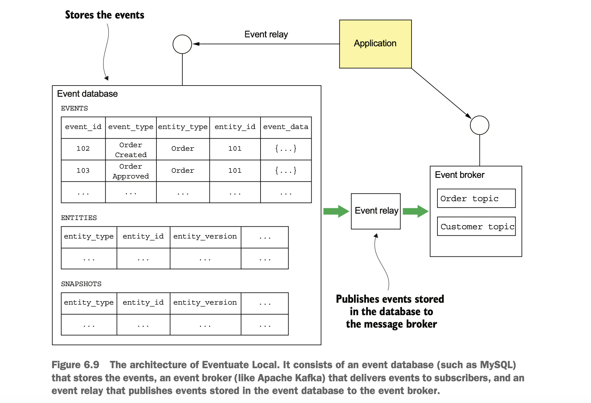
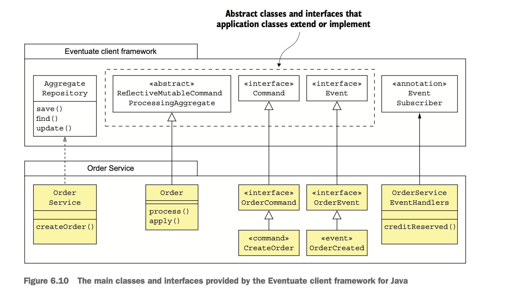

## Implementing an event store

- An event store is a hybrid of a database and a message broker.
- It has an API for inserting and retrieving an aggregate’s events from/to DB by primary key.
- It has an API for subscribing to events.
- Instead of implementing event store manually, it is better to use a special purpose one which provides a rich set of
  features.
  - `Event Store:` A .NET-based open source event store developed by Greg Young, an event sourcing pioneer.
  - `Lagom:` A microservices framework developed by Lightbend, the company formerly known as Typesafe.
  - `Axon:` An open source Java framework for developing event-driven applications that use event sourcing and CQRS.
  - `Eventuate:` Developed by Eventuate. 
    - There are two versions of Eventuate: 
      - `Eventuate SaaS:` A cloud service
      - `Eventuate Local:` An Apache Kafka/RDBMS-based open source project.
    
### How the Eventuate Local event store works

- Eventuate Local is an open source event store.
- Events are stored in a database, such as MySQL.
- Applications insert and retrieve aggregate events by primary key(event_id).
- Applications consume events from a message broker, such as Apache Kafka.
  - A transaction log tailing mechanism propagates events from the database to the message broker.



#### _THE SCHEMA OF EVENTUATE LOCAL’S EVENT DATABASE_

- The event database consists of three tables:
  - `events:` Stores the events
  - `entities:` One row per entity
  - `snapshots:` Stores snapshots 

```
create table events (
  event_id varchar(1000) PRIMARY KEY,
  event_type varchar(1000),
  event_data varchar(1000) NOT NULL,
  entity_type VARCHAR(1000) NOT NULL,
  entity_id VARCHAR(1000) NOT NULL,
  triggering_event VARCHAR(1000)
);

create table entities (
  entity_type VARCHAR(1000),
  entity_id VARCHAR(1000),
  entity_version VARCHAR(1000) NOT NULL,
  PRIMARY KEY(entity_type, entity_id)
);

create table snapshots (
  entity_type VARCHAR(1000),
  entity_id VARCHAR(1000),
  entity_version VARCHAR(1000),
  snapshot_type VARCHAR(1000) NOT NULL,
  snapshot_json VARCHAR(1000) NOT NULL,
  triggering_events VARCHAR(1000),
  PRIMARY KEY(entity_type, entity_id, entity_version)
)
```
- `triggering_event` column in events table is used to detect duplicate events/messages.
- `entity_version` column in entities table is used to implement optimistic locking.
- `The snapshot _json` column is the serialized representation of the snapshot.

- The three operations supported by the schema are find, create and udpate.
  - `find()`
    - Queries the snapshots table to retrieve the latest snapshot, if any.
    - If snapshot exists
      - fetches all events whose event_id is greater than the snapshot’s entity_version.
    - If snapshot doesn't exist
      - fetches all events for the specified entity.
    - `Note:` The find() operation also queries the entity table to retrieve the entity’s current version.
  - `create()`
    - Inserts a row into the entity table and inserts the events into the events table.
  - `update()`
    - Inserts events into the events table and performs optimistic locking within a transaction to ensure atomicity.

```
UPDATE entities SET entity_version = ? WHERE entity_type = ? and entity_id = ? and entity_version = ?
```

#### _CONSUMING EVENTS BY SUBSCRIBING TO EVENTUATE LOCAL’S EVENT BROKER_

- Services consume events by subscribing to the aggregate's topic of an event broker.
- The event broker has a topic for each aggregate type.
  - A topic is a partitioned message channel.
    - This enables consumers to scale horizontally while preserving message ordering. 
    - The aggregate ID is used as the partition key, which preserves the ordering of events.
    
#### _EVENT RELAY PROPAGATES EVENTS FROM THE DATABASE TO THE MESSAGE BROKER_

- The event relay propagates events inserted into the event database to the event broker.
- It uses transaction log tailing whenever possible.
  - For ex, the event relay connects to the MySQL server and reads the MySQL binlog.
- It uses polling for other databases which doesn't support transaction log tailing.
- All events that are inserted into events table are published, any other changes are ignored.
- The event relay is deployed as a standalone process.
- In order to restart correctly, it periodically saves the current position in the binlog and offset in a special
  kafka topic.
- The event database, message broker, and event relay comprise the event store.

### The Eventuate client framework for Java

- The Eventuate client framework enables developers to write event sourcing-based applications that use the 
  Eventuate Local event store.
- The framework provides base classes for aggregates, commands, and events.
- It has an AggregateRepository class that provides CRUD functionality.
- It has an API for subscribing to events.



#### _DEFINING AGGREGATES WITH THE REFLECTIVEMUTABLECOMMANDPROCESSINGAGGREGATE CLASS_

- ReflectiveMutableCommandProcessingAggregate is the base class for aggregates.
- It’s a generic class that has two type parameters:
  - Aggregate class
  - superclass of the aggregate’s command classes.
- It uses reflection to dispatch command and events to the appropriate method.
  - Commands are dispatched to a process() method.
  - Events are dispatched to an apply() method.
    
```java
public class Order extends ReflectiveMutableCommandProcessingAggregate<Order, OrderCommand> {
    public List<Event> process(CreateOrderCommand command) {
        // 
    }

    public void apply(OrderCreatedEvent event) {
        // 
    }
}
```

#### _DEFINING AGGREGATE COMMANDS_

- An aggregate’s command classes must extend an aggregate-specific base interface.
- The aggregate-specific base interface should extend Command interface from the framework.

```java
public interface OrderCommand extends Command {}
public class CreateOrderCommand implements OrderCommand {}
```

#### _DEFINING DOMAIN EVENTS_

- An aggregate’s event classes must extend the Event interface, which is a marker interface.
- It’s also useful to define a common base interface, which extends Event.

```java
interface OrderEvent extends Event {}
public class OrderCreated extends OrderEvent{}
```

#### _CREATING, FINDING, AND UPDATING AGGREGATES WITH THE AGGREGATEREPOSITORY CLASS_

- The framework provides several ways to create, find, and update aggregates.
- AggregateRepository is a generic class for this.
- It is parameterized by aggregate's class and aggregate's base command.
- It provides three overloaded methods: save(), find() and update().
  - `save()`
    - It takes a command object as a parameter and does the following.
      - Instantiates the aggregate using its default constructor
      - Invokes process() to process the command
      - Applies the generated events by calling apply()
      - Saves the generated events in the event store
  - `update()`
    - It takes two parameters: an aggregate ID and a command and does the following.
      - Retrieves the aggregate from the event store
      - Invokes process() to process the command
      - Applies the generated events by calling apply()
      - Saves the generated events in the event store
- The AggregateRepository class is primarily used by services in response to external requests.

```java
public class OrderService {
    private AggregateRepository<Order, OrderCommand> orderRepository;

    public OrderService(AggregateRepository<Order, OrderCommand> orderRepository) {
        this.orderRepository = orderRepository;
    }

    public EntityWithIdAndVersion<Order> createOrder(OrderDetails orderDetails) {
        return orderRepository.save(new CreateOrder(orderDetails));
    }
}
```

#### _SUBSCRIBING TO DOMAIN EVENTS_

- The Eventuate Client framework also provides an API for writing event handlers.
- The @EventSubscriber annotation specifies the `id` of the durable subscription.
- Events that are published when the subscriber isn’t running will be delivered when it starts up.
- The @EventHandlerMethod annotation identifies the method for an event type as an event handler.
- An event handler has a parameter of type EventHandlerContext, which contains the event and its metadata.

```java
@EventSubscriber(id="orderServiceEventHandlers")
public class OrderServiceEventHandlers {
    @EventHandlerMethod
    public void creditReserved(EventHandlerContext<CreditReserved> ctx) {
        CreditReserved event = ctx.getEvent();
    }
}
```

