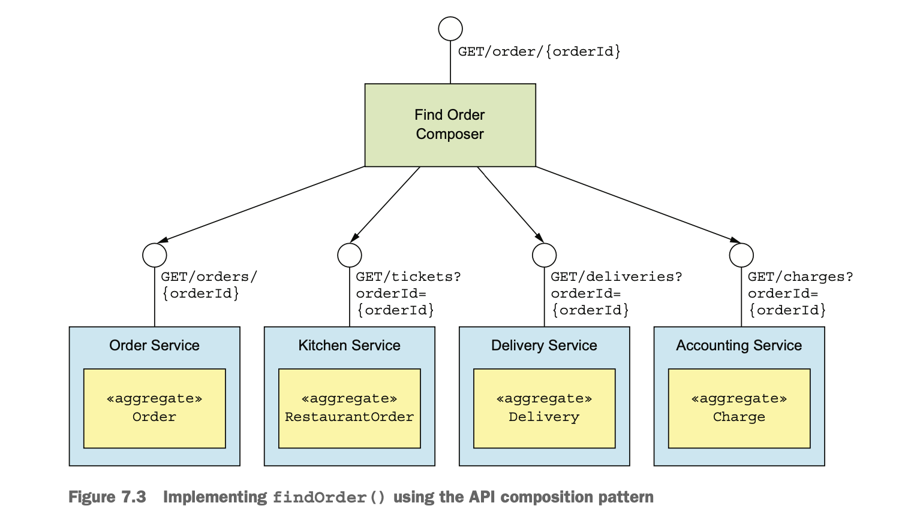
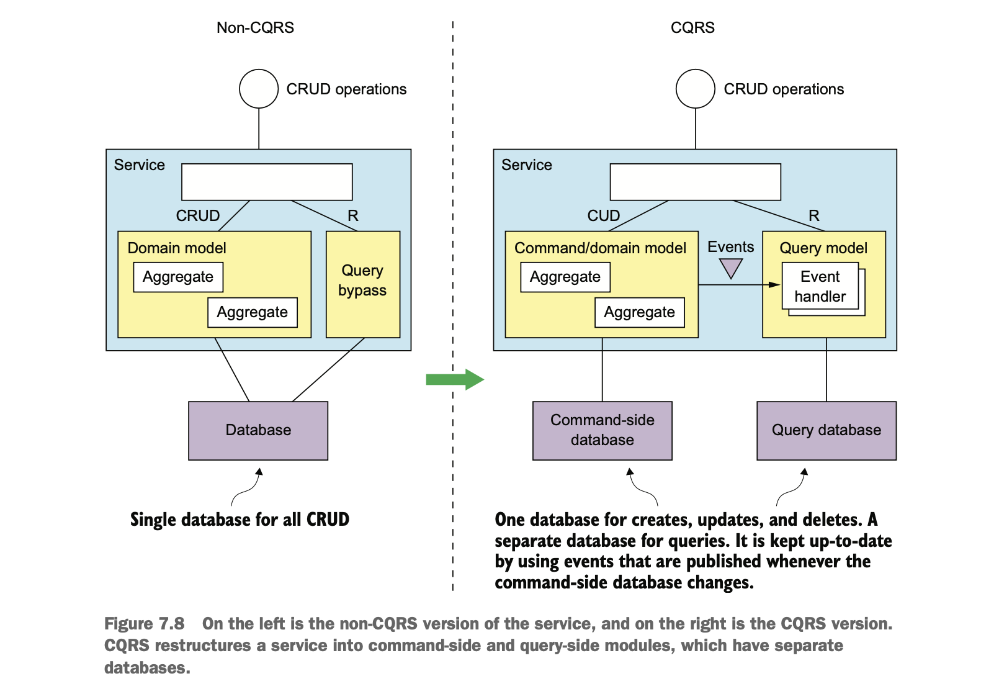
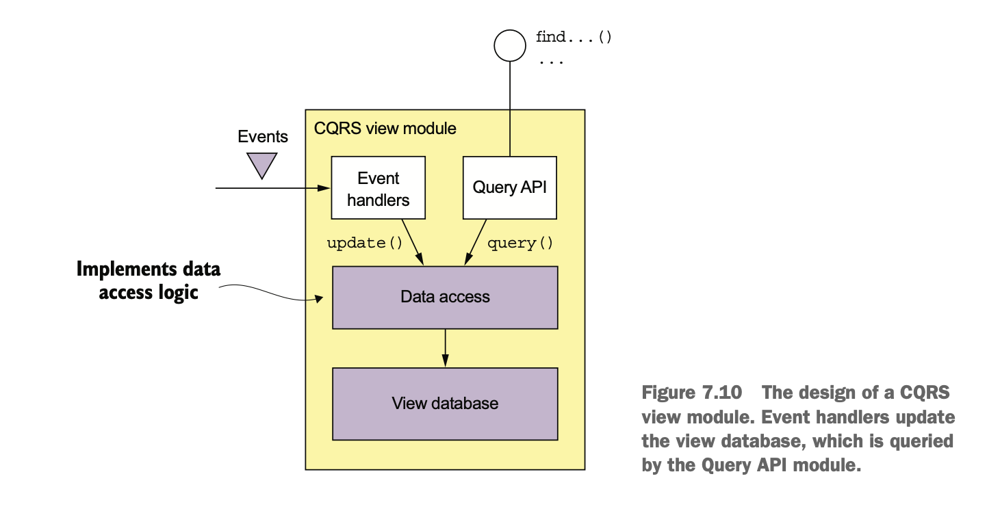

## Querying in microservices

- Queries often need to retrieve data that’s scattered among the databases owned by multiple services.
- Distributed queries violate encapsulation, because client need to know all apis.
- There are two patterns for implementing query operations in a microservice architecture:
  - The API composition pattern
    - In this approach clients of the services invoke services and combine the results.
  - The Command query responsibility segregation (CQRS) pattern
    - It maintains one or more view databases whose sole purpose is to support queries.

### Querying using the API composition pattern

- Let's take findOrder() query operation from FTGO to understand API composition.

#### _The findOrder() query operation_

- The findOrder() operation retrieves an order by its primary key.
  - It takes an orderId as parameter and returns OrderDetails.
- This operation is called by a frontend module, such as a mobile device or a web application, that implements 
  the Order Status view.
- This contains basic information about the order, payment status, status of the order from restaurant's perspective
  and delivery status(like location, deliveryTime etc).

#### _Overview of the API composition pattern_

- This pattern implements a query operation by invoking the services that own the data and combining the results.
- It has two participants:
  - An API composer
  - A provider service
- An API composer might be a client, such as a web application, that needs the data to render a web page.
- It might be a service, such as an API gateway.

### Implementing the findOrder() query operation using the API composition pattern

- The findOrder() query operation corresponds to a simple primary key-based equijoin query.
- Each of the Provider services has an API endpoint for retrieving the required data by orderId.
- The API composer invokes the four services and combines the results together.
  - OrderService, KitchenService, DeliveryService and AccountingService.
- The Find Order Composer implements a REST endpoint GET /order/{orderId}.
- It invokes the four services and joins the responses using the orderId.
- Each Provider service implements a REST endpoint that returns a response corresponding to a single aggregate.
- The OrderService retrieves its version of an Order by primary key.
  - The other services use the orderId as a foreign key to retrieve their aggregates.



### API composition design issues

- The following design issues need to be addressed.
  - Deciding which component is API composer
  - How to write efficient aggregation logic

#### _WHO PLAYS THE ROLE OF THE API COMPOSER?_

- There are three options possible for the role of the api composer.
  - The client of the services
    - For ex, A frontend client such as a web application.
    - This is not practical for the clients running outside the firewall due to slower network.  
  - API gateway
    - this is a suitable option if the query operation is part of the application’s external API.
    - This approach enables a client, such as a mobile device, that’s running outside the firewall to 
      efficiently retrieve data from numerous services with a single API call.
  - Standalone service
    - Use this option for a query operation that’s used internally by multiple services.

#### _API COMPOSERS SHOULD USE A REACTIVE PROGRAMMING MODEL_

- API composer should call provider services in parallel to minimize the response time for a query operation
  wherever possible.
- API composer should use a reactive design based on Java CompletableFuture’s, RxJava observables etc.

### The drawbacks of the API composition pattern

- `Drawbacks`
  - INCREASED OVERHEAD
    - Using the API composition pattern involves multiple requests and database queries.
    - More computing and network resources increase the cost of running the application.
  - RISK OF REDUCED AVAILABILITY
    - An API composer sometimes caches the data returned by a Provider service in order to improve performance
      and availability.
    - Another strategy for improving availability is for the API composer to return incomplete data.
  - LACK OF TRANSACTIONAL DATA CONSISTENCY
    - The API composition pattern executes multiple database queries against multiple databases, so a query
      operation may return inconsistent data.
      - For example, an Order retrieved from Order Service might be in the CANCELLED state, the corresponding
        Ticket retrieved in KitchenService might not have cancelled.
- A query operation might, for example, require the API composer to perform an in-memory join of large datasets.
- It’s usually better to implement these types of query operations using the CQRS pattern. 

### Using the CQRS pattern

- Many enterprise applications use an RDBMS as the transactional system of record and a text search database, 
  such as Elasticsearch or Solr, for text search queries.
- Some applications keep the databases synchronized by writing to both simultaneously.
- Some applications periodically copy data from the RDBMS to the text search engine.
- CQRS is a generalization of this kind of architecture.
- It maintains one or more view databases, not just text search dbs that implements application's queries.

### Motivations for using CQRS

- There are multiple service queries the API composition pattern can’t implement efficiently.
- There are also single service queries that are challenging implementing.
  - The service’s database doesn’t efficiently support the query.

#### _IMPLEMENTING THE FINDORDERHISTORY() QUERY OPERATION_

- The findOrderHistory() operation retrieves a consumer’s order history. 
  - It has several parameters:
    - `consumerId:` Identifies the consumer
    - `pagination:` Page of results to return
    - `filter:` Filter criteria, including the max age of the orders to return, an optional order status, 
      and optional keywords that match the restaurant name and menu items
- It returns an OrderHistory object that contains a summary of the matching orders sorted by increasing age.
- It’s called by the module that implements the Order History view.
- This view displays a summary of each order.
- This operation is not simple to achieve with API composition.
  - For ex, the filterCriteria is a keyword match against a menu item.
    - DeliveryService, AccountingService don't store this data, so can't filter using keyword.
  - Similarly, KitchenService and DeliveryService can't sort by orderCreationDate.
- There are two solutions to achieve this using API composer.    
  - The API composer needs to retrieve all orders for consumer from DeliveryService and AccountingService and 
    perform a join with the orders from OrderService and KitchenService.
    - Fetching and joining large datasets is inefficient.
  - The other solution is for the API composer to retrieve matching orders from Order Service and Kitchen Service
    and then request orders from the other services by ID.
    - This is only practical if those services have a bulk fetch API.
  - `Drawbacks`
    - Queries such as findOrderHistory() require the API composer to duplicate the functionality of an RDBMS’s 
      query execution engine.
    - Developers should be writing business functionality, not a query execution engine.
   
#### _A CHALLENGING SINGLE SERVICE QUERY: FINDAVAILABLERESTAURANTS()_

- Queries that are local to a single service can also be difficult to implement.
  - A service’s database (or data model) doesn’t efficiently support the query sometimes.
    - For ex, the findAvailableRestaurants() query operation is performing an efficient geospatial query.
    - If the application stores data in dbs which doesn't support geospatial search it is difficult to query.
    - CQRS solves this problem by storing the replica of data in some other database that supports queries.
  - It’s not appropriate for the service that owns the data to implement the query sometimes.
    - For ex, the findAvailableRestaurants() query operation retrieves data that is owned by Restaurant Service.
    - The primary responsibility of Restaurant Service is enabling restaurant managers to maintain their 
      restaurants, not implementing a high volume, critical query.
    - If the team is responsible for querying, the team would constantly live in fear of deploying a change 
      that prevented consumers from placing orders.

### Overview of CQRS

#### _CQRS SEPARATES COMMANDS FROM QUERIES_

- CQRS splits a persistent data model and the modules that use it into two parts:
  - The command side
    - The command side modules implements create, update and delete(CUD).
  - The query side
    - The query-side module implements queries.
- The query side keeps its data model synchronized with the command-side data model by subscribing to the events 
  published by the command side.    
- In non-CQRS, A single persistent data model supports both commands and queries.
- In CQRS, the command-side domain model has its own database.
  - It may also handles simple queries, such as non-join, primary key based.
  - The command side publishes domain events whenever its data changes.
  - These events might be published using a framework or using event sourcing.
- The query-side domain model also has its own database.
  - It’s much simpler than the command side, because it doesn't implement business logic.
  - It uses whatever kind of database makes sense for the queries that it must support.
  - It has event handlers that subscribe to domain events and update the database or databases.



#### _CQRS AND QUERY-ONLY SERVICES_

- A query service has an API consisting of only query operations.
- A query-side service is a good way to implement a view that’s built by subscribing to events published by 
  multiple services. 
  - For ex, OrderHistoryService needs to listen events from OrderService, KitchenService, DeliveryService and
    AccountingService.

### _The benefits of CQRS_

- ENABLES THE EFFICIENT IMPLEMENTATION OF QUERIES IN A MICROSERVICE ARCHITECTURE
  - It’s efficient to use an easily queried CQRS view that pre-joins the data from two or more services.
- ENABLES THE EFFICIENT IMPLEMENTATION OF DIVERSE QUERIES
  - It enables an application or service to efficiently implement a diverse set of queries.
- ENABLES QUERYING IN AN EVENT SOURCING-BASED APPLICATION
  - CQRS overcomes a major limitation of event sourcing.
    - Event sourcing only supports only primary key based queries.
- IMPROVES SEPARATION OF CONCERNS
  - The CQRS pattern defines separate code modules and database schemas for the command and query sides of a 
    service.
  
#### _The drawbacks of CQRS_

- MORE COMPLEX ARCHITECTURE
  - Developers must write the query side services that update and query the views.
  - It requires extra operational complexity of managing and operating the extra datastores.
- DEALING WITH THE REPLICATION LAG
  - CQRS needs to deal with the “lag” between the command-side and the query-side views.
    - `Solution`
      - Supply the client with version information that enables it to tell that the query side is out-of-date.
      - A client can poll the query-side view until it’s up-to-date.
    
### Designing CQRS views

- CQRS a view module consists of a view database and three submodules.
  - Data access module
  - Event handlers module
  - Query API module



#### _IMPORTANT DESIGN DECISIONS WHEN DESIGNING CQRS VIEWS_

- Choose a database and design the schema.
- Ensure that updates are idempotent and handle concurrent updates.
- When implementing a new view in an existing application or changing the schema of an existing application, 
  implement a mechanism to efficiently build or rebuild the view.
- Enable a client of the view to cope with the replication lag.

### Choosing a view datastore

#### _SQL VS. NOSQL DATABASES_

- A NoSQL db has a limited form of transactions and less general querying capabilities.
- NoSQL dbs have flexible data model, better performance and scalability.
- A NoSQL database is often a good choice for a CQRS view, because it only uses simple transactions and 
  executes a fixed set of queries.
  
#### _SUPPORTING UPDATE OPERATIONS_

- The view data model must also efficiently implement the update operations executed by the event handlers.
- Usually, an event handler will update or delete a record in the view database using its primary key. 
  - For ex, findOrderHistory() stores each Order as a database record using the orderId as the primary key.
  - When this view receives an event from Order Service, it can update the corresponding record.
- Sometimes, an event handler need to update or delete a record using the equivalent of a foreign key.
  - For ex, the Delivery* events such as DeliveryCreated, DeliveryPickedUp.
    - If Delivery has its own primary key(or one to many relationship b/w Order and Delivery), some events
      such as DeliveryCreated will contain orderId.
    - Events such as DeliveryPickedUp may not have orderId. It uses deliveryId as the equivalent foreign key to
      update order's record.
    - Non-primary key-based updates are not straightforward when using other NOSQL databases.
    - The application will need to maintain some kind of database-specific mapping from a foreign key to a 
      primary key in order to determine which record to update.

### Data access module design

- The event handlers and the query API module don’t access the datastore directly, they use DAO.
- The DAO maps between the data types used by the higher-level code and the database API.
- The DAO must handle concurrent updates and ensure that updates are idempotent.

#### _HANDLING CONCURRENCY_

- If a view subscribes to events published by a single aggregate type, there won’t be any concurrency issues. 
- if a view subscribes to events published by multiple aggregate types, then it’s possible that multiple events 
  handlers update the same record simultaneously.
- For example, an event handler for an Order* event might be invoked at the same time as an event handler for a 
  Delivery* event for the same order.
- If a DAO implements updates by reading a record and then writing the updated record, it must use either 
  pessimistic or optimistic locking.
  
#### _IDEMPOTENT EVENT HANDLERS_

- An event handler is idempotent if handling duplicate events results in the correct outcome. 
- In the worst case, the view datastore will temporarily be out-of-date.
  - For example, an event handler that maintains the Order History view might be invoked with the 
    sequence of events as below. 
    - DeliveryPickedUp, DeliveryDelivered, DeliveryPickedUp, and DeliveryDelivered.
  - After the first two events, if DeliveryPickedUp(third) is processed again, the order state is PICKED_UP for
    sometime until 4th event is processed.
  - If this behavior is undesirable, then the event handler should detect and discard duplicate events, 
    like a non-idempotent event handler.
- An event handler isn’t idempotent if duplicate events result in an incorrect outcome.
  - For example, an event handler that increments the balance of a bank account isn’t idempotent.

#### _NON IDEMPOTENT EVENT HANDLERS_

- In order to be reliable, the event handler must record the event ID and update the datastore atomically. 
- `SQL`
  - If the view database store is a SQL database, the event handler could insert processed events into a 
    PROCESSED_EVENTS table as part of the transaction that updates the view.
- `NoSQL`
  - The event handler must save the event(record Id) in the datastore “record” that it updates.
- The event handler doesn’t need to record the ID of every event if events come from multiple services.
  - With some frameworks(like eventuate) events have a monotonically increasing ID, then each record only needs 
    to store the max(eventId).
  - If the record corresponds to a single aggregate, then the event handler only needs to record max(eventId).
  - If the record corresponds to multiple aggregates, records that represent joins of events from multiple 
    aggregates must contain a map from [aggregate type, aggregate id] to max(eventId).

```
{...
              "Order3949384394-039434903" : "0000015e0c6fc18f-0242ac1100e50002",
              "Delivery3949384394-039434903" : "0000015e0c6fc264-0242ac1100e50002",
}
```

- `TODO: read the book again to understand more on this`

#### _ENABLING A CLIENT APPLICATION TO USE AN EVENTUALLY CONSISTENT VIEW_

- The command and query module APIs can enable the client to detect an inconsistency using the following approach.
  - A command-side operation returns a token containing the ID of the published event to the client.
  - The client then passes the token to a query operation.
    - The query operation returns an error if the view hasn’t been updated by that event. 

### Adding and updating CQRS views

- CQRS views will be added and updated throughout the lifetime of an application.
- To create a new view, develop the query-side module, set up the datastore, and deploy the service.
  - The query side module’s event handlers process all the events, and eventually the view will be up-to-date.
- To update a view, change the event handlers and rebuild the view from scratch.
  - This approach has the following issues.
    - `BUILD CQRS VIEWS USING ARCHIVED EVENTS`
      - Traditional message brokers such as RabbitMQ delete a message once it’s been processed by a consumer.
      - So, a view can’t be built by only reading all the needed events from the message broker.
      - An application must also read older events that have been archived in, for ex, AWS S3.
    - `BUILD CQRS VIEWS INCREMENTALLY`
      - The time and resources required to process all events keep growing over time.
      - Eventually, view creation will become too slow and expensive.
      - `Solution`
        - Periodically computes a snapshot of each aggregate instance based on its previous snapshot and events
          that have occurred since that snapshot was created.
        - Create a view using the snapshots and any subsequent events.