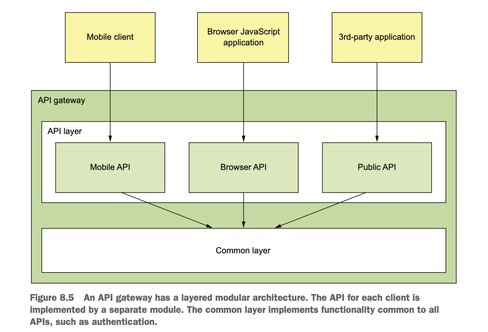

# External API design issues

- An application’s services are consumed by a variety of clients. For ex, FTGO has the following.
  - `Web applications():` Web applications are typical backend applications that serve html/js files with each request.
    - For ex, consumer web application, restaurant web application and admin web application.
    - These applications run inside the firewall, so they access services over high bandwidth.  
  - `JavaScript applications:` These are modern js framework(Angular/React) based applications.
  - `Mobile applications:` Android/ios applications.
  - `Third-party applications:` Applications written by third-party developers.  

## Invoke services directly

- In this approach clients invoke services directly as in a monolithic application.
- `Drawbacks`
  - Clients need to make multiple requests to retrieve data, which is inefficient and result in poor user experience.
  - Clients need to know about each service, which results in poor encapsulation, which means changes to services may break
    client applications.
  - Services might use different IPC mechanisms that are not convenient or practical for clients to use.  

## API design issues for FTGO application

- To retrieve order details as in monolithic requires the data is scattered across the following services.
  - `Order Service:` Contains basic order information, details and status.
  - `Kitchen Service:` Contains restaurant order status, estimated time of order ready for pickup.
  - `Delivery Service:` Contains order delivery status, estimated delivery time and current location.
  - `Accounting Service:` The order payment status.  

### _Mobile client_

- If the mobile application plays the role of the api composer, all the above mentioned drawbacks are present.
  - `POOR USER EXPERIENCE DUE TO THE CLIENT MAKING MULTIPLE REQUESTS`
    - Interaction between client and services is very slow because of slowness of internet, which is 100X slower than LAN.
      especially when client needs to make multiple request sequentially.
    - It requires the mobile developer to write potentially complex API composition code.  
  - `LACK OF ENCAPSULATION REQUIRES FRONTEND DEVELOPERS TO CHANGE THEIR CODE IN LOCKSTEP WITH THE BACKEND`
    - As application evolves, the developers of a service sometimes change an API in a way that breaks existing clients.
    - Developers may add new services and split or merge existing services.
    - Knowledge about the services into a mobile application, makes it difficult to change the services’ APIs.
    - Mobile app changes happen in lock step with backend services. One problem with this is Users might not download new
      version of the app.
  - `SERVICES MIGHT USE CLIENT-UNFRIENDLY IPC MECHANISMS`
    - Client applications that run outside the firewall typically use protocols such as HTTP and WebSockets.
    - Some application services might use gRPC, whereas others could use the AMQP messaging protocol.
      - These protocols work well internally, but may not be easily consumed by a mobile client or not firewall friendly.

### _Browser based applications_

- Browser-based JavaScript applications are easy to update when service APIs change.
- These applications have the same problems as mobile applications with network latency.
- API composition in browser-based Javascript applications may not be efficient as in mobile applications.

### _Third party APIs_

- Third-party applications access the APIs over the internet, so API composition is likely to be inefficient.
- Third-party developers need an API that’s stable.
  - So, carefully manage the evolution of an API that’s used by third-party developers.
  - The organization has to maintain older versions for a long time, possibly forever.
- Rather than expose services directly to third-party developers, organizations should have a separate public API that’s 
  developed by a separate team.
- The public API is implemented by an architectural component known as an API gateway.  

## API gateway pattern

- API gateway pattern is similar to Facade from object-oriented design.
- API gateway encapsulates the application’s internal architecture and provides an API to its clients.
- API gateway provides each client with its own API, instead of one-size-fits-all(OFSA) API.
  - OFSA doesn't solve different requirements of the clients.
    
- An API gateway has the following two layers.
  - `API Layer`
    - Request routing
    - API composition
    - Protocol translation
  - `Edge functions`
    - Authentication
    - Authorization
    - Rate limiting
    - Caching
    - Metrics collection
    - Request Logging

### _REQUEST ROUTING_

- An API gateway implements some API operations by routing requests to the corresponding service.
- An API gateway consults a routing map that specifies which service to route the request to.
  - For example, map an HTTP method and path to the HTTP URL of a service.

### _API COMPOSITION_

- An API gateway implement some API operations using API composition.
  - For ex, FTGO application implements the Get Order details(getOrderDetails()) API operation using API composition.

### _PROTOCOL TRANSLATION_

- An API gateway might provide a Restful API to external clients, even though the application services use a 
  mixture of protocols internally like REST and gRPC.
- The implementation of some API operations translates between the Restful external API and the internal gRPC-based APIs.  

### _EDGE FUNCTIONS_

- Edge functions can be implemented in three ways.
  - Services
    - It is generally more secure if the application authenticates requests on the edge before they reach the services.
  - Edge service  
    - Implement these edge functions in an edge service that’s upstream from the API gateway.
    - The edge service is the first point of contact for an external client.
    - It authenticates the request and performs other edge processing before passing it to the API gateway.
    - `Drawbacks`
      - Increases network latency because of the extra hop.
      - It adds complexity to the application.
  - Api Gateway
    - It’s often convenient to use the third option and implement these edge functions, in the API gateway itself.
    - This reduces one extra network hop, which improves latency.

## API Gateway ownership model

- API Gateway development and operations can have various options.
  - A separate team
    - The drawback with this approach is an app team needs access to a service must submit a request and wait for access. 
  - Client teams and operations team
    - `Client team`
      - The client teams like the mobile, web, and public API teams—to own the API module that exposes their API.
      - If client team need a change, they check in the changes to the source repository for the API gateway.
  - `Operations team`      
    - An API gateway team is responsible for developing the Common module and for the operational aspects of the gateway.

## Using the backends for frontends patterns

- API gateway has no clear responsibilities. For ex, multiple teams contribute to the same code base.
- An API gateway team is responsible for its operation.
- This blurring of responsibilities is counter to the microservice architecture philosophy of “if you build it, you own it.”
- `BFF pattern`
  - The solution is to have an API gateway for each client, the so-called Backends for front-ends (BFF) pattern.
  - Each API module becomes its own standalone API gateway that’s developed and operated by a single client team.  

- `Advantages`
  - Different API gateways could be developed using different technology stacks.
    - This needs common functionality to be duplicated in multiple languages.
  - The API modules are isolated from one another, which improves reliability.
    - One misbehaving API can’t easily impact other APIs.
  - It improves observability, because different API modules are different processes.
  - Each API is independently scalable.
  - Reduces startup time because each API gateway is a smaller, simpler application.  

## Benefits and drawbacks of an API gateway

- `Benefits`
  - It encapsulates internal structure of the application.
  - It reduces the number of round-trips between the client and application.
  - It reduces the client code.
- `Drawbacks`
  - It should be highly available component that must be developed, deployed, and managed.
  - This becomes a development bottleneck.
    - Developers must update the API gateway in order to expose their services’s API.

## API gateway design issues

- There are several issues to consider when designing an API gateway:
  - Performance and scalability
  - Writing maintainable code by using reactive programming abstractions 
  - Handling partial failure
  - Being a good citizen in the application’s architecture
    
### _Performance and scalability_

- A key design decision that affects performance and scalability is whether the API gateway should use synchronous or 
  asynchronous I/O.
- `Synchronous`
  - In the synchronous I/O model , each network connection is handled by a dedicated thread.
  - Operating system threads are heavyweight, so there is a limit on the number of threads.
- `Asynchonous`
  - In this, a single event loop thread dispatches I/O requests to event handlers.
  - There are a variety of asynchronous I/O technologies to choose from.
    - On the JVM, we can choose one of the NIO based frameworks such as Netty, Vertx, Spring Reactor or Jboss undertow.
    - For non JVM option, we can choose nodejs.
  - Nonblocking I/O is much more scalable because it doesn’t have the overhead of using multiple threads.
  - `Drawback`
    - The asynchronous, callback- based programming model is much more complex.
    - The code is more difficult to write, understand, and debug. 
    - Event handlers must return quickly to avoid blocking the event loop thread.

### USE REACTIVE PROGRAMMING ABSTRACTIONS

- In order to minimize response time, the composition logic should, whenever possible, invoke services concurrently. 
- The challenge is to write concurrent code that’s maintainable.
- The traditional way to write scalable, concurrent code is to use callbacks.
  - Even a Servlet API-based API composer that invokes services concurrently typically uses callbacks.
  - This could execute requests concurrently using Executor framework which returns a Future, which has a blocking API.
- The better approach is to use declarative style using a reactive approach.
- Examples of reactive abstractions for the JVM include the following:
  - Java 8 CompletableFutures
  - Project Reactor Monos
  - RxJava (Reactive Extensions for Java) Observables, created by Netflix specifi-
    cally to solve this problem in its API gateway
  - ScalaFutures

### HANDLING PARTIAL FAILURES

- One way to achieve reliability is to run multiple instances of the gateway behind a load balancer.
- Properly handle failed requests and requests that have unacceptably high latency.
  - An api gateway should use circuit breaker pattern when invoking services.

### BEING A GOOD CITIZEN IN THE ARCHITECTURE

- The service discovery patterns enable a service client, such as an API gateway, to determine the network location 
  of a service instance so that it can invoke it.
- The observability patterns enable developers to monitor the behavior of an application and troubleshoot problems.
