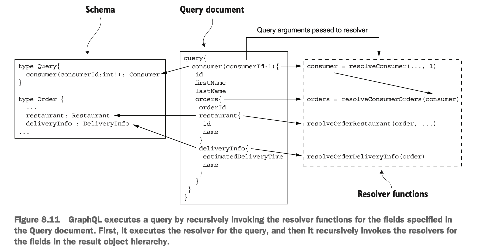

# Implementing an API Gateway

- The primary responsibilities of API Gateway should include the following.
  - Request routing
  - API composition
  - Edge functions
  - Protocol translations
  - Should support service discovery, observability patterns.
- API gateway can implemented with any of the below approaches.
  - `Using an off-the-shelf API gateway product/service`
  - `Developing your own API gateway using either an API gateway framework or a web framework as the starting point`

## _Using an off-the-shelf API gateway product/service_

### _AWS API GATEWAY_

- An AWS API gateway API is a set of REST resources, each of which supports one or more HTTP methods.
- Using AWS API gateway we can configure to route each (Method, Resource) to a backend service.
- Using AWS API gateway we can transform request and response using a template-based mechanism.
- The AWS API gateway can also authenticate requests.
- `Limitations`
  - It does not support API composition.
  - It only supports HTTP(S) with a heavy emphasis on JSON.   
  - It only supports the Server-side discovery pattern through a load balancer.
- Unless API composition is needed, the AWS API gateway is a good implementation of the API gateway pattern.

### _AWS APPLICATION LOAD BALANCER_

- AWS APPLICATION LOAD BALANCER service provides API gateway-like functionality.
- This works with HTTP, HTTPS, WebSocket, and HTTP/2.
- We can define routing rules that route requests to backend services, which must be running on AWS EC2 instances.
- It implements basic routing functionality.
- `Limitations`
  - It does not implement HTTP method-based routing.
  - It does not implement API composition or authentication.  

### _USING AN API GATEWAY PRODUCT_

- The modern popular API gateway product choices are Kong or Traefik.
- Kong is based on NGINX HTTP server, whereas Traefik is written in GoLang.
- Both products are configured using flexible routing rules that use the HTTP method, headers, and path to select the 
  backend service.
- Both supports plugins for the edge functions such as authentication.
- `Traefik` can integrate with some service registries.
- `Limitations`
  - Need to install, configure, and operate.
  - These products do not implement API composition.

## _Developing own API gateway_

- An API gateway is a web application that proxies requests to other services.
- An API gateway needs to solve two key design problems.
  - Implementing a mechanism for defining routing rules in order to minimize the complex coding.
  - Correctly implementing the HTTP proxying behavior, including how HTTP headers are handled.
- An API gateway can be implemented using a framework designed for that purpose.    
  - Netflix Zuul
  - Spring cloud gateway
    
### _NETFLIX ZUUL_

- Netflix developed the Zuul framework to implement edge functions such as routing, rate limiting, and authentication.
- The Zuul framework uses the concept of filters.
  - These filters are reusable request interceptors that are similar to servlet filters or NodeJS Express middleware.
- Zuul handles a http request by assembling a chain of filters, that transform the request/response when invoking backends.
- Spring Cloud Zuul builds on Zuul and through convention-over-configuration makes developing a Zuul-based easy.
- We can extend Zuul by defining Spring MVC controllers that implement API composition.
- `Limitations`
  - It supports only path based routing.
    - For ex, it’s incapable of routing GET /orders to one service and POST /orders to a different service.

### _SPRING CLOUD GATEWAY_

- It’s an API gateway framework built on top of several frameworks.
  - Spring 5
  - Spring boot 2
  - Spring webflux(Reactive web framework that is part of spring 5 built using project reactor)
- Project Reactor is an NIO-based reactive framework for the JVM that provides the Mono abstraction.
- Spring Cloud Gateway provides a simple yet comprehensive way to implement the following. 
  - Route requests to backend services
  - Api composition
  - Edge function

## API Gateway implementation

- This is a spring boot application which consists of the following.
  - `configuration beans`
    - Typical spring boot configuration bean definitions of handlers, routers(RouteLocator and RouterFunction) and 
      Services(proxies).
  - `Routers`
    - These RouteLocator and RouterFunction beans define map API operations to Handler class methods.
    - These are like controller methods of spring MVC.
  - `Handler classes`
    - Defines the request handler methods that implement custom behavior, including API composition.
  - `Service classes`
    - These are remote proxies for the backend Service. 

#### _OrderConfiguration_

```java
@Configuration
@EnableConfigurationProperties(OrderDestinations.class)
public class OrderConfiguration {

  // By default, route all requests whose path begins with /orders to the URL orderDestinations.orderServiceUrl.  
  @Bean
  public RouteLocator orderProxyRouting(RouteLocatorBuilder builder, OrderDestinations orderDestinations) {
    return builder.routes()
            .route(r -> r.path("/orders").and().method("POST").uri(orderDestinations.getOrderServiceUrl()))
            .route(r -> r.path("/orders").and().method("PUT").uri(orderDestinations.getOrderServiceUrl()))
            .route(r -> r.path("/orders/**").and().method("POST").uri(orderDestinations.getOrderServiceUrl()))
            .route(r -> r.path("/orders/**").and().method("PUT").uri(orderDestinations.getOrderServiceUrl()))
            .route(r -> r.path("/orders").and().method("GET").uri(orderDestinations.getOrderHistoryServiceUrl()))
            .build();
  }

  //Route a GET /orders/{orderId} to orderHandlers:: getOrderDetails.
  @Bean
  public RouterFunction<ServerResponse> orderHandlerRouting(OrderHandlers orderHandlers) {
    return RouterFunctions.route(GET("/orders/{orderId}"), orderHandlers::getOrderDetails);
  }

  @Bean
  public OrderHandlers orderHandlers(OrderServiceProxy orderService, KitchenService kitchenService,
                                     DeliveryService deliveryService, AccountingService accountingService) {
    return new OrderHandlers(orderService, kitchenService, deliveryService, accountingService);
  }

  @Bean
  public WebClient webClient() {
    return WebClient.create();
  }

}
```

#### _OrderDestinations_

- This class maps backend service urls from properties file into a java pojo.

```java
package net.chrisrichardson.ftgo.apiagateway.orders;

import org.springframework.boot.context.properties.ConfigurationProperties;

import javax.validation.constraints.NotNull;

@ConfigurationProperties(prefix = "order.destinations")
public class OrderDestinations {

  @NotNull
  private String orderServiceUrl;

  @NotNull
  private String orderHistoryServiceUrl;

  public String getOrderHistoryServiceUrl() {
    return orderHistoryServiceUrl;
  }

  public void setOrderHistoryServiceUrl(String orderHistoryServiceUrl) {
    this.orderHistoryServiceUrl = orderHistoryServiceUrl;
  }


  public String getOrderServiceUrl() {
    return orderServiceUrl;
  }

  public void setOrderServiceUrl(String orderServiceUrl) {
    this.orderServiceUrl = orderServiceUrl;
  }
}
```

#### _OrderHandler_

- This class contains logic related to invoking backend services through the service(proxy) classes.
- This contains API composition logic.
- These invoke backend classes using proxies such as OrderServiceProxy.

```java
package net.chrisrichardson.ftgo.apiagateway.orders;

import net.chrisrichardson.ftgo.apiagateway.proxies.*;
import org.springframework.http.MediaType;
import org.springframework.web.reactive.function.server.ServerRequest;
import org.springframework.web.reactive.function.server.ServerResponse;
import reactor.core.publisher.Mono;
import reactor.util.function.Tuple4;
import java.util.Optional;
import static org.springframework.web.reactive.function.BodyInserters.fromObject;

public class OrderHandlers {

  private OrderServiceProxy orderService;
  private KitchenService kitchenService;
  private DeliveryService deliveryService;
  private AccountingService accountingService;

  public OrderHandlers(OrderServiceProxy orderService,
                       KitchenService kitchenService,
                       DeliveryService deliveryService,
                       AccountingService accountingService) {
    this.orderService = orderService;
    this.kitchenService = kitchenService;
    this.deliveryService = deliveryService;
    this.accountingService = accountingService;
  }

  public Mono<ServerResponse> getOrderDetails(ServerRequest serverRequest) {
    String orderId = serverRequest.pathVariable("orderId");

    Mono<OrderInfo> orderInfo = orderService.findOrderById(orderId);

    Mono<Optional<TicketInfo>> ticketInfo = kitchenService
            .findTicketById(orderId)
            .map(Optional::of)
            .onErrorReturn(Optional.empty());

    Mono<Optional<DeliveryInfo>> deliveryInfo = deliveryService
            .findDeliveryByOrderId(orderId)
            .map(Optional::of)
            .onErrorReturn(Optional.empty());

    Mono<Optional<BillInfo>> billInfo = accountingService
            .findBillByOrderId(orderId)
            .map(Optional::of)
            .onErrorReturn(Optional.empty());

    Mono<Tuple4<OrderInfo, Optional<TicketInfo>, Optional<DeliveryInfo>, Optional<BillInfo>>> combined =
            Mono.zip(orderInfo, ticketInfo, deliveryInfo, billInfo);

    Mono<OrderDetails> orderDetails = combined.map(OrderDetails::makeOrderDetails);

    return orderDetails.flatMap(od -> ServerResponse.ok()
            .contentType(MediaType.APPLICATION_JSON)
            .body(fromObject(od)))
            .onErrorResume(OrderNotFoundException.class, e -> ServerResponse.notFound().build());
  }
  
}
```
- A Mono is a richer kind of Java 8 CompletableFuture, contains the outcome of an asynchronous operation that’s either 
  a value or an exception.
- The getOrderDetails() invokes the services and combines the results without using messy, difficult-to-read callbacks.

### _OrderServiceProxy_

- It is a remote proxy for the Order Service.
- It invokes the Order Service using a WebClient, which is the Spring Web-Flux reactive HTTP client.

```java
package net.chrisrichardson.ftgo.apiagateway.proxies;

import net.chrisrichardson.ftgo.apiagateway.orders.OrderDestinations;
import org.springframework.stereotype.Service;
import org.springframework.web.reactive.function.client.ClientResponse;
import org.springframework.web.reactive.function.client.WebClient;
import reactor.core.publisher.Mono;

@Service
public class OrderServiceProxy {

  private OrderDestinations orderDestinations;
  private WebClient client;

  public OrderServiceProxy(OrderDestinations orderDestinations, WebClient client) {
    this.orderDestinations = orderDestinations;
    this.client = client;
  }

  public Mono<OrderInfo> findOrderById(String orderId) {
    Mono<ClientResponse> response = client
            .get()
            .uri(orderDestinations.getOrderServiceUrl() + "/orders/{orderId}", orderId)
            .exchange();
    return response.flatMap(resp -> {
      switch (resp.statusCode()) {
        case OK:
          return resp.bodyToMono(OrderInfo.class);
        case NOT_FOUND:
          return Mono.error(new OrderNotFoundException());
        default:
          return Mono.error(new RuntimeException("Unknown" + resp.statusCode()));
      }
    });
  }

}
```
- The findOrder() method uses flatMap() to transform the Mono<ClientResponse> into a Mono<OrderInfo>. 
- The bodyToMono() method returns the response body as a Mono.

## Implementing an API gateway using GraphQL

- Different clients need slightly different data.
- There are two ways to achieve this.  
  - Give the client the ability to specify the data they need.
    - Implementing an API gateway with a REST API that supports a diverse set of clients well is time-consuming.
  - Define multiple versions of this endpoint as part of applying the Backends for frontends pattern.

### Graph QL

- The graph-based schema defines a set of nodes (types), which have properties (fields) and relationships with other nodes.
- Graph-based API technology has a couple of important benefits. It gives clients control over what data is returned.
  - `Advantages`
    - It gives clients control over what data is returned.
    - This approach significantly reduces the development effort.
- The two most popular graph-based API technologies are GraphQL (http://graphql.org) and Netflix Falcor.
- Apollo GraphQL is a popular JavaScript/NodeJS implementation.
- The key parts of the GraphQL design are as follows:
  - `GraphQL schema:` The GraphQL schema defines the server-side data model and the queries it supports.
  - `Resolver functions:` The resolve functions map elements of the schema to the various backend services.
  - `Proxy classes:` The proxy classes invoke the application’s services.

### DEFINING A GRAPHQL SCHEMA

- A GraphQL API is centered around a schema.
- It consists of a collection of types that define the structure of server-side data model and the operations.
- GraphQL has several kinds of types like Object types and enums.
- `Object types:` This is the primary way of defining the data model. 
  - An object type has a name and a collection of typed, named fields.
  - A field can be a scalar type such as number, string or list of scalar types or list of object references.
  - `A GraphQL field is conceptually a function that returns a value`.
- GraphQL also uses fields to define the queries supported by the schema.
- GraphQL APIs are declared using an object type, which by convention is called Query.
- Each field of the Query object is a named query, which has an optional set of parameters, and a return type.
  - It helps to keep in mind that a GraphQL field is a function.
- The following listing shows part of the schema for the GraphQL-based FTGO API gateway.
- It defines several object types and also has a Query object.

```
const typeDefs = gql`
  type Query {
    orders(consumerId : Int!): [Order]
    order(orderId : Int!): Order
    consumer(consumerId : Int!): Consumer
  }

  type Mutation {
    createConsumer(c : ConsumerInfo) : Consumer
  }

  type Order {
    orderId: ID,
    consumerId : Int,
    consumer: Consumer
    restaurant: Restaurant
    deliveryInfo : DeliveryInfo
  }

  type Restaurant {
    id: ID
    name: String
  }

  type Consumer {
    id: ID
    firstName: String
    lastName: String
    orders: [Order]
  }

  input ConsumerInfo {
    firstName: String
    lastName: String
  }
  
  type DeliveryInfo {
    status : DeliveryStatus
    estimatedDeliveryTime : Int
    assignedCourier :String
  }
  
  enum DeliveryStatus {
    PREPARING
    READY_FOR_PICKUP
    PICKED_UP
    DELIVERED
  }
}
```

- The `ID` type defines the unique identifier.
- The `!` symbol indicates that the value should be non-null.
- The above schema defines three queries:
  - `orders()` Returns the Orders for the specified Consumer 
  - `order()` Returns the specified Order
  - `consumer()` Returns the specified Consumer
  
### EXECUTING GRAPHQL QUERIES

- A query document specifies the name of the query, the argument values, and the fields of the result object to return.
```
query {
  consumer(consumerId:1) // Specifies the query called consumer, which fetches a consumer
    { 
      firstName // The fields of the Consumer to return 
      lastName
    }
}
```
- A query that returns a consumer, their orders, and the ID and name of each order’s restaurant:

```
query {
    consumer(consumerId:1)  {
      id
      firstName
      lastName
      orders {
        orderId
        restaurant {
          id
          name 
        }
        deliveryInfo {
          estimatedDeliveryTime
          name
        } 
      }
    }
}
```

### CONNECTING THE SCHEMA TO THE DATA

- GraphQL query must retrieve the requested data from one or more data stores.
- In the case of the FTGO application, the GraphQL server must invoke the APIs of the services that own the data.
- GraphQL associates a schema with the data sources by attaching resolver functions to the fields of the object types 
  defined by the schema.
- The GraphQL server implements the API composition pattern by invoking resolver functions to retrieve the data, 
  first for the top-level query, and then recursively for the fields of the result object or objects.
  
```
const resolvers = {
  Query: {
    orders: resolveOrders,
    consumer: resolveConsumer,
    order: resolveOrder
  },
  Mutation: {
    createConsumer: createConsumer
  },
  Order: {
    consumer: resolveOrderConsumer,
    restaurant: resolveOrderRestaurant,
    deliveryInfo: resolveOrderDeliveryInfo
  },
  Consumer: {
    orders: resolveConsumerOrders
  }
};

function resolveOrders(_, { consumerId }, context) {
  return context.orderServiceProxy.findOrders(consumerId);
}

function resolveOrderConsumer({consumerId}, args, context) {
    return context.consumerServiceProxy.findConsumer(consumerId);
}
```

- `Resolvers`
  - A resolver function has three parameters:
    - `Object`
      - A top level query field, such as resolveOrders, object is a root object that's ignored by the resolver function.
      - The resolver function for the Order.consumer field is passed the value returned by the Order’s resolver function.
    - `Query arguments`
      - These are supplied by the query document.
    - `Context`
      - Global state of the query execution that’s accessible by all resolvers.
      - It is used to pass user information and dependencies to the resolvers.
- A resolver function might invoke a single service or it might implement the API composition pattern and retrieve data 
  from multiple services.
- An Apollo GraphQL server resolver function returns a Promise, which is JavaScript’s version of Java’s Completable Future.
- GraphQL uses a recursive algorithm to execute the resolver functions.
  - It executes the resolver function for the top-level query specified by the Query document.
  - For each object returned by the top-level query, it iterates through the fields specified in the Query document.
  - If a field has a resolver, it invokes the resolver with the object and the arguments from the Query document.



### OPTIMIZING LOADING USING BATCHING AND CACHING

- GraphQL server executes each resolver independently.
  - For example, a query that retrieves a consumer, their orders, and the orders’ restaurants.
  - If there are N orders, then a simplistic implementation would make 
    - One call to Consumer Service
    - One call to Order History Service
    - N calls to Restaurant Service
- Though GraphQL engine typically make the calls to Restaurant Service in parallel, there’s a risk of poor performance.  
- To optimize Graph QL resolvers use server-side batching and caching.
  - Batching turns N calls to a service, such as Restaurant Service, into a single call that retrieves a batch of N objects.
  - Caching reuses the result of a previous fetch of the same object to avoid making an unnecessary duplicate call.
- A NodeJS-based GraphQL server can use the DataLoader module to implement batching and caching.
  - It coalesces loads that occur within a single execution of the event loop and calls a batch loading function. 
  - It also caches calls to eliminate duplicate loads. 
  - The following listing shows how RestaurantServiceProxy can use DataLoader. 
  - The findRestaurant() method loads a Restaurant via DataLoader.

```node

const fetch = require("node-fetch");
const DataLoader = require('dataloader');

class RestaurantServiceProxy {
    constructor(options) {
        this.restaurantServiceUrl = `${options.baseUrl}/restaurants`;
        this.dataLoader = new DataLoader(restaurantIds => this.batchFindRestaurants(restaurantIds));
        console.log("this.restaurantServiceUrl", this.restaurantServiceUrl);
    }

    findRestaurant(restaurantId) {
        return this.dataLoader.load(restaurantId);
    }

    findRestaurantInternal(restaurantId) {
        return fetch(`${this.restaurantServiceUrl}/${restaurantId}`)
            .then(response => {
                console.log("response=", response.status);
                if (response.status === 200) {
                    return response.json().then(body => {
                        console.log("response=", body);
                        return Object.assign({id: restaurantId, name: body.name.name}, body);
                    })
                } else
                    return Promise.reject(new Error("cannot found restaurant for id" + restaurantId))
            });
    }

    batchFindRestaurants(restaurantIds) {
        console.log("restaurantIds=", restaurantIds);
        return Promise.all(restaurantIds.map(k => this.findRestaurantInternal(k)));
    }

}

module.exports = {RestaurantServiceProxy};
```
  